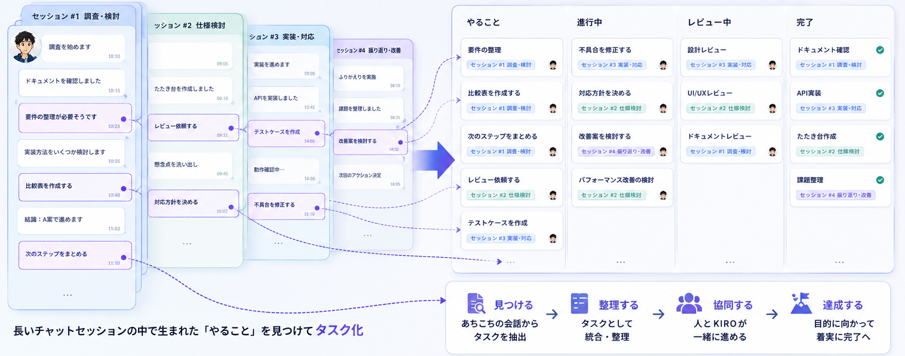
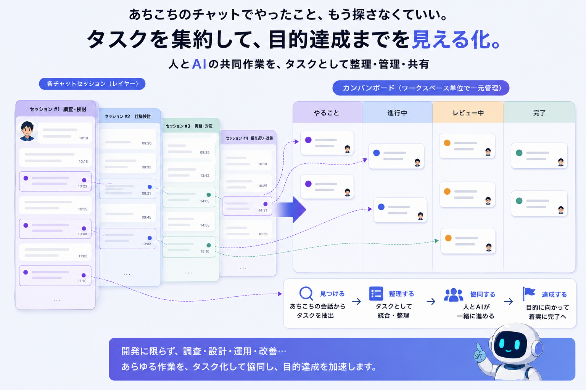

# backlog-dashboard

**AIエージェントと協働するための、Markdownバックログ管理システム。**

---

## こんなことで困ったことないですか？

- チャットスレッドで色々やり取りして何かを決めたはずなのに、「あれ、あのとき何を決めたんだっけ？どこで話したっけ？」と探し回る
- 「これ、前どうやって直したっけ？」と思って過去のやり取りを遡っても、要望と結果だけが残っていて、**途中の判断や手順が分からない**
- 同じことをもう一度AIに頼んだら、前回と**全然違うアプローチ**でやり始めて戸惑う
- 1つのチャットスレッドに作業をどんどん積み重ねているうちに、コンテキストが膨れ上がって**AIの応答の質が落ちてきた**気がする
- 結局「できました」という結果だけが残り、**何をどうやったのかが誰にも（自分にも）分からない**

---

## backlog-dashboardを使うとこうなる

- **やりたいこと**は、まずAIと一緒に整理してタスクに分解し、Markdownのバックログへ起票する。これが「決めたこと」の記録になる
- **1タスク＝1チャットスレッド**を基本にするので、AIは常にそのタスクに必要な文脈だけを読み込んで着手できる。無関係な過去のやり取りを背負わない分、応答の質が落ちにくく、結果として**AIの利用量もトータルで抑えられる**
- タスクに「実行中」フラグが立つと、ダッシュボードのカードがグローして光る。**AIが今何をしているか**がひと目で分かる
- 作業の途中で浮かんだ「あ、これもやっといて」という思いつきも、その場でバックログに追加できる。**アイデアも要望も、途中で消えない**
- タスクIDを指定するだけで、AIは説明欄・引き継ぎファイルを読み込んでコンテキストを復元できる。**「あれ何だっけ」を、AIに聞けば済むようにする**

「できたー」で終わる会話から、**何を・なぜ・どうやったかが後から辿れる開発**へ。

---

## 主な機能

| 機能 | できること |
|------|-----------|
| かんばんボード | 状態（未着手／進行中／完了 等）ごとにタスクをリアルタイム表示。md編集は即座にUIへ反映される |
| 実行中インジケータ | いまAIが着手中のタスクをグロー表示でひと目に |
| Epic（親子タスク） | 大きなタスクを子タスクに分解し、進捗バッジ `[完了数/全数]` で自動集計 |
| 今日やるピン（📌） | 今日やることだけに絞り込める |
| 達成感モード（🎉） | 「今日完了した分」だけを表示。積み上げが見える |
| フィルタ | プロジェクト別・ワークスペース別に絞り込み可能 |
| テーマ | Dark / Light / System + アクセントカラーを自由に設定 |

より詳しい仕様は [design-docs/backlog-dashboard-spec.md](design-docs/backlog-dashboard-spec.md) を参照。

---

## 使い方のイメージ

1. **計画セッション**: 「〇〇をやりたい」とAIに伝える → 全体設計とタスク分解を一緒に行う → バックログに起票（大きな作業は引き継ぎファイルも作成）
2. **実行セッション**: 「BT-007やって」とタスクIDを指定するだけで、AIが説明欄・引き継ぎファイルを読み、状態を「進行中」に、実行中フラグを立てて着手する
3. 作業中にダッシュボードを開いておけば、**進捗がリアルタイムで見える**
4. 完了すればAIが状態を「完了」に更新し、バックログの完了テーブルに記録が残る
5. 思いついた追加タスクは、ダッシュボードの＋ボタンからでも、チャット越しにでも、その場で起票できる

---

## ワークスペースについて

**「1つの仕事の枠＝1つのワークスペース」として運用するのがおすすめ。**

backlog-dashboardは複数のワークスペース（プロジェクト）を横断して1つのダッシュボードに登録できるが、各ワークスペースはバックログmdファイル1本・プレフィクス1つに対応する。仕事の文脈をワークスペース単位できっちり分けておくことで、

- そのワークスペース内でのタスクの積み重ね・決定の履歴に一貫性が保てる
- 「このワークスペースでは何をやっているんだっけ」が、バックログを見れば一目で分かる
- プロジェクトごとの色分け表示（カード左ボーダー）で、複数ワークスペースを同時に見ていても混乱しない

複数の性質が異なる仕事を1つのワークスペースに混在させると、バックログの見通しが悪くなるので避けたい。

---

## インストール

### 前提条件

- Node.js（標準ライブラリ + `ws` パッケージ1個のみで動作。localhost完結・外部サービス不要）
- Claude Code など、常設指示ファイル（`CLAUDE.md` / `AGENTS.md` 等）でルールを読み込めるAIエージェント環境
- ポート `3333`（既定値。衝突する場合のみ変更）

### 手順

このリポジトリには `.claude/skills/install-backlog-hub/` にインストーラーが同梱されている。Claude Codeで当該ワークスペースを開き、**「backlog-dashboardを使いたい」と伝えるだけ**で、以下を対話的に決めながらセットアップが進む。

1. 新規インストールか、既存ダッシュボードへのワークスペース追加登録かを判定
2. バックログmdの置き場所・ポート・このワークスペースのプレフィクス（2英大文字）を決定
3. `backlog-dashboard/` 一式を設置し、`npm install` → `node server.js` で起動
4. バックログmdの雛形を1本作成
5. 運用ルール（`backlog-hub-rules.md`）をグローバル設定へ配置し、`CLAUDE.md` からインポート

### 気をつけること

- `backlog-dashboard/config.json` は `backlogDir`・`projects[]`・`port` といった**個人の環境に依存する値**を含むため、リポジトリには含めない（`.gitignore` 対象）。`config.json.example` をコピーして使う
- 複数のワークスペースを1つのダッシュボードにまとめる場合、`config.json` の `projects[]` に追記するだけでは反映されない。`config.json` は**サーバー起動時に1度だけ**読み込まれるため、追記後は必ずサーバーを再起動すること
- 稼働確認は `GET /api/health` が `{"status":"ok"}` を返すかどうかで行う
