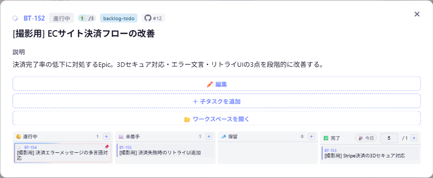
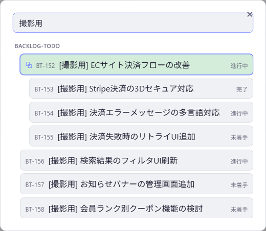
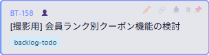
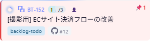

# backlog-dashboard

**AIエージェントと協働するための、SQLiteバックログ管理システム。**


## こんなことで困ったことないですか？

- チャットで決めたことや、前回の判断理由を見つけられない
- 同じ依頼でも、AIが前回と違う進め方をして戸惑う
- 一つの長いスレッドに作業が積み重なり、文脈が重くなる
- 「できました」だけが残り、何をどう進めたか追えない

## backlog-dashboardを使うとこうなる


- やりたいことをAIと整理してタスク化し、**SQLite DBへ一元登録**する
- **1タスク＝1チャットセッション**を基本に、必要な文脈だけを引き継げる
- 実行中のタスクはカードが光り、AIが今何をしているかひと目で分かる
- 途中で生まれた追加要望もすぐに登録でき、アイデアを取りこぼさない
- タスクIDを指定すれば、説明欄と成果物から作業の文脈を復元できる

「できた」で終わる会話から、**何を・なぜ・どうやったかを後から辿れる開発**へ。

## 主な機能

| 機能 | できること |
|---|---|
| かんばんボード | TODO / READY / DO / DONEごとにタスクをリアルタイム表示 |
| 実行中インジケータ | 実行中タスクと担当AIをボード・ステータスバーで表示 |
| Epic（親子タスク） | 大きな作業を子タスクに分解し、進捗を自動集計 |
| 今日やるピン | 今日着手するタスクだけに絞り込み |
| 達成感モード | 今日完了したタスクを表示 |
| 検索・一括操作 | タスク検索、複数選択、移動、削除、GitHub Issue化 |
| ワークスペース連携 | カードからVS Codeでワークスペースを開く。新規作成も可能 |
| 履歴・成果物 | 操作履歴、説明、担当、日付、成果物をタスクへ記録 |
| テーマ | Dark / Light / System とアクセントカラーを設定 |

### 画面イメージ







## GitHub Issueと二重管理にならない

個人の「次やること」とチームのGitHub Issueを別々に持つと、紐付けや完了反映が漏れがちです。backlog-dashboardは次を提供します。

- Open Issueを取り込み、バックログタスクとして管理
- タスクからGitHub Issueを作成（複数選択にも対応）
- 紐づいたタスクを完了すると、Issueへ完了コメントを投稿してclose
- カードからGitHub Issueを直接開く



## 使い方のイメージ

1. **計画**: 「〇〇をやりたい」とAIへ伝え、タスクに分解して登録する
2. **実行**: 「BT-007やって」とIDを指定する。AIが説明欄・成果物を読み、DOと実行中を記録して始める
3. **可視化**: ダッシュボードで進捗と実行中のAIを確認する
4. **完了**: 成果物・実施結果をタスクに残し、完了へ更新する
5. **追加**: 思いついたことはUIまたはAI経由でその場で登録する

## データと運用

タスク、親子関係、状態、担当、期日、実行状態、成果物、履歴の正本は `backlogDir/backlog.sqlite3` です。UIとAIエージェントはREST APIだけを通じて操作します。SQLite DB、`config.json`、またはタスクデータを直接編集しないでください。

複数ワークスペースを一つのダッシュボードに登録できます。各ワークスペースにはIDプレフィクスを割り当て、タスクの文脈と履歴を分離します。ワークスペース追加は `POST /api/create-workspace` で行います。

## インストール

### 前提条件

- Node.js 22.5以上
- localhostで利用できるポート（既定値: 3333）
- Claude Code、Codex、Kiroなど、運用ルールを読み込めるAIエージェント環境

### 起動

```powershell
cd backlog-dashboard
npm install
npm start
```

`config.json` の `backlogDir` にSQLite DBの格納先、`projects[]` に表示するワークスペースを設定します。起動後、`GET /api/health` が `{"status":"ok"}` を返せば利用できます。

新しい環境には `.claude/skills/install-backlog-hub/` の配布assetsと導入手順を利用できます。既存のダッシュボードへワークスペースを追加する場合は、`POST /api/create-workspace` を使います。

### Windows起動時の自動起動

任意で `backlog-dashboard/scripts/register-startup-task.ps1` を実行すると、ログオン時にダッシュボードを非表示で起動できます。解除には `unregister-startup-task.ps1` を使います。

## APIと仕様

主要APIは、ボード取得、タスク追加・更新、状態変更、実行中切替、ワークスペース登録、履歴取得を提供します。書き込みはUTF-8の `application/json` を使い、AIエージェントは操作時に `actor` を指定します。

詳細は [現行仕様書](design-docs/backlog-dashboard-spec.md) を参照してください。
