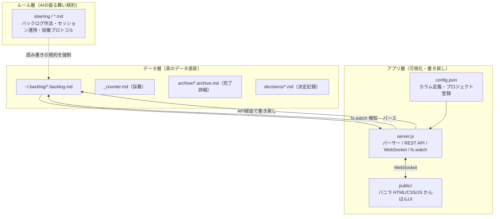
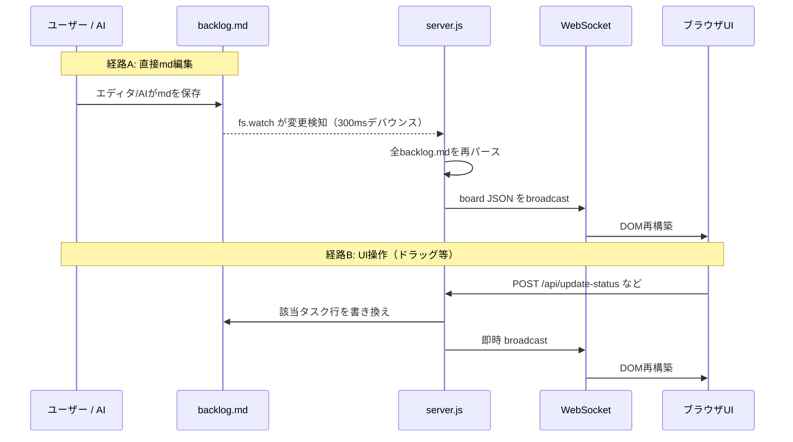
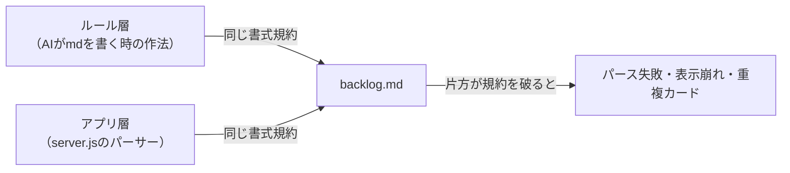
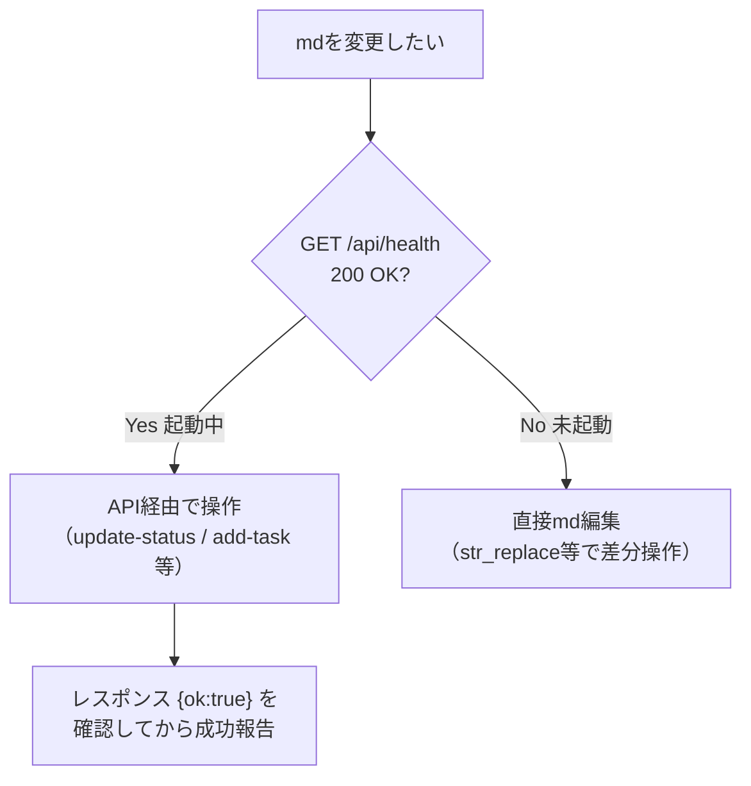
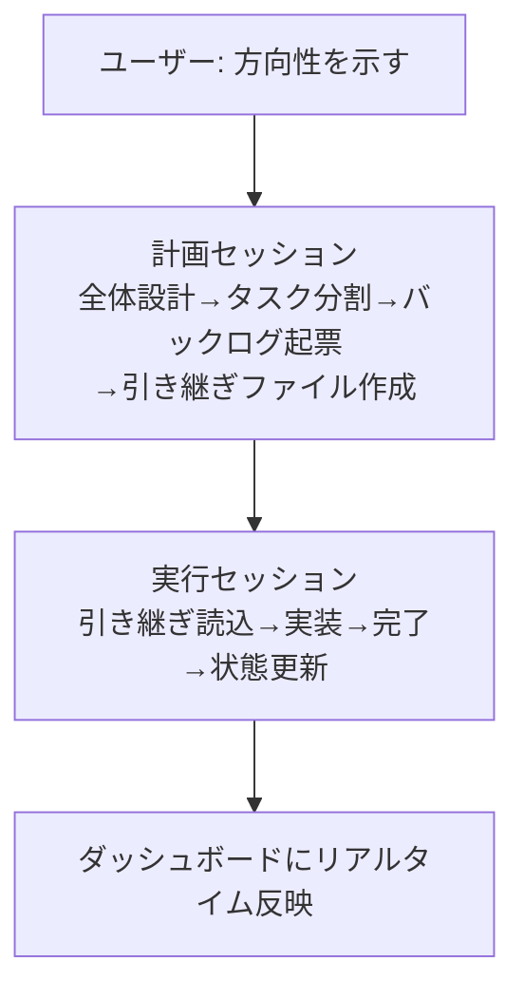
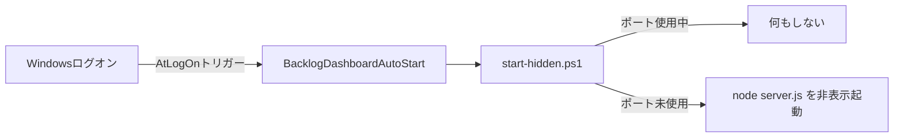

# backlog-dashboard 設計書

<div style="text-align: right;">
作成者: hidep-hub<br>
作成日: 2026-07-26<br>
版数: 1.0
</div>

---

## 0. この文書について

### 0.1 これは何のためのシステムか

AIエージェントとの協働開発は、便利になった一方で新しい悩みも連れてきた。

- 「今このAIは、何をどこまでやってくれているのか」が、チャットのスクロールの中に埋もれて見えなくなる
- 会話の途中で浮かんだ「あ、これもやっといて」という思いつきが、拾われずに流れて消えていく
- 1つのチャットスレッドに次々と作業を積み重ねるうちにコンテキストが膨れ上がり、AIの応答の質そのものが落ちていく

`backlog-dashboard` は、この3つの悩みに向き合うための仕組みである。

- **やりたいことを、計画してからタスクに分ける。** 大きな「やりたいこと」はまず一緒に整理し、実行できる粒度に分解してバックログへ起票する。作業の合間にこぼれ落ちる追加の要望やアイデアも、「🔥次やる」「💡アイデア／保留」としてその場で拾い、迷子にしない。
- **AIがいま何をしているかを、目で見える形にする。** タスクに「実行中」フラグを立てると、ダッシュボード上でカードがグローして光る。頼んだ作業が本当に動いているのか、チャットを遡って確認する必要はない。
- **1タスク＝1セッションを基本にして、AIのコンテキストを軽く保つ。** タスクIDを指定してセッションを始めれば、AIはそのタスクに必要な文脈だけを読み込んで着手できる。余計な過去のやり取りを背負わせないことが、そのまま応答の質を守ることにつながる。
- **タスクの実体は、ただのMarkdownファイル。** データベースも専用フォーマットも持たない。ダッシュボードはそれを映して整える窓であり、真実は常に人にもAIにも読み書きできるテキストの側にある。

つまり `backlog-dashboard` は、単なるToDo管理ではない。**AIと人間が同じ土俵で「やりたいこと」を計画し、進捗を分かち合い、コンテキストを軽く保ちながら、目的に向かって協働し続けるための基盤**である。

### 0.2 いちばん大事な考え方

このシステムの本質は、次の一文に集約される。

> **テキスト（Markdown）が真のデータ。アプリはそれを映す窓。ルールはその窓とデータの整合を保つ約束事。**

- **データ層（md）**: `~/.backlog/*.backlog.md` が唯一の真実。
- **アプリ層（dashboard）**: データ層をパースして可視化し、API経由で書き戻す窓。
- **ルール層（AIの振る舞い規約）**: 窓とデータの書式整合を保つための約束事。

3層のうち、どれか1つが規約を破ると、パーサーが誤動作するか、表示が壊れる。

### 0.3 スコープと前提

| 項目 | 内容 |
|------|------|
| 対象バージョン | `backlog-dashboard` v1.0.0 |
| データ配置 | `~/.backlog/*.backlog.md`（`config.json` の `backlogDir` で変更可） |
| ランタイム | Node.js（標準ライブラリ + `ws` パッケージ1個のみ） |
| ネットワーク | localhost 完結（外部サービス不要） |

---

## 1. システム全体アーキテクチャ

### 1.1 3層構造



- **AIエージェント**と**アプリ**は、どちらも同じ Markdown を読み書きする。
- 両者が「同じ書式規約」を守るからこそ、パーサーが壊れずに動く（詳細は第5章）。

### 1.2 リアルタイム更新のデータフロー



2経路とも**最終的に md が真実**で、UI はそれを再描画するだけ。UI に状態を溜め込まない設計になっている。

---

## 2. データ契約：バックログ Markdown フォーマット仕様

パーサー（`server.js`）はこの書式を厳密に前提としており、**1文字でも崩れると認識されない**箇所がある。

### 2.1 ディレクトリ構成

```
~/.backlog/
├── 00_index.md                  ← ハブ（任意・人間用の目次。アプリ非対象）
├── _counter.md                  ← ID採番カウンター（アプリが自動管理）
├── <project>.backlog.md         ← プロジェクトごとのバックログ本体
├── inbox.backlog.md             ← 未分類タスク置き場（アプリが自動生成）
├── archive/
│   └── <project>.archive.md     ← 完了チケットの全文（詳細退避先）
└── decisions/
    └── <ID>.md                  ← 決定記録（ADR、アプリ非対象）
```

- パーサーが走査するのは `*.backlog.md` のみ。`archive/` は完了タスクの詳細補完のために別途読まれる。`decisions/` はアプリ非対象（リンクで辿るだけ）。

### 2.2 ファイル構造テンプレート

```markdown
# <プロジェクト名> バックログ
<div style="text-align: right;">最終更新：YYYY-MM-DD</div>
- **目的**: <一行説明>
- **ワークスペース**: <ワークスペース名>
---
## 🔥 次やる（おすすめ順）

### [KT-007] デプロイフロー整備
- 状態: 進行中
- 担当: 担当者A
- 開始日: 2026-07-01
- 期日: -
- 分類: 改善
- 説明: リポジトリと本番の乖離を解消する
- 成果物: docs/plans/deploy.md, backlog-dashboard/server.js

#### [KT-008] SSH鍵配置（親:KT-007）
- 状態: 完了
- 分類: 改善
- 説明: デプロイ用の鍵をサーバーに配置

## 💡 アイデア／保留
（現在なし）

---
## ✅ 完了（アーカイブ）

| 完了日 | 親 | ID | 件名 |
|---|---|---|---|
| 2026-07-01 | - | KT-001 | 初期構築 |
```

### 2.3 パーサーが依存する厳密ルール（★崩すと壊れる）

| 要素 | 必須の形 | 崩すとどうなるか |
|------|---------|-----------------|
| プロジェクト名 | `# <名前> バックログ`（末尾「バックログ」で判定） | 表示名がファイル名になる |
| セクション見出し | `## 🔥` / `## 💡` / `## ✅`（絵文字で判定） | セクション未認識 → タスクが未着手/保留に誤分類 |
| 親タスク | `### [ID] 件名`（角括弧必須） | `### ID 件名` は認識されない |
| 子タスク | `#### [ID] 件名（親:親ID）`（角括弧＋親表記） | 子として集約されない |
| フィールド | `- キー: 値`（太字禁止） | `- **状態**:` は認識されない |
| 完了テーブル行 | `\| YYYY-MM-DD \| 親 \| ID \| 件名 \|`（先頭セルが日付） | 完了カードにならない |

> 全角コロン `：` と半角コロン `:` はどちらも許容される（正規表現 `[:：]`）。ただし絵文字と角括弧は代替不可。

### 2.4 タスクフィールド一覧（パーサー対応キー）

`server.js` の `parseBacklogFile` が解釈するキーは以下がすべて。これ以外のキーは無視される。

| キー | 型 / 値 | 用途 | 備考 |
|------|---------|------|------|
| `状態` | `保留`/`未着手`/`未着手（素材あり）`/`進行中`/`完了` | カラム振り分け | 値は config の `columns[].match` と連動 |
| `分類` | 自由文字列 | カテゴリタグ | 調査/機能追加/バグ修正/改善/設計 等 |
| `説明` | 複数行可 | 本文 | 次行が `-`/`#`/空行でなければ継続行として取り込む |
| `担当` | 自由文字列 | assignee | |
| `開始日` | `YYYY-MM-DD` or `-` | startDate | |
| `期日` | `YYYY-MM-DD` or `-` | dueDate | |
| `起源` | `user` / `claude` | 起票者マーク（👤/🤖） | |
| `成果物` | カンマ区切りパス | 関連ファイル | `path1, path2, dir/*` |
| `完了日` | `YYYY-MM-DD` | completedDate | 完了時にアプリが自動付与 |
| `今日やる` | `true` | 今日やるフラグ（📌） | アプリがトグル管理 |
| `実行中` | `true` | 実行中フラグ（グロー表示） | アプリがトグル管理 |

### 2.5 ID体系と採番

- 形式: **ワークスペースプレフィクス（2英大文字）+ 3桁通番**。例 `KT-001`, `BL-007`, `GW-003`。
- 採番は `_counter.md` で管理。フォーマット:

```markdown
# Backlog Counter

| prefix | next |
|--------|------|
| KT | 059 |
| BL | 013 |
```

- カウンターが無い/空の場合、アプリが全 `*.backlog.md` を走査し `[XX-NNN]` の最大値を検出、`max + 1` で初期化する（`initCounter`）。
- `config.json` の `projects[]` に定義が無いのに `_counter.md` 側には存在するプレフィクスがあっても、`writeCounter` はそれを削除せず書き出し続ける（過去に使われていたプロジェクトの残骸を保持する挙動）。

### 2.6 親子・Epic の扱い

- **子を持つ h3 = Epic（親）**。子の有無で自動判定される。
- 親のステータスは**明示値ではなく子から自動計算**される（`computeParentStatus`、詳細は 3.3）。
- 親には進捗バッジ `[完了数/全数]` が集約表示される。

### 2.7 完了・アーカイブ運用

完了時の md 操作は「タスクの種類」によって異なる（ダッシュボード表示の重複を防ぐため）。

| タスク種別 | 完了時のブロック操作 | 完了テーブルへの1行追加 |
|-----------|--------------------|----------------------|
| h3 単発（子なし親なし） | 🔥/💡 から削除 | **する**（完了日必須） |
| h4 子タスク | **削除しない**（`状態:完了` のまま残す） | しない |
| h3 Epic（子あり親） | 残す（子を保持するため） | しない |

> **なぜ h4 を残すのか**: 完了テーブルの各行は独立カードとして描画される。h4 子タスクはブロックが親にネストされ重複排除されないため、テーブルにも足すと完了カラムに**重複した単品カード**が出てしまう。

- 完了チケットの**全文**は `archive/<project>.archive.md` に `## [ID] 件名` 形式で退避する。アプリはここから完了タスクの説明・成果物・分類・担当を補完マージする（`mergeArchiveDetails`）。
- なお、アプリが未起動時に自動生成する `inbox.backlog.md` のテンプレート（`INBOX_TEMPLATE`）は、完了テーブルの見出しが `| 完了日 | EP | ID | 件名 |` のまま歴史的に "EP"（Epicの略と思われる）という古い列名を引きずっている。パーサーは列の見出し文字列自体を見ないため実害はないが、他のテンプレート・実データが `親` 列に統一済みであることを踏まえると、いずれ揃えるのが望ましい。

### 2.8 決定記録（ADR）と引き継ぎファイル連携

これらはアプリの機能ではなく**ルール層の運用**である。

- **決定記録**: `decisions/<ID>.md` に「症状・原因・検討案・決定と理由・対応内容」を残す。バックログ本体の説明欄に `- 決定記録: decisions/<ID>.md` とリンクを書く。
- **引き継ぎファイル**: セッション分割時のコンテキスト復元用ガイド。説明欄に `- 説明: 引き継ぎ: docs/plans/xxx.md` のようにパスを書くと、AI が「そのIDやって」で自動的に辿れる。

---

## 3. アプリ層仕様（server.js）

### 3.1 技術スタック

| 項目 | 内容 |
|------|------|
| ランタイム | Node.js |
| 外部依存 | `ws`（WebSocket）1個のみ |
| HTTP | 標準 `http` モジュール |
| ファイル監視 | 標準 `fs.watch`（300ms デバウンス） |
| フロント | フレームワークなし。バニラ HTML/CSS/JS |

### 3.2 config.json スキーマ

```json
{
  "columns": [
    {
      "id": "in_progress",
      "label": "🟡 進行中",
      "match": ["進行中"],
      "visibleFields": ["id", "title", "badge", "project", "category"]
    },
    {
      "id": "done",
      "label": "✅ 完了",
      "match": ["完了"],
      "limit": 5,
      "compact": true,
      "visibleFields": ["id", "title", "completedDate"]
    }
  ],
  "port": 3333,
  "backlogDir": "~/.backlog",
  "projects": [
    { "file": "your-project", "prefix": "YP", "name": "your-project", "workspace": "C:/dev/your-project" }
  ]
}
```

| キー | 説明 |
|------|------|
| `columns[].match` | この配列の値と md の `- 状態:` を突き合わせてカラム振り分け。**正当なステータス値の定義元**でもある（3.6） |
| `columns[].limit` | 表示件数上限（超過分は「他N件」に畳む） |
| `columns[].compact` | 完了カラム等のコンパクト表示・日付降順ソート |
| `columns[].visibleFields` | カードに表示する項目 |
| `port` | リッスンポート（既定 3333） |
| `backlogDir` | バックログmdのディレクトリ。`~` はホームに展開 |
| `projects[]` | `file`（ファイル名）↔ `prefix`（採番）↔ `name`（表示名）↔ `workspace`（パス）の対応 |

> **注意**: 正当なステータス値の集合は、実質的に **config駆動（`isValidStatus` が `columns[].match` から動的生成）** と **コード内固定（`STATUS_ORDER` のハードコード、3.3節）** の二重管理になっている。config側でステータス値を追加した場合、バリデーションは通るが、`STATUS_ORDER` に無い値は `getStatusRank` がデフォルトで rank=1（`未着手`相当）にフォールバックする。ステータス値を拡張する際はこの二重管理を意識すること。

### 3.3 パーサーのコアロジック

**ステータス進捗順序**（親ステータス自動計算に使用。`STATUS_ORDER` としてコード内に固定定義）:

```
保留(0) < 未着手(1) < 未着手（素材あり）(2) < 進行中(3) < 完了(4)
```

**親ステータス計算（`computeParentStatus`）**:

1. 子が全員 `完了` → 親も `完了`
2. そうでなければ → 「完了を除いた子の最大進捗」と「親の明示ステータス」の**大きい方**を採用

**集約処理**: 親に `childrenTotal` / `childrenDone` / `todayCount`（子の📌数）を付与。子のいずれかが `実行中` なら親にも伝播（表示上の伝播のみで、mdへの書き込みは発生しない）。

**重複排除**: 同一IDが複数箇所にある場合、`説明`・`成果物`・`子` の有無でスコアリングし**詳細な方を優先**。`完了日` だけは失われないよう引き継ぐ。

**アーカイブマージ**: `archive/*.archive.md` を読み、完了タスクに説明・成果物・分類・担当を補完。

**board JSON の構造（`buildBoard`）**: API `GET /api/board` が返すJSONは `columns`（カラムごとのタスク配列）だけでなく、以下のフィールドも持つ。

| フィールド | 内容 |
|-----------|------|
| `columns[]` | カラムごとの `id` / `label` / `match` / `items[]` / `totalCount` / `limit` / `visibleFields` / `compact` |
| `projects[]` | 全タスクから抽出したプロジェクト表示名の一覧 |
| `remainingByProject` | プロジェクト別の残タスク数（完了以外のh3タスク数） |
| `updatedAt` | ビルド時刻（ISO文字列） |
| `workspaceMap` | プロジェクト表示名 → ワークスペースパスのマッピング |
| `workspaceFilterMap` | ワークスペース識別子（file名/name/パス末尾ディレクトリ名）→ プロジェクト表示名のマッピング（`?workspace=xxx` フィルタで使用） |

### 3.4 REST API 一覧

| メソッド / パス | ボディ | レスポンス | 動作 |
|----------------|--------|-----------|------|
| `GET /api/health` | - | `{status:"ok", uptime}` | **起動確認はこれを使う** |
| `GET /api/board` | - | board JSON全体（3.3節） | 全タスクをパースして返す |
| `POST /api/update-status` | `{taskId, newStatus, isChild?}` | `{ok:true}` | 状態変更。`完了`時はフラグ解除＋完了日付与 |
| `POST /api/reorder` | `{orderedIds[], isChild?, parentId?}` | `{ok:true}` | 並び替え |
| `POST /api/toggle-today` | `{taskId, isChild?, value?}` | `{ok:true, taskId, todayFlag}` | 今日やるフラグ。親は子を一括操作 |
| `POST /api/toggle-running` | `{taskId, isChild?, value?}` | `{ok:true, taskId, running}` | 実行中フラグ（単体・伝播なし） |
| `POST /api/add-task` | `{title, project?, status?, origin?, parentId?}` | `{ok:true, id}` | タスク追加。`parentId`指定で子タスク |

- 書き込み系 API は処理後に即 `broadcast` して UI を更新する。
- リクエストボディは `Content-Type` ヘッダを検査せず、受信したチャンクを結合して `JSON.parse` するのみ。Windows PowerShell の `Invoke-RestMethod` で日本語ボディが文字化けする問題は、サーバー側APIの制約ではなく**クライアント側（PowerShellのエンコーディング挙動）に起因**する既知の落とし穴であり、3.6節のバリデーションがそれを検知する安全網になっている。

### 3.5 完了時の自動処理（`updateTaskStatus`）

`newStatus === '完了'` のとき、該当ブロック内で:

1. `- 今日やる: true` 行を削除
2. `- 実行中: true` 行を削除
3. `- 完了日: YYYY-MM-DD` を付与（**JST**。`UTC+9` で算出）。既存があれば上書き

`完了`以外に変更した場合は `- 完了日:` 行を削除する。

### 3.6 ステータスバリデーション

`config.columns[].match` に定義された値だけを正当なステータスとして受理する（`isValidStatus`）。これは PowerShell の `Invoke-RestMethod` 等でリクエストボディの日本語が文字化けし、`???` のような不正値が md に書き込まれる事故を防ぐためのガード。`update-status` と `add-task` の両方で検証し、未知の値は 400 で弾く。

### 3.7 採番・追加・並び替えの挙動

- **add-task**: `🔥` セクションを探し、次の `##` セクションの直前に挿入。プロジェクトファイル名→prefix を解決して `allocateId` で採番。プロジェクト未特定なら `inbox.backlog.md`（無ければ自動生成）へ。
- **add-child-task**: 親 h3 を見つけ、その範囲末尾に h4 を挿入。
- **reorder（h3）**: 複数ワークスペース（複数ファイル）にまたがりうるため、「このファイルに存在する対象IDの相対順だけ」を最小限反映する方式。対象外ブロックは元位置に据え置く。
- **reorder（h4）**: 親配下の h4 ブロックを並べ替える。

### 3.8 WebSocket とファイル監視

- 接続時に現在のボードを送信。
- `fs.watch` が `*.backlog.md` の変更を検知 → 300ms デバウンス → 再パース → 全クライアントに broadcast。
- 切断時、フロントは3秒間隔で自動再接続。

---

## 4. フロントエンド機能仕様（public/）

UI はフレームワーク非依存のバニラ HTML/CSS/JS（`index.html` / `style.css` / `app.js`）で構成される。以下、機能ごとの意図と実装を示す。

### 4.1 ＋ボタン（タスク追加）— 3種類の配置

「思いついた瞬間に、その場で起票できる」ための導線。文脈に応じて3種類が出る。

| 場所 | クラス | サイズ | 挙動 |
|------|--------|--------|------|
| カラムヘッダー右 | `.add-task-btn` | 20px | そのカラムの状態を初期値にフォームを開く。ホバーで `scale(1.1)` |
| Epicミニボードのカラム | `.add-task-btn-mini` | 14px | 親IDを引き継いで**子タスク**を追加 |
| カード詳細モーダル内 | `.add-child-btn` | ボタン | 「＋ 子タスクを追加」。破線枠、ホバーで塗り |

- フォーム（`.add-task-modal`）はタイトル・ワークスペース・ステータスを選べる。子タスク追加時はワークスペース選択を `disabled` にしてタイトルを「子タスク追加 (親ID)」に切り替える。
- Enterキーで送信、送信後は自動クローズ。起票は `origin: 'user'` で記録される。

### 4.2 フィルタ群 — 4種の絞り込みが独立動作

| フィルタ | UI | 状態の持ち方 | 挙動 |
|---------|----|-----------|----|
| プロジェクト | ヘッダーのセレクト + 残数バッジ | sessionStorage | バッジは残タスク数を丸バッジで表示。**同じバッジ再クリックで解除**（トグル）。選択中は `active`、非選択は `dimmed` |
| ワークスペース連携 | `?workspace=xxx` URLパラメータ | sessionStorage優先 | 優先順位: **手動選択の記憶 > URLパラメータ > All**。ファイル名/表示名/パス末尾ディレクトリ名のどれでもマッチ |
| 今日やる | ヘッダーの 📌 ボタン | localStorage | 「今日やる」フラグの立つタスク（Epicは子の集約 `todayCount`）だけ表示。`filter-active` で赤く点灯 |
| 達成感モード | 完了カラムの「🎉 今日」チップ | localStorage | 本日完了（JST）分だけに絞る。メインとミニボードで状態を**共有**して同期 |

- プロジェクトフィルタは**バッジとセレクトが双方向連動**する（片方を操作すると他方も追従）。

### 4.3 表示件数コントロール（limit / 他N件）

完了カラムのように件数が膨らむカラム向けの畳み込み。

- カラムヘッダーに数値入力（`.limit-input`）。上限を超えた分は「**他 N 件**」まとめカード（`.card-summary`、破線＋シェブロン `▾`）に畳む。
- クリックで全件展開、展開中は「**折りたたむ**」カード（`▴`）に切り替わる。件数は localStorage にカラム単位で永続化。
- ミニボードにも同等の仕組み（`mini-` プレフィクスの別キー）。

### 4.4 ドラッグ&ドロップ — 状態変更と並び替えの同時実行

単なる並び替えではなく、**列をまたぐと状態変更＋その位置への挿入**まで一気にやる。

- ドラッグ中: 掴んだカードは `card-dragging`（半透明＋影）。
- ドロップ位置インジケータ: カード上下に `card-drop-above` / `card-drop-below`（アクセント色の線）。別カラムに入ると `drop-over`（破線ハイライト）。
- 同一カラム内 → `reorder` のみ。別カラムへ → `update-status` 後に `reorder` を連鎖実行。
- ドロップ時の `clientY` はブラウザ差で不安定なため、**`dragover` で計算した最後のターゲット位置を記憶して使う**という安定化の工夫が入っている。

### 4.5 Epic ミニボード（★特にこだわった箇所）

親カード（Epic）を開くと、モーダルが `modal-wide`（860px）に広がり、**子タスクだけのミニかんばん**が中に描画される。

- メインボードと同じカラム構成を継承。完了カラムは日付降順＋同日ID降順ソート。
- ミニボード内でも**ドラッグ&ドロップ・limit畳み込み・達成感モード・📌ピン・＋子タスク追加**がすべて動く（メインの機能をスケールダウンして再現）。
- 達成感モードのトグルはメインボードと状態共有し、片方を切り替えると両方を再描画して同期する。
- 子カード（`.card-child`）は専用の小型スタイルで、密集しても見やすいようフォント・余白・スピナー幅を個別に絞っている。

> ミニボードは「メインボードの全機能を、モーダル内の狭い領域で破綻なく再現する」のが難所だった。DnDのドロップゾーン設定・limitキーの名前空間分離・達成感モードの状態共有が、それぞれ独立して効くよう作り込んである。

### 4.6 実行中インジケータ（★スピナーのこだわり）

いま AI が着手中のタスク（`実行中: true`）を、ひと目で分かるよう**2種類の演出を重ねて**強調する。

1. **回転スピナー**（`.running-spinner`）: 10px のリング。`spin 0.8s`（回転）と `ring-pulse 1.6s`（周囲の光彩点滅）の**二重アニメーション**。カードID横・詳細モーダルヘッダー・ミニボード子カードにそれぞれ最適サイズで配置（ミニは7px）。
2. **縁を回る光**（`.card.is-running`）: `@property --border-angle` で角度をアニメーション可能にし、`conic-gradient` の光がカードの縁を 3.5秒でぐるっと一周する。色はプロジェクトカラー（`--running-color`）に追従、無ければアクセント色。

> `is-running::before` の `z-index: -1` が祖先要素の背面まで突き抜けて光が見えなくなる問題があり、カード自身に `z-index: 0` でスタッキングコンテキストを作って封じ込めた。この z-index 格闘の経緯はCSSコメントに残してある。

### 4.7 今日やるピン（📌）

- カードホバーで薄く出現（`opacity 0 → 0.3`）、ボタン自体のホバーで `0.7`、アクティブ時は固定表示＋赤（`pin-active`）。
- 単発タスクは自身をトグル。**Epicは 📌n 表示で、配下の子を一括ON/OFF**する。
- 今日やるフラグの立ったカードは左ボーダーが赤＋淡い背景（`.card-today`）で、フラグ無しと視覚的に区別される。

### 4.8 その他の作り込み

| 要素 | 内容 |
|------|------|
| Epicカードの重なり表現 | `box-shadow` で背後に段違いのカードを2枚描画し「集合体」を表現（z-index不使用で確実に表示）。ハブアイコン `⧉` 付き |
| 進捗バッジ | GitHub風ピル `[完了/全数]`。全完了で緑（`badge-done`） |
| 起源マーク | 👤 user / 🤖 claude をカードIDの隣に表示 |
| 成果物 | カードに 📎 インジケータ。詳細モーダルでフルパス表示＋**ワンクリックでパスコピー**（✓フィードバック） |
| カード詳細モーダル | スライドインアニメーション。子タスクは親モーダルの上に**重ねて**開く（`z-index:1100`）。Escで閉じる |
| 達成感の空状態 | 本日完了ゼロのとき「🌱 今日の達成はまだないよ ひとつ片付けてこ！」と励ます |
| テーマ変更（経路1） | ヘッダーの `theme-select`（Dark / Light / System） |
| テーマ変更（経路2） | ⚙ 設定ボタン → オーバーレイパネル（`settings-theme` / `settings-accent`）。アクセントカラーも自由設定可能。どちらの経路もlocalStorage永続化で同期する |
| プロジェクト色 | カード左ボーダーをプロジェクトごとに色分け。実行中グローの色にも連動 |
| 接続ステータス | 右上に connected / reconnecting を色付き表示。切断時は3秒間隔で自動再接続 |

---

## 5. ルールとアプリの協働制約

**同じ md を、AI（人）とアプリの両方が読み書きする**ため、両者が同じ書式規約を守らないと壊れる。

### 5.1 なぜ整合が必要か



例えば、ルールが「太字禁止」を守らず AI が `- **状態**: 進行中` と書くと、パーサーの `- キー: 値` 正規表現にマッチせず、そのタスクが未着手扱いになる。**ルールはパーサーの前提を人間・AI側に強制する装置**である。

### 5.2 書式規約の対応表（ルール ⟷ パーサー）

| ルールが強制すること | パーサーがそれを前提にしている箇所 |
|--------------------|--------------------------------|
| セクションは 🔥/💡/✅ の絵文字必須 | `sectionMatch` が絵文字でカラム判定 |
| タスクヘッダーは `[ID]` 角括弧必須 | `### \[([^\]]+)\]` 正規表現 |
| 子タスクは `（親:親ID）` 表記 | 子タイトルから親表記を除去する処理 |
| フィールドは `- キー: 値`（太字禁止） | `- (.+?)[:：] (.*)` 正規表現 |
| 状態値は既定5種のみ | `VALID_STATUSES`（config由来）で検証 |
| 完了テーブルは `\|日付\|親\|ID\|件名\|` | 完了行パース（先頭セルが日付） |
| h4完了はブロックを残す | 重複排除ロジックが親ネストを前提 |

### 5.3 操作手段の使い分け（ルールで規定）



- **起動確認は必ず `GET /api/health`**（200なら起動、接続エラーなら未起動）。
- 起動中は API 経由が原則（パーサーの整合を壊さず、即 broadcast されるため）。
- 未起動時のみ直接 md 編集にフォールバック。
- **API/コマンド実行後は必ずレスポンスを確認**してから成功/失敗を報告する（推測で「成功」と言わない）。

### 5.4 文字化け対策（Windows PowerShell 環境）

PowerShell 5.1 の `Invoke-RestMethod` は日本語ボディを ANSI 変換で文字化けさせる既知バグがある。日本語を含む API 呼び出しは UTF-8 バイト配列に変換して送るヘルパー経由にする。サーバー側の 3.6 バリデーションは、この文字化けを検知するセーフティネットにもなっている。

---

## 6. AIエージェント協働プロトコル

ルール層の「AIが自律的に何をやるか」の定義。

### 6.1 AIエージェントがやること



- 作業が大きければ「計画セッションにしよう」と提案
- 計画後はバックログに起票（説明欄に引き継ぎファイルパスも記載）
- セッションが長くなれば（目安10往復）「切る？」と提案
- タスクID指定で再開できる（下記フロー）
- 完了すればバックログ更新＋作業記録

### 6.2 タスクID指定での再開フロー（★最優先アクション）

「KT-030やって」のようにタスクIDで指示された場合の**必須シーケンス**（最初の応答で実行）:

1. バックログからそのタスクの説明欄を読む
2. **即座に** 状態を `未着手`→`進行中` に変更（`POST /api/update-status`）
3. **即座に** 実行中フラグを立てる（`POST /api/toggle-running, value:true`）
4. 説明欄に引き継ぎファイルパスがあれば自動読込
5. コンテキスト復元して作業開始

> ステータス変更・実行中フラグは「確認フェーズ」であっても後回し厳禁。IDで指示された時点で先に立てる。

### 6.3 スコープ逸脱の検知

タスクID起点のセッションで、要望が元タスクの範囲を明らかに超える場合（別機能・別画面・別APIエンドポイント追加など）は、「別タスクに切る？」と提案する。軽微な調整（実装中のバグ修正・関連CSS微調整）はスコープ内として続行。

### 6.4 バックアップ・安全作法

- ファイル書き換え前にバックアップ（`.bak`）と切り戻し手順を用意
- 重要ファイル（`config.json` 等）は上書き前に `.bak` 必須
- うまくいかない時も正直に報告する

---

## 7. Windows起動時の自動起動（任意機能）

VSCodeのワークスペースを開かなくても、PC起動直後からWEB-UIだけで思いついたTODOを追加・整理できるようにするための仕組み。VSCode連動（ワークスペースを開いたときだけ起動する方式）ではなく、**Windowsのログオンに紐づく常時起動**を採用している。理由は、この仕組みの価値が「開発中だけ」ではなく「AIと繋がっていない移動中や会議中でも、思いついたことをその場で書き留められる」点にあるため。

### 7.1 構成

```
backlog-dashboard/
├── scripts/
│   ├── start-hidden.ps1              ← 二重起動防止つきの非表示起動ラッパー
│   ├── register-startup-task.ps1     ← タスクスケジューラへの登録（要管理者権限）
│   └── unregister-startup-task.ps1   ← タスクスケジューラからの解除
└── logs/
    └── startup.log                    ← 起動/スキップの実行ログ
```

### 7.2 二重起動防止

`server.js` 自体には `EADDRINUSE`（ポート使用中）のハンドリングが無く、既に起動中の状態で `node server.js` を実行すると素朴にクラッシュする。これを踏まえ、二重起動防止はサーバー本体ではなく**起動側（`start-hidden.ps1`）の責務**とした。

- `Get-NetTCPConnection -LocalPort <port> -State Listen` でLISTEN状態を確認
- 使用中なら何もせず終了（ログに記録するのみ）
- 未使用なら `node.exe` のパスを解決し、`Start-Process -WindowStyle Hidden` でコンソール窓を出さずに起動

### 7.3 タスクスケジューラ登録



- `register-startup-task.ps1` が `New-ScheduledTaskTrigger -AtLogOn` でログオントリガーのタスクを登録する。
- **`Register-ScheduledTask` はタスクスケジューラのルートフォルダへの書き込みを伴うため管理者権限が必須**。通常権限のPowerShellで実行すると `Access is denied` で失敗する（この失敗はエラー終了ではなく非終端エラーのため、後続の `Write-Host` は実行されてしまい、一見成功したように見える点に注意。`Get-ScheduledTask` で実際の登録有無を必ず確認すること）。
- 管理者権限が無い環境では `Start-Process powershell -Verb RunAs -ArgumentList "... -File <register-startup-task.ps1>" -Wait` でUAC昇格して実行する。
- 解除は `unregister-startup-task.ps1`（`Unregister-ScheduledTask`）。

### 7.4 install-backlog-hub skillとの連携

新規インストール時、`scripts/` 一式は同梱物としてそのままコピーされ、自動起動を希望するかどうかをユーザーに確認した上で `register-startup-task.ps1` を案内する（`.claude/skills/install-backlog-hub/SKILL.md` 2章参照）。既存ダッシュボードへのワークスペース追加登録時は、サーバープロセス自体は変わらないため対象外。

## 付録A: 用語

| 用語 | 意味 |
|------|------|
| Epic | 子タスク（h4）を束ねる親タスク（h3）。進捗バッジ `[n/m]` を持つ |
| 起源 | タスクの起票者（`user` / `claude`） |
| 達成感モード | 完了カラムを「本日完了分」だけに絞る表示（🎉） |
| 実行中フラグ | AIがいま着手中のタスクを示すマーク（グロー点滅） |
| 引き継ぎファイル | セッション分割時のコンテキスト復元ガイド（`docs/plans/*.md`） |
| 決定記録（ADR） | チケット単位の「原因・検討・決定と理由」の記録（`decisions/<ID>.md`） |
