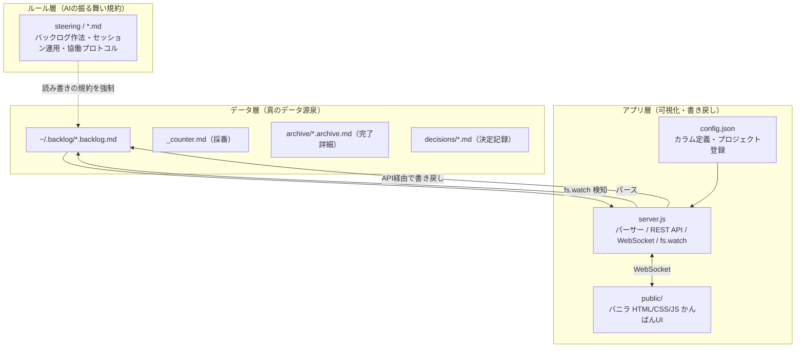
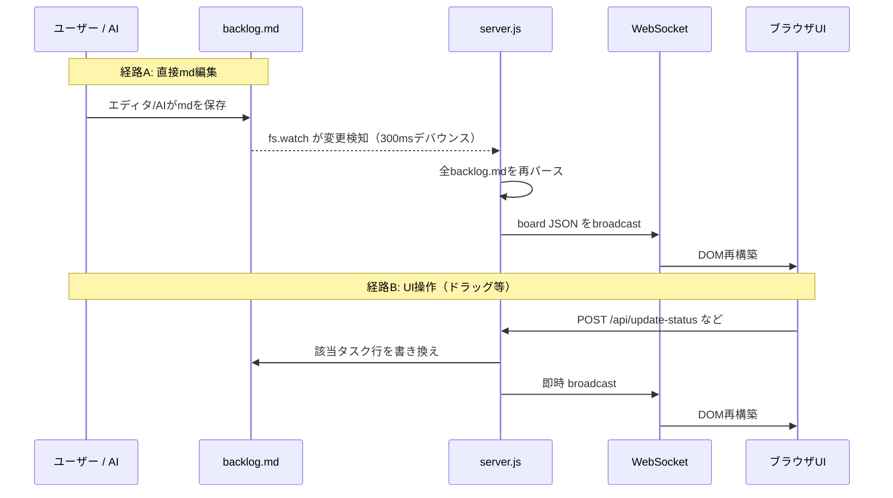
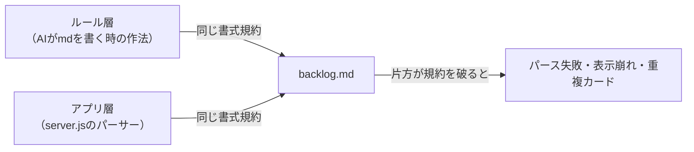
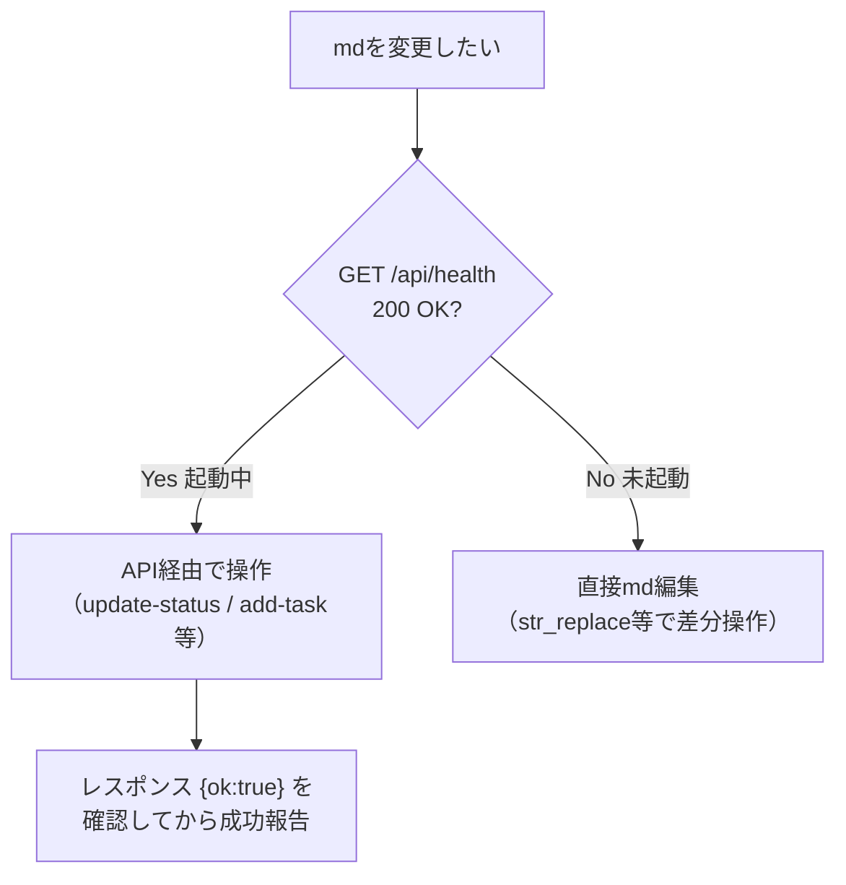
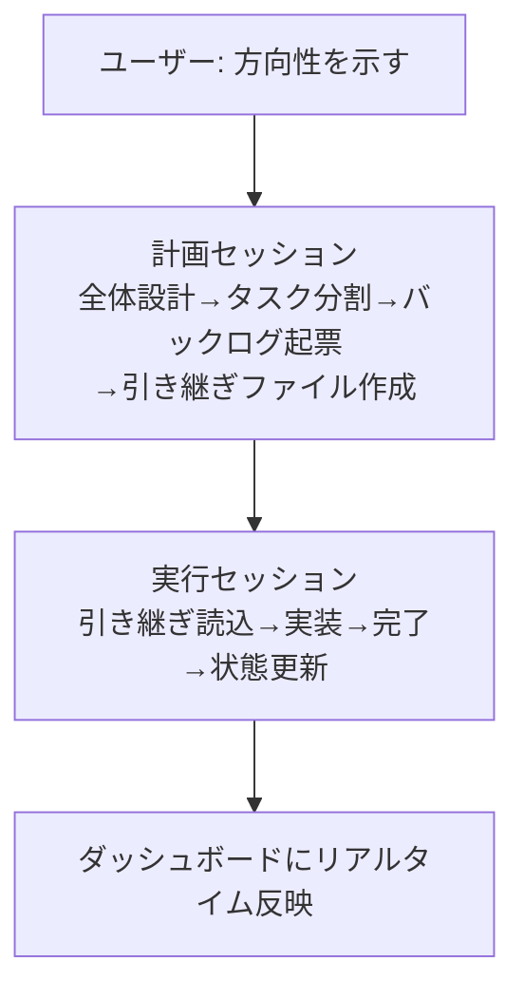

# バックログ管理システム 移植仕様書（自己完結版・コード同梱）

<div style="text-align: right;">
作成者: hidep-hub（伴奏支援 Kiro）<br>
作成日: 2026-07-21<br>
更新日: 2026-07-21<br>
版数: 2.0（自己完結版）
</div>

---

## 0. この文書について

### 0.1 目的

本書は `backlog-dashboard`（Markdownベースのバックログ管理システム）の**現時点の仕様をソースコードから起こした一次資料**であり、同時に **Kiro 以外の AI 開発環境（主に VS Code の Claude Code 拡張 / Codex 拡張）へ移植するための設計図** である。

**本書はこの1ファイルで自己完結する。** 付録C（第9章）に全ソースコードを丸ごと同梱しているため、別途ソースファイルを配布・添付する必要はない。読者（または読者が使うAI）は、本書だけを頼りに、かんばんUIの作り込みまで含めて同等のバックログ管理を再現できる。移植ガイド（第7章）は Claude Code 拡張と Codex 拡張を具体的な対象として記述する。

> **✅ 再現のしかた：本書 付録C のコードを、そのままファイルとして書き出す。**
> UI（`public/` の app.js / style.css / index.html）とサーバー（`server.js`）は、**文章から推測して書き直すのではなく、付録Cの実コードをそのまま復元**すること。実行中スピナーの二重アニメ、縁を回る光（conic-gradient + `@property`）、Epicカードの重ねシャドウ、ミニボードのドラッグ&ドロップ安定化といった作り込みは、付録Cのコードを忠実に再現すればそのまま得られる。本文（第1〜6章）は「なぜそう動くか」の理解のため、付録Cは「何を書けばよいか」の正解である。**本文の説明と付録Cのコードが食い違う場合は、付録Cのコードを正とする。**

### 0.2 いちばん大事な考え方

このシステムの本質は、次の一文に集約される。

> **テキスト（Markdown）が真のデータ。アプリはそれを映す窓。ルールはその窓とデータの整合を保つ約束事。**

移植とは、この3つ（データ・アプリ・ルール）のうち、

- **データ層（md）とアプリ層（dashboard）はほぼそのまま流用でき**、
- **ルール層（AIの振る舞い規約）だけを移植先ベンダーの作法に翻訳する**

という作業に他ならない。本書はその切り分けを明示する。

### 0.3 スコープと前提

| 項目 | 内容 |
|------|------|
| 対象バージョン | `backlog-dashboard` v1.0.0（本書作成時点のソース） |
| データ配置 | `~/.backlog/*.backlog.md`（移植先では任意ディレクトリに変更可） |
| ランタイム | Node.js（標準ライブラリ + `ws` パッケージ1個のみ） |
| ネットワーク | localhost 完結（外部サービス不要） |

---

## 1. システム全体アーキテクチャ

### 1.1 3層構造



- **AI エージェント**（Kiro 等）と**アプリ**は、どちらも同じ Markdown を読み書きする。
- 両者が「同じ書式規約」を守るからこそ、パーサーが壊れずに動く。この規約の一致が移植の生命線（詳細は第5章）。

### 1.2 リアルタイム更新のデータフロー



2経路とも**最終的に md が真実**で、UI はそれを再描画するだけ。UI に状態を溜め込まない設計になっている。

---

## 2. データ契約：バックログ Markdown フォーマット仕様

移植で最も忠実にコピーすべきなのがこの章。パーサー（`server.js`）はこの書式を厳密に前提としており、**1文字でも崩れると認識されない**箇所がある。

### 2.1 ディレクトリ構成

```
~/.backlog/
├── 00_index.md                  ← ハブ（任意・人間用の目次）
├── _counter.md                  ← ID採番カウンター（アプリが自動管理）
├── <project>.backlog.md         ← プロジェクトごとのバックログ本体
├── inbox.backlog.md             ← 未分類タスク置き場（アプリが自動生成）
├── archive/
│   └── <project>.archive.md     ← 完了チケットの全文（詳細退避先）
└── decisions/
    └── <ID>.md                  ← 決定記録（ADR）
```

- パーサーが走査するのは `*.backlog.md` のみ。`archive/` は完了タスクの詳細補完のために別途読まれる。`decisions/` はアプリ非対象（リンクで辿るだけ）。

### 2.2 ファイル構造テンプレート

```markdown
# <プロジェクト名> バックログ
<div style="text-align: right;">最終更新：YYYY-MM-DD</div>
- **目的**: <一行説明>
- **ワークスペース**: <ワークスペース名>
---
## 🔥 次やる（おすすめ順）

### [KT-007] デプロイフロー整備
- 状態: 進行中
- 担当: 担当者A
- 開始日: 2026-07-01
- 期日: -
- 分類: 改善
- 説明: リポジトリと本番の乖離を解消する
- 成果物: docs/plans/deploy.md, backlog-dashboard/server.js

#### [KT-008] SSH鍵配置（親:KT-007）
- 状態: 完了
- 分類: 改善
- 説明: デプロイ用の鍵をサーバーに配置

## 💡 アイデア／保留
（現在なし）

---
## ✅ 完了（アーカイブ）

| 完了日 | 親 | ID | 件名 |
|---|---|---|---|
| 2026-07-01 | - | KT-001 | 初期構築 |
```

### 2.3 パーサーが依存する厳密ルール（★崩すと壊れる）

| 要素 | 必須の形 | 崩すとどうなるか |
|------|---------|-----------------|
| プロジェクト名 | `# <名前> バックログ`（末尾「バックログ」で判定） | 表示名がファイル名になる |
| セクション見出し | `## 🔥` / `## 💡` / `## ✅`（絵文字で判定） | セクション未認識 → タスクが未着手/保留に誤分類 |
| 親タスク | `### [ID] 件名`（角括弧必須） | `### ID 件名` は認識されない |
| 子タスク | `#### [ID] 件名（親:親ID）`（角括弧＋親表記） | 子として集約されない |
| フィールド | `- キー: 値`（太字禁止） | `- **状態**:` は認識されない |
| 完了テーブル行 | `\| YYYY-MM-DD \| 親 \| ID \| 件名 \|`（先頭セルが日付） | 完了カードにならない |

> **移植時の注意**: 全角コロン `：` と半角コロン `:` はどちらも許容される（正規表現 `[:：]`）。ただし絵文字と角括弧は代替不可。

### 2.4 タスクフィールド一覧（パーサー対応キー）

`server.js` の `parseBacklogFile` が解釈するキーは以下がすべて。これ以外のキーは無視される。

| キー | 型 / 値 | 用途 | 備考 |
|------|---------|------|------|
| `状態` | `保留`/`未着手`/`未着手（素材あり）`/`進行中`/`完了` | カラム振り分け | 値は config の `columns[].match` と連動 |
| `分類` | 自由文字列 | カテゴリタグ | 調査/機能追加/バグ修正/改善/設計 等 |
| `説明` | 複数行可 | 本文 | 次行が `-`/`#`/空行でなければ継続行として取り込む |
| `担当` | 自由文字列 | assignee | |
| `開始日` | `YYYY-MM-DD` or `-` | startDate | |
| `期日` | `YYYY-MM-DD` or `-` | dueDate | |
| `起源` | `user` / `claude` | 起票者マーク（👤/🤖） | |
| `成果物` | カンマ区切りパス | 関連ファイル | `path1, path2, dir/*` |
| `完了日` | `YYYY-MM-DD` | completedDate | 完了時にアプリが自動付与 |
| `今日やる` | `true` | 今日やるフラグ（📌） | アプリがトグル管理 |
| `実行中` | `true` | 実行中フラグ（グロー表示） | アプリがトグル管理 |

### 2.5 ID体系と採番

- 形式: **ワークスペースプレフィクス（2英大文字）+ 3桁通番**。例 `KT-001`, `BL-007`, `GW-003`。
- 採番は `_counter.md` で管理。フォーマット:

```markdown
# Backlog Counter

| prefix | next |
|--------|------|
| KT | 059 |
| BL | 013 |
```

- カウンターが無い/空の場合、アプリが全 `*.backlog.md` を走査し `[XX-NNN]` の最大値を検出、`max + 1` で初期化する（`initCounter`）。
- 移植先でもこの自動初期化があるため、`_counter.md` を手で作る必要はない。

### 2.6 親子・Epic の扱い

- **子を持つ h3 = Epic（親）**。子の有無で自動判定される。
- 親のステータスは**明示値ではなく子から自動計算**される（`computeParentStatus`、詳細は 3.3）。
- 親には進捗バッジ `[完了数/全数]` が集約表示される。

### 2.7 完了・アーカイブ運用

完了時の md 操作は「タスクの種類」によって異なる（ダッシュボード表示の重複を防ぐため）。

| タスク種別 | 完了時のブロック操作 | 完了テーブルへの1行追加 |
|-----------|--------------------|----------------------|
| h3 単発（子なし親なし） | 🔥/💡 から削除 | **する**（完了日必須） |
| h4 子タスク | **削除しない**（`状態:完了` のまま残す） | しない |
| h3 Epic（子あり親） | 残す（子を保持するため） | しない |

> **なぜ h4 を残すのか（KT-023 の教訓）**: 完了テーブルの各行は独立カードとして描画される。h4 子タスクはブロックが親にネストされ重複排除されないため、テーブルにも足すと完了カラムに**重複した単品カード**が出てしまう。

- 完了チケットの**全文**は `archive/<project>.archive.md` に `## [ID] 件名` 形式で退避する。アプリはここから完了タスクの説明・成果物・分類・担当を補完マージする。

### 2.8 決定記録（ADR）と引き継ぎファイル連携

これらはアプリの機能ではなく**ルール層の運用**だが、移植時に一緒に持っていくと効果が高い。

- **決定記録**: `decisions/<ID>.md` に「症状・原因・検討案・決定と理由・対応内容」を残す。バックログ本体の説明欄に `- 決定記録: decisions/<ID>.md` とリンクを書く。
- **引き継ぎファイル**: セッション分割時のコンテキスト復元用ガイド。説明欄に `- 説明: 引き継ぎ: docs/plans/xxx.md` のようにパスを書くと、AI が「そのIDやって」で自動的に辿れる。

---

## 3. アプリ層仕様（server.js）

### 3.1 技術スタック

| 項目 | 内容 |
|------|------|
| ランタイム | Node.js |
| 外部依存 | `ws`（WebSocket）1個のみ |
| HTTP | 標準 `http` モジュール |
| ファイル監視 | 標準 `fs.watch`（300ms デバウンス） |
| フロント | フレームワークなし。バニラ HTML/CSS/JS |

### 3.2 config.json スキーマ

```json
{
  "columns": [
    {
      "id": "in_progress",
      "label": "🟡 進行中",
      "match": ["進行中"],
      "visibleFields": ["id", "title", "badge", "project", "category"]
    },
    {
      "id": "done",
      "label": "✅ 完了",
      "match": ["完了"],
      "limit": 5,
      "compact": true,
      "visibleFields": ["id", "title", "completedDate"]
    }
  ],
  "port": 3333,
  "backlogDir": "~/.backlog",
  "projects": [
    { "file": "your-project", "prefix": "YP", "name": "your-project", "workspace": "C:/dev/your-project" }
  ]
}
```

| キー | 説明 |
|------|------|
| `columns[].match` | この配列の値と md の `- 状態:` を突き合わせてカラム振り分け。**正当なステータス値の定義元**でもある（3.6） |
| `columns[].limit` | 表示件数上限（超過分は「他N件」に畳む） |
| `columns[].compact` | 完了カラム等のコンパクト表示・日付降順ソート |
| `columns[].visibleFields` | カードに表示する項目 |
| `port` | リッスンポート（既定 3333） |
| `backlogDir` | バックログmdのディレクトリ。`~` はホームに展開 |
| `projects[]` | `file`（ファイル名）↔ `prefix`（採番）↔ `name`（表示名）↔ `workspace`（パス）の対応 |

> **移植で真っ先に触るのはここ**。`backlogDir` と `projects` を移植先の環境に合わせるだけで動き出す。カラムの追加・並び替え・改名も config 編集だけで完結。

### 3.3 パーサーのコアロジック

**ステータス進捗順序**（親ステータス自動計算に使用）:

```
保留(0) < 未着手(1) < 未着手（素材あり）(2) < 進行中(3) < 完了(4)
```

**親ステータス計算（`computeParentStatus`）**:

1. 子が全員 `完了` → 親も `完了`
2. そうでなければ → 「完了を除いた子の最大進捗」と「親の明示ステータス」の**大きい方**を採用

**集約処理**: 親に `childrenTotal` / `childrenDone` / `todayCount`（子の📌数）を付与。子のいずれかが `実行中` なら親にも伝播。

**重複排除**: 同一IDが複数箇所にある場合、`説明`・`成果物`・`子` の有無でスコアリングし**詳細な方を優先**。`完了日` だけは失われないよう引き継ぐ。

**アーカイブマージ**: `archive/*.archive.md` を読み、完了タスクに説明・成果物・分類・担当を補完。

### 3.4 REST API 一覧

| メソッド / パス | ボディ | 動作 |
|----------------|--------|------|
| `GET /api/health` | - | `{status:"ok", uptime}` を返す（**起動確認はこれを使う**） |
| `GET /api/board` | - | 全タスクをパースしたボードJSONを返す |
| `POST /api/update-status` | `{taskId, newStatus, isChild?}` | 状態変更。`完了`時はフラグ解除＋完了日付与 |
| `POST /api/reorder` | `{orderedIds[], isChild?, parentId?}` | 並び替え |
| `POST /api/toggle-today` | `{taskId, isChild?, value?}` | 今日やるフラグ。親は子を一括操作 |
| `POST /api/toggle-running` | `{taskId, isChild?, value?}` | 実行中フラグ（単体・伝播なし） |
| `POST /api/add-task` | `{title, project?, status?, origin?, parentId?}` | タスク追加。`parentId`指定で子タスク |

- 成功レスポンスは `{"ok":true}`（add-task は `{"ok":true, "id":"KT-059"}`）。
- 書き込み系 API は処理後に即 `broadcast` して UI を更新する。
- **Content-Type は `application/json`**。`; charset=utf-8` を付けるとボディパースに失敗する既知の注意点あり。

### 3.5 完了時の自動処理（`updateTaskStatus`）

`newStatus === '完了'` のとき、該当ブロック内で:

1. `- 今日やる: true` 行を削除
2. `- 実行中: true` 行を削除
3. `- 完了日: YYYY-MM-DD` を付与（**JST**。`UTC+9` で算出）。既存があれば上書き

`完了`以外に変更した場合は `- 完了日:` 行を削除する。

### 3.6 ステータスバリデーション（KT-052 ガード）

`config.columns[].match` に定義された値だけを正当なステータスとして受理する。これは PowerShell の `Invoke-RestMethod` 等でリクエストボディの日本語が文字化けし、`???` のような不正値が md に書き込まれる事故を防ぐためのガード。`update-status` と `add-task` の両方で検証し、未知の値は 400 で弾く。

### 3.7 採番・追加・並び替えの挙動

- **add-task**: `🔥` セクションを探し、次の `##` セクションの直前に挿入。プロジェクトファイル名→prefix を解決して `allocateId` で採番。プロジェクト未特定なら `inbox.backlog.md`（無ければ自動生成）へ。
- **add-child-task**: 親 h3 を見つけ、その範囲末尾に h4 を挿入。
- **reorder（h3）**: 複数ワークスペース（複数ファイル）にまたがりうるため、「このファイルに存在する対象IDの相対順だけ」を最小限反映する方式（案A）。対象外ブロックは元位置に据え置く。
- **reorder（h4）**: 親配下の h4 ブロックを並べ替える。

### 3.8 WebSocket とファイル監視

- 接続時に現在のボードを送信。
- `fs.watch` が `*.backlog.md` の変更を検知 → 300ms デバウンス → 再パース → 全クライアントに broadcast。
- 切断時、フロントは3秒間隔で自動再接続。

---

## 4. フロントエンド機能仕様（public/）

UI は付録C（第9章）の `public/` のコード（フレームワーク非依存のバニラ HTML/CSS/JS）を忠実に復元すれば動く。ただし**使い勝手を左右する作り込みが多数あり、これらこそがこのシステムの体験価値**である。以下に意図と実装を明記するが、**実際のコードは付録Cが正**。この章はその読み解きの助けとして使う。

### 4.1 ＋ボタン（タスク追加）— 3種類の配置

「思いついた瞬間に、その場で起票できる」ための導線。文脈に応じて3種類が出る。

| 場所 | クラス | サイズ | 挙動 |
|------|--------|--------|------|
| カラムヘッダー右 | `.add-task-btn` | 20px | そのカラムの状態を初期値にフォームを開く。ホバーで `scale(1.1)` |
| Epicミニボードのカラム | `.add-task-btn-mini` | 14px | 親IDを引き継いで**子タスク**を追加 |
| カード詳細モーダル内 | `.add-child-btn` | ボタン | 「＋ 子タスクを追加」。破線枠、ホバーで塗り |

- フォーム（`.add-task-modal`）はタイトル・ワークスペース・ステータスを選べる。子タスク追加時はワークスペース選択を `disabled` にしてタイトルを「子タスク追加 (親ID)」に切り替える細やかさ。
- Enterキーで送信、送信後は自動クローズ。起票は `origin: 'user'` で記録される。

### 4.2 フィルタ群 — 4種の絞り込みが独立動作

| フィルタ | UI | 状態の持ち方 | 挙動 |
|---------|----|-----------|----|
| プロジェクト | ヘッダーのセレクト + 残数バッジ | sessionStorage | バッジは残タスク数を丸バッジで表示。**同じバッジ再クリックで解除**（トグル）。選択中は `active`、非選択は `dimmed` |
| ワークスペース連携 | `?workspace=xxx` URLパラメータ | sessionStorage優先 | 優先順位: **手動選択の記憶 > URLパラメータ > All**。ファイル名/表示名/パス末尾ディレクトリ名のどれでもマッチ |
| 今日やる | ヘッダーの 📌 ボタン | localStorage | 「今日やる」フラグの立つタスク（Epicは子の集約 `todayCount`）だけ表示。`filter-active` で赤く点灯 |
| 達成感モード | 完了カラムの「🎉 今日」チップ | localStorage | 本日完了（JST）分だけに絞る。メインとミニボードで状態を**共有**して同期 |

- プロジェクトフィルタは**バッジとセレクトが双方向連動**する（片方を操作すると他方も追従）。

### 4.3 表示件数コントロール（limit / 他N件）

完了カラムのように件数が膨らむカラム向けの畳み込み。

- カラムヘッダーに数値入力（`.limit-input`）。上限を超えた分は「**他 N 件**」まとめカード（`.card-summary`、破線＋シェブロン `▾`）に畳む。
- クリックで全件展開、展開中は「**折りたたむ**」カード（`▴`）に切り替わる。件数は localStorage にカラム単位で永続化。
- ミニボードにも同等の仕組み（`mini-` プレフィクスの別キー）。

### 4.4 ドラッグ&ドロップ — 状態変更と並び替えの同時実行

単なる並び替えではなく、**列をまたぐと状態変更＋その位置への挿入**まで一気にやる。

- ドラッグ中: 掴んだカードは `card-dragging`（半透明＋影）。
- ドロップ位置インジケータ: カード上下に `card-drop-above` / `card-drop-below`（アクセント色の線）。別カラムに入ると `drop-over`（破線ハイライト）。
- 同一カラム内 → `reorder` のみ。別カラムへ → `update-status` 後に `reorder` を連鎖実行。
- ドロップ時の `clientY` はブラウザ差で不安定なため、**`dragover` で計算した最後のターゲット位置を記憶して使う**という安定化の工夫が入っている。

### 4.5 Epic ミニボード（★特にこだわった箇所）

親カード（Epic）を開くと、モーダルが `modal-wide`（860px）に広がり、**子タスクだけのミニかんばん**が中に描画される。

- メインボードと同じカラム構成を継承。完了カラムは日付降順＋同日ID降順ソート。
- ミニボード内でも**ドラッグ&ドロップ・limit畳み込み・達成感モード・📌ピン・＋子タスク追加**がすべて動く（メインの機能をスケールダウンして再現）。
- 達成感モードのトグルはメインボードと状態共有し、片方を切り替えると両方を再描画して同期する。
- 子カード（`.card-child`）は専用の小型スタイルで、密集しても見やすいようフォント・余白・スピナー幅を個別に絞っている。

> ミニボードは「メインボードの全機能を、モーダル内の狭い領域で破綻なく再現する」のが難所だった。DnDのドロップゾーン設定・limitキーの名前空間分離・達成感モードの状態共有が、それぞれ独立して効くよう作り込んである。

### 4.6 実行中インジケータ（★スピナーのこだわり）

いま AI が着手中のタスク（`実行中: true`）を、ひと目で分かるよう**2種類の演出を重ねて**強調する。

1. **回転スピナー**（`.running-spinner`）: 10px のリング。`spin 0.8s`（回転）と `ring-pulse 1.6s`（周囲の光彩点滅）の**二重アニメーション**。カードID横・詳細モーダルヘッダー・ミニボード子カードにそれぞれ最適サイズで配置（ミニは7px）。
2. **縁を回る光**（`.card.is-running`、KT-054 B案v2）: `@property --border-angle` で角度をアニメーション可能にし、`conic-gradient` の光がカードの縁を 3.5秒でぐるっと一周する。色はプロジェクトカラー（`--running-color`）に追従、無ければアクセント色。

> `is-running::before` の `z-index: -1` が祖先要素の背面まで突き抜けて光が見えなくなる問題があり、カード自身に `z-index: 0` でスタッキングコンテキストを作って封じ込めた。この z-index 格闘の経緯はCSSコメントに残してある。

### 4.7 今日やるピン（📌）

- カードホバーで薄く出現（`opacity 0 → 0.3`）、ボタン自体のホバーで `0.7`、アクティブ時は固定表示＋赤（`pin-active`）。
- 単発タスクは自身をトグル。**Epicは 📌n 表示で、配下の子を一括ON/OFF**する。
- 今日やるフラグの立ったカードは左ボーダーが赤＋淡い背景（`.card-today`）で、フラグ無しと視覚的に区別される。

### 4.8 その他の作り込み

| 要素 | 内容 |
|------|------|
| Epicカードの重なり表現 | `box-shadow` で背後に段違いのカードを2枚描画し「集合体」を表現（z-index不使用で確実に表示）。ハブアイコン `⧉` 付き |
| 進捗バッジ | GitHub風ピル `[完了/全数]`。全完了で緑（`badge-done`） |
| 起源マーク | 👤 user / 🤖 claude をカードIDの隣に表示 |
| 成果物 | カードに 📎 インジケータ。詳細モーダルでフルパス表示＋**ワンクリックでパスコピー**（✓フィードバック） |
| カード詳細モーダル | スライドインアニメーション。子タスクは親モーダルの上に**重ねて**開く（`z-index:1100`）。Escで閉じる |
| 達成感の空状態 | 本日完了ゼロのとき「🌱 今日の達成はまだないよ ひとつ片付けてこ！」と励ます |
| テーマ | Dark / Light / System（OS追従）＋アクセントカラー自由設定。localStorage永続化 |
| プロジェクト色 | カード左ボーダーをプロジェクトごとに色分け。実行中グローの色にも連動 |
| 接続ステータス | 右上に connected / reconnecting を色付き表示。切断時は3秒間隔で自動再接続 |

> **移植時の推奨**: これらは付録Cの `public/` コードをそのまま書き出せば全部動く。ベンダーが変わってもフロントは無改修で流用できる（依存はブラウザとWebSocketだけ）。**付録Cを簡略化・省略せず書き写すこと**が体験維持のコツ。特にスピナー・縁光・Epic重ね・ミニボードは、それらしく作り直すと必ず質感が落ちる。

---

## 5. ルールとアプリの協働制約（★移植の核心）

この章が本書で最も重要。**同じ md を、AI（人）とアプリの両方が読み書きする**ため、両者が同じ書式規約を守らないと壊れる。移植先でも必ずこの整合を再現すること。

### 5.1 なぜ整合が必要か



例えば、ルールが「太字禁止」を守らず AI が `- **状態**: 進行中` と書くと、パーサーの `- キー: 値` 正規表現にマッチせず、そのタスクが未着手扱いになる。**ルールはパーサーの前提を人間・AI側に強制する装置**である。

### 5.2 書式規約の対応表（ルール ⟷ パーサー）

| ルールが強制すること | パーサーがそれを前提にしている箇所 |
|--------------------|--------------------------------|
| セクションは 🔥/💡/✅ の絵文字必須 | `sectionMatch` が絵文字でカラム判定 |
| タスクヘッダーは `[ID]` 角括弧必須 | `### \[([^\]]+)\]` 正規表現 |
| 子タスクは `（親:親ID）` 表記 | 子タイトルから親表記を除去する処理 |
| フィールドは `- キー: 値`（太字禁止） | `- (.+?)[:：] (.*)` 正規表現 |
| 状態値は既定5種のみ | `VALID_STATUSES`（config由来）で検証 |
| 完了テーブルは `\|日付\|親\|ID\|件名\|` | 完了行パース（先頭セルが日付） |
| h4完了はブロックを残す | 重複排除ロジックが親ネストを前提 |

### 5.3 操作手段の使い分け（ルールで規定）



- **起動確認は必ず `GET /api/health`**（200なら起動、接続エラーなら未起動）。
- 起動中は API 経由が原則（パーサーの整合を壊さず、即 broadcast されるため）。
- 未起動時のみ直接 md 編集にフォールバック。
- **API/コマンド実行後は必ずレスポンスを確認**してから成功/失敗を報告する（推測で「成功」と言わない）。

### 5.4 文字化け対策（Windows PowerShell 環境）

PowerShell 5.1 の `Invoke-RestMethod` は日本語ボディを ANSI 変換で文字化けさせる既知バグがある。日本語を含む API 呼び出しは UTF-8 バイト配列に変換して送るヘルパー経由にする。サーバー側の 5.6 バリデーションは、この文字化けを検知するセーフティネットにもなっている。

---

## 6. AIエージェント協働プロトコル（steering の中身）

ルール層の「AIが自律的に何をやるか」の定義。これが移植で**ベンダーごとに翻訳が必要な唯一の層**。

### 6.1 AIエージェントがやること（Claude Code運用）



- 作業が大きければ「計画セッションにしよう」と提案
- 計画後はバックログに起票（説明欄に引き継ぎファイルパスも記載）
- セッションが長くなれば（目安10往復）「切る？」と提案
- タスクID指定で再開できる（下記フロー）
- 完了すればバックログ更新＋作業記録

### 6.2 タスクID指定での再開フロー（★最優先アクション）

「KT-030やって」のようにタスクIDで指示された場合の**必須シーケンス**（最初の応答で実行）:

1. バックログからそのタスクの説明欄を読む
2. **即座に** 状態を `未着手`→`進行中` に変更（`POST /api/update-status`）
3. **即座に** 実行中フラグを立てる（`POST /api/toggle-running, value:true`）
4. 説明欄に引き継ぎファイルパスがあれば自動読込
5. コンテキスト復元して作業開始

> ステータス変更・実行中フラグは「確認フェーズ」であっても後回し厳禁。IDで指示された時点で先に立てる。

### 6.3 スコープ逸脱の検知

タスクID起点のセッションで、要望が元タスクの範囲を明らかに超える場合（別機能・別画面・別APIエンドポイント追加など）は、「別タスクに切る？」と提案する。軽微な調整（実装中のバグ修正・関連CSS微調整）はスコープ内として続行。

### 6.4 バックアップ・安全作法

- ファイル書き換え前にバックアップ（`.bak`）と切り戻し手順を用意
- 重要ファイル（`config.json` / `mcp.json` / `servers.yaml` 等）は上書き前に `.bak` 必須
- うまくいかない時も正直に報告する

---

## 7. 移植ガイド（Claude Code / Codex 拡張向け）

### 7.1 汎用層と固有層の切り分け

| 層 | 移植の扱い | 理由 |
|----|----------|------|
| データ層（md書式・採番・アーカイブ） | **そのまま流用** | ツール非依存のテキスト |
| アプリ層（server.js / config / public） | **そのまま流用**（`backlogDir`・`projects`・`port` を環境調整） | Node.js があれば動く |
| ルール層（AIの振る舞い規約） | **ベンダーのルールファイルに翻訳** | ファイル名・置き場が違うだけで、中身は共通 |

移植作業は「付録Cのコードをファイルとして書き出す」＋「ルールを常設指示ファイルに繋ぐ」だけ。**Claude Code も Codex もシェル実行できるため、ダッシュボードAPIは `curl` で叩ける**（Kiro固有ツールは不要）。

### 7.2 ルールファイルの置き場（VS Code 拡張）

| 拡張 | ルールファイル | 読み込み | 備考 |
|------|--------------|---------|------|
| Claude Code | リポジトリルート `CLAUDE.md` | セッション開始時に自動 | ユーザー全体は `~/.claude/CLAUDE.md`（Windows: `C:\Users\<name>\.claude\CLAUDE.md`）。両方あれば両方ロード |
| Codex | リポジトリルート `AGENTS.md` | 作業前に自動 | `~/.codex/AGENTS.md`（グローバル）→ リポジトリルート → 作業ディレクトリ の順でマージ |

> どちらも標準Markdown。ただし本書の推奨は「ルールを `CLAUDE.md` / `AGENTS.md` に**直書きしない**」こと。ルールは独立ファイル `backlog-hub-rules.md` を唯一の実体とし、常設指示ファイルからは取り込むだけにする（詳細は 7.3 以降）。**規約の中身（第2章の書式・第5章の協働制約・第6章のプロトコル）は1文字も変えない**。

### 7.3 ルールは「独立した実体」として持ち、インポートで取り込む（方針）

このシステムは、**ルールに縛られることで初めて機能する**。md書式規約・API操作作法・タスクID再開プロトコルを守る主体（AI）がいなければ、パーサーもダッシュボードも意味を持たない。つまり**ルールファイルこそが運用契約の本体**である。

そこで移植にあたっては、ルールを `CLAUDE.md` に直書きせず、**今までと同じ命名の独立ファイル（`backlog-hub-rules.md`）を唯一の実体**として持つ。各ベンダーの常設指示ファイル（`CLAUDE.md` / `AGENTS.md`）からは、それを**インポート／参照するだけ**にする。

- 利点: ルールの実体が1つに集約され、複数ツール・複数リポジトリから同じ契約を共有できる。更新も1ファイルで済む。
- 思想: 「バックログ運用に参加したい人（AI）だけが、自分の常設指示にインポート1行を足して縛られる」というオプトイン運用。参加しないセッションはルールを読み込まないので軽い。

```
（唯一の実体）
~/.backlog/backlog-hub-rules.md      ← ルール本体（従来の steering と同じ命名）
        ▲                      ▲
        │ @import              │ 参照指示
   CLAUDE.md               AGENTS.md
 （Claude Code）           （Codex）
```

### 7.4 Claude Code 拡張向けセットアップ（@import）

Claude Code は `CLAUDE.md` 内の `@パス` 記法で他のMarkdownを取り込める（Anthropic 公式推奨のモジュール化手法）。**ルールは直書きせず、1行のインポートだけ**書く。

```markdown
<!-- CLAUDE.md -->
# プロジェクト共通指示

<!-- バックログ運用ルールを取り込む（必要な人だけこの行を足す） -->
@~/.backlog/backlog-hub-rules.md
```

- リポジトリ外（ホーム配下など）のパスを import すると、初回に「外部CLAUDE.mdインポートを許可するか」の確認が出る。許可すればセッション開始時に自動ロードされる。
- リポジトリ内に置きたい場合は相対パス（例 `@docs/rules/backlog-hub-rules.md`）でもよい。
- Claude Code はシェル実行できるので、状態変更は `curl` で叩く。例:

```bash
# 起動確認
curl -s http://localhost:3333/api/health
# タスクを進行中に
curl -s -X POST http://localhost:3333/api/update-status \
  -H "Content-Type: application/json" \
  -d '{"taskId":"KT-007","newStatus":"進行中"}'
# 実行中フラグON
curl -s -X POST http://localhost:3333/api/toggle-running \
  -H "Content-Type: application/json" \
  -d '{"taskId":"KT-007","value":true}'
```

> `Content-Type` は `application/json` のみ（`; charset=utf-8` を付けない）。日本語ボディは `curl` なら文字化けしない（PowerShell `Invoke-RestMethod` の既知バグは curl では起きない）。

### 7.5 Codex 拡張向けセットアップ（参照指示）

Codex の `AGENTS.md` は階層マージ方式（グローバル→リポジトリ→ディレクトリ）で読まれるが、**Claude のような `@import`（ファイル取り込み）は持たない**（`@` はチャット中の手動ファイル言及用）。そこで同じルール実体を、次のいずれかで取り込む。

- **方法A（参照指示・推奨）**: `AGENTS.md` に「セッション開始時にルール実体を読め」という一文を書く。実体は1つのまま共有できる。

```markdown
<!-- AGENTS.md -->
# プロジェクト共通指示

## バックログ運用
作業開始前に必ず `~/.backlog/backlog-hub-rules.md` を読み込み、
その規約（md書式・API操作・タスクID再開プロトコル）に従うこと。
```

- **方法B（配置で継承）**: ルール実体を `~/.codex/AGENTS.md`（グローバル）やリポジトリルートに置き、Codex の階層マージに乗せる。ただしこれは「実体をそこに置く」ことになるため、複数ツールで実体を1つに保ちたい場合は方法Aが向く。

Codex もシェル実行できるので、API操作は 7.4 の `curl` コマンドがそのまま使える。

> **併用のコツ**: 実体は `backlog-hub-rules.md` 1つに保ち、`CLAUDE.md` は `@import`、`AGENTS.md` は参照指示、で同じ契約を共有する。実体を書き換えれば両ツールに反映される。

### 7.6 最小構成での立ち上げ手順（付録Cから再現）

本書は自己完結版なので、既存ソースをコピーするのではなく**付録C（第9章）のコードをファイルとして書き出す**ところから始める。AIに任せる場合は「付録Cの各ファイルを、記載どおり一字一句そのまま作成して」と指示するのが確実。

```bash
# 1. ディレクトリを作る
mkdir -p backlog-dashboard/public

# 2. 付録C のコードを、対応するパスにそのまま書き出す（改変しない）
#    - backlog-dashboard/server.js        （付録C-1）
#    - backlog-dashboard/config.json      （付録C-2）
#    - backlog-dashboard/package.json     （付録C-3）
#    - backlog-dashboard/public/index.html（付録C-4）
#    - backlog-dashboard/public/style.css （付録C-5）
#    - backlog-dashboard/public/app.js    （付録C-6）

# 3. 依存インストール（ws 1個だけ）
cd backlog-dashboard && npm install

# 4. config.json を環境に合わせる
#    - backlogDir: バックログmdの置き場（例 ~/.backlog のまま流用可）
#    - projects:   file/prefix/name/workspace を自分のプロジェクトに
#    - port:       競合すれば変更

# 5. バックログmdを用意（第2章テンプレート）
#    <backlogDir>/<project>.backlog.md
#    ※ _counter.md は初回起動時に自動生成される

# 6. 起動（VS Code なら tasks.json の folderOpen で自動起動も可）
node server.js   #  http://localhost:3333

# 7. ルール実体（7.7）を backlog-hub-rules.md として配置し、
#    CLAUDE.md は @import、AGENTS.md は参照指示で取り込む（7.4 / 7.5）
```

> **重要**: 手順2で付録Cのコードを「要約」「整理」「モダン化」しないこと。特に `public/style.css` と
> `public/app.js` は作り込みの実体そのもの。一字一句そのまま書き出せば、スピナー・縁光・ミニボード等の
> リッチさが完全に再現される。書き直すと必ず劣化する。

### 7.7 ルール実体の中身（`backlog-hub-rules.md` として保存する）

以下は Kiro の steering から**ベンダー非依存の核だけ**を抽出した最小ルール。これを `backlog-hub-rules.md` という独立ファイルとして保存し、`CLAUDE.md` からは `@import`、`AGENTS.md` からは参照指示で取り込む（直書きしない）。

````markdown
# バックログ管理ルール（backlog-dashboard 連携）

## データの真実
- タスクの真のデータは `<backlogDir>/*.backlog.md`（Markdown）。UIやAPIはその窓。
- 変更は「md書式規約」を厳守すること。1文字崩すとパーサーが壊れる。

## md書式規約（厳守）
- セクション見出しは絵文字必須: `## 🔥 次やる` / `## 💡 アイデア／保留` / `## ✅ 完了（アーカイブ）`
- 親タスク: `### [ID] 件名`（角括弧必須）
- 子タスク: `#### [ID] 件名（親:親ID）`
- フィールドは `- キー: 値`（**太字禁止**）。キーは 状態/分類/説明/担当/開始日/期日/起源/成果物/完了日 のいずれか
- 状態値は `保留` / `未着手` / `未着手（素材あり）` / `進行中` / `完了` のみ
- ID = 2英大文字プレフィクス + 3桁通番（例 KT-007）
- 完了テーブル行: `| YYYY-MM-DD | 親 | ID | 件名 |`

## 操作手段の使い分け
- まず `curl -s http://localhost:3333/api/health` で起動確認
  - 200 → API経由で操作（下記）。実行後は必ずレスポンス {"ok":true} を確認してから成功報告
  - 接続不可 → 直接md編集にフォールバック（差分編集で）
- Content-Type は application/json のみ（; charset=utf-8 を付けない）
- 主要API:
  - 状態変更: POST /api/update-status {taskId, newStatus, isChild?}
  - 今日やる: POST /api/toggle-today {taskId, isChild?, value?}
  - 実行中:   POST /api/toggle-running {taskId, isChild?, value?}
  - 追加:     POST /api/add-task {title, project?, status?, origin?, parentId?}

## タスクID指定で始めるときの必須アクション（最初の応答で）
1. そのタスクの説明欄を読む
2. 即座に 状態を 未着手→進行中 に変更（update-status）
3. 即座に 実行中フラグON（toggle-running, value:true）
4. 説明欄に引き継ぎファイルパスがあれば自動で読み込みコンテキスト復元
- 完了時: 状態を「完了」に（今日やる/実行中/完了日はAPIが自動処理）

## 完了・アーカイブの作法
- h3単発タスク: 🔥/💡から削除し、完了テーブルに1行追加（完了日必須）
- h4子タスク: 状態:完了 のまま残す（削除しない・完了テーブルに足さない）
- h3 Epic（子あり）: ブロックは残す
- 完了チケットの全文は archive/<project>.archive.md に退避

## 安全作法
- 書き換え前に .bak を取り、切り戻し手順を用意する
- API/コマンド実行後は結果を確認してから成功/失敗を報告する（推測で言わない）
````

> このブロックはあくまで「協働の核」。Kiro のセッション分割提案・スコープ逸脱検知・作業記録・決定記録（ADR）といった運用作法も移したい場合は、本書 第6章 と 第2.8節 を同ファイルに追記する。

---

## 8. 移植チェックリスト

- [ ] 付録C の6ファイルを、記載どおり一字一句そのまま書き出した（`server.js` / `config.json` / `package.json` / `public/index.html` / `public/style.css` / `public/app.js`）
- [ ] `npm install`（ws）が通った
- [ ] `config.json` の `backlogDir` / `projects` / `port` を移植先に合わせた
- [ ] バックログmdを第2章テンプレートで1本作成した
- [ ] `node server.js` 起動 → `http://localhost:3333` でボードが出た
- [ ] `GET /api/health` が 200 を返す
- [ ] md の状態を書き換えて保存 → カードが移動する（fs.watch確認）
- [ ] UI からタスク追加 → md に追記され採番される（API確認）
- [ ] `public/` の作り込み（スピナー・実行中グロー・ミニボード・＋ボタン・フィルタ）が**元と同じ見た目で**動く
- [ ] ルール実体を `backlog-hub-rules.md` として配置した（7.7）
- [ ] Claude Code = `CLAUDE.md` に `@import` 1行、Codex = `AGENTS.md` に参照指示を書いた（直書きしていない）
- [ ] `curl` でAPIが叩ける（health / update-status / toggle-running）
- [ ] AI に「そのIDやって」でタスクID再開が動く（ステータス変更＋実行中フラグ）

---

## 付録A: 用語

| 用語 | 意味 |
|------|------|
| Epic | 子タスク（h4）を束ねる親タスク（h3）。進捗バッジ `[n/m]` を持つ |
| 起源 | タスクの起票者（`user` / `claude`） |
| 達成感モード | 完了カラムを「本日完了分」だけに絞る表示（🎉） |
| 実行中フラグ | AIがいま着手中のタスクを示すマーク（グロー点滅） |
| 引き継ぎファイル | セッション分割時のコンテキスト復元ガイド（`docs/plans/*.md`） |
| 決定記録（ADR） | チケット単位の「原因・検討・決定と理由」の記録（`decisions/<ID>.md`） |

## 付録B: ファイル索引（付録Cのどこに何があるか）

| 書き出し先パス | 付録C | 役割 |
|---------------|-------|------|
| `backlog-dashboard/server.js` | C-1 | パーサー・API・WebSocket・採番の実装 |
| `backlog-dashboard/config.json` | C-2 | カラム定義・プロジェクト登録 |
| `backlog-dashboard/package.json` | C-3 | 依存定義（`ws` 1個） |
| `backlog-dashboard/public/index.html` | C-4 | UI骨格 |
| `backlog-dashboard/public/style.css` | C-5 | 全スタイル（スピナー・縁光・Epic重ね・ミニボード等の作り込み） |
| `backlog-dashboard/public/app.js` | C-6 | ボード描画・DnD・モーダル・ミニボード |
| （任意）`.vscode/tasks.json` | 7.5節 | ワークスペースを開くと自動起動（folderOpen） |
| `backlog-hub-rules.md` | 7.7節 | バックログ書式規約・API操作作法・協働プロトコル |

---

## 9. 付録C: 全ソースコード（そのまま書き出す）

以下は `backlog-dashboard/` の全ファイルである。**各コードブロックの中身を、見出しに書かれたパスへ一字一句そのまま書き出す**こと（要約・整形・モダン化をしない）。これで UI の作り込みまで完全に再現される。`node_modules` は含めない（`npm install` で `ws` を取得する）。`README.md` は再現に不要なため省略。

### 付録C-1: `backlog-dashboard/server.js`

`````javascript
'use strict';

const http = require('http');
const fs = require('fs');
const path = require('path');
const os = require('os');
const { WebSocketServer } = require('ws');

// --- Config ---
const config = JSON.parse(fs.readFileSync(path.join(__dirname, 'config.json'), 'utf8'));
const PORT = config.port || 3333;
const BACKLOG_DIR = config.backlogDir.replace(/^~/, os.homedir());
const COUNTER_FILE = path.join(BACKLOG_DIR, '_counter.md');

// --- Projects / Prefix helper ---
function getPrefixMap() {
  // { file: prefix } マッピングを返す
  const map = {};
  for (const p of config.projects || []) {
    map[p.file] = p.prefix;
  }
  return map;
}

function getAllPrefixes() {
  return (config.projects || []).map(p => p.prefix);
}

// --- Status Validation ---
// config.json の columns[].match に定義された値だけを「正当なステータス」として扱う。
// PowerShellのInvoke-RestMethod等でリクエストボディの日本語が文字化けし「???」等の
// 不正な値がmdファイルに書き込まれる事故を防ぐためのガード（KT-052）。
const VALID_STATUSES = new Set(
  (config.columns || []).flatMap(col => col.match || [])
);

/**
 * ステータス値が既知の値と一致するかを検証する。
 * 未知の値（文字化けした "???" 等）を弾くためのガード。
 * @param {string} status
 * @returns {boolean}
 */
function isValidStatus(status) {
  return typeof status === 'string' && VALID_STATUSES.has(status);
}

// ============================================================
// Counter (_counter.md) Management
// ============================================================

/**
 * _counter.md を読み込み { prefix: nextNumber } を返す
 * ファイルがなければ null を返す
 */
function readCounter() {
  if (!fs.existsSync(COUNTER_FILE)) return null;
  const content = fs.readFileSync(COUNTER_FILE, 'utf8');
  const counter = {};
  const lines = content.split(/\r?\n/);
  for (const line of lines) {
    const m = line.match(/^\|\s*([A-Z]{2})\s*\|\s*(\d+)\s*\|/);
    if (m) {
      counter[m[1]] = parseInt(m[2], 10);
    }
  }
  return counter;
}

/**
 * カウンターオブジェクトを _counter.md に書き出す
 * @param {Object} counter - { prefix: nextNumber }
 */
function writeCounter(counter) {
  const lines = [
    '# Backlog Counter',
    '',
    '| prefix | next |',
    '|--------|------|',
  ];
  // プロジェクト定義順に出力
  const allPrefixes = getAllPrefixes();
  for (const prefix of allPrefixes) {
    const next = counter[prefix] || 1;
    lines.push(`| ${prefix} | ${String(next).padStart(3, '0')} |`);
  }
  // config に未定義だがカウンターに存在するプレフィクス（EP等の残骸）
  for (const [prefix, next] of Object.entries(counter)) {
    if (!allPrefixes.includes(prefix)) {
      lines.push(`| ${prefix} | ${String(next).padStart(3, '0')} |`);
    }
  }
  lines.push('');
  fs.writeFileSync(COUNTER_FILE, lines.join('\n'), 'utf8');
  console.log('[counter] Written:', COUNTER_FILE);
}

/**
 * 全バックログmdをスキャンし、各プレフィクスの最大番号を検出
 * → next = max + 1 としてカウンターを初期化・書き出す
 */
function initCounter() {
  const files = fs.readdirSync(BACKLOG_DIR)
    .filter(f => f.endsWith('.backlog.md'));

  const maxMap = {}; // { prefix: maxNumber }

  for (const file of files) {
    const content = fs.readFileSync(path.join(BACKLOG_DIR, file), 'utf8');
    const matches = content.matchAll(/\[([A-Z]{2})-(\d{3})\]/g);
    for (const m of matches) {
      const prefix = m[1];
      const num = parseInt(m[2], 10);
      if (!maxMap[prefix] || maxMap[prefix] < num) {
        maxMap[prefix] = num;
      }
    }
  }

  // next = max + 1 (見つからないプレフィクスは 1)
  const counter = {};
  for (const prefix of getAllPrefixes()) {
    counter[prefix] = (maxMap[prefix] || 0) + 1;
  }

  writeCounter(counter);
  console.log('[counter] Initialized from existing backlogs:', counter);
  return counter;
}

/**
 * カウンターを読み込む。なければ初期化する。
 */
function ensureCounter() {
  let counter = readCounter();
  if (!counter || Object.keys(counter).length === 0) {
    counter = initCounter();
  }
  return counter;
}

/**
 * 指定プレフィクスの次のIDを採番してカウンターを更新
 * @param {string} prefix - e.g. "KT"
 * @returns {string} - e.g. "KT-016"
 */
function allocateId(prefix) {
  const counter = ensureCounter();
  const next = counter[prefix] || 1;
  const id = `${prefix}-${String(next).padStart(3, '0')}`;
  counter[prefix] = next + 1;
  writeCounter(counter);
  return id;
}

/**
 * ファイル名からプレフィクスを逆引き
 * @param {string} fileName - e.g. "kiro-todo"
 * @returns {string|null}
 */
function prefixForFile(fileName) {
  const proj = (config.projects || []).find(p => p.file === fileName || p.file.toLowerCase() === fileName.toLowerCase());
  return proj ? proj.prefix : null;
}

// --- MIME Types ---
const MIME = {
  '.html': 'text/html; charset=utf-8',
  '.css': 'text/css; charset=utf-8',
  '.js': 'application/javascript; charset=utf-8',
  '.json': 'application/json; charset=utf-8',
  '.png': 'image/png',
  '.svg': 'image/svg+xml',
};

// ============================================================
// Markdown Parser
// ============================================================

// ステータスの進捗順序（数字が大きいほど進んでいる）
const STATUS_ORDER = {
  '保留': 0,
  '未着手': 1,
  '未着手（素材あり）': 2,
  '進行中': 3,
  '完了': 4,
};

function getStatusRank(status) {
  return STATUS_ORDER[status] !== undefined ? STATUS_ORDER[status] : 1;
}

/**
 * 親ステータスを計算する（C案）
 * - 子が全て完了 → '完了'
 * - そうでなければ → 子の最大進捗（完了を除く）vs 親の明示ステータス の大きい方
 */
function computeParentStatus(children, parentOwnStatus) {
  if (!children || children.length === 0) return parentOwnStatus;

  const allDone = children.every(c => c.status === '完了');
  if (allDone) return '完了';

  // 完了していない子の中で最大進捗を探す
  let maxRank = 0;
  let maxStatus = '未着手';

  for (const child of children) {
    if (child.status === '完了') continue; // 完了は除外して集計
    const rank = getStatusRank(child.status);
    if (rank > maxRank) {
      maxRank = rank;
      maxStatus = child.status;
    }
  }

  // C案: 親の明示ステータスと子の最大進捗の大きい方を採用
  const parentRank = getStatusRank(parentOwnStatus);
  return parentRank > maxRank ? parentOwnStatus : maxStatus;
}

function parseBacklogFile(filePath) {
  const content = fs.readFileSync(filePath, 'utf8');
  const fileName = path.basename(filePath, '.backlog.md');
  const tasks = [];

  // プロジェクト表示名: # <name> バックログ
  const titleMatch = content.match(/^#\s+(.+?)[\s]*バックログ/m);
  const projectName = titleMatch ? titleMatch[1].trim() : fileName;

  const lines = content.split(/\r?\n/);
  let currentSection = null; // セクション名 (🔥 / 💡 / ✅)
  let currentTask = null;    // h3 タスク（カード化対象）
  let currentChild = null;   // h4 子タスク（カードにしない）

  for (let i = 0; i < lines.length; i++) {
    const line = lines[i];

    // セクション検出: ## 🔥 / ## 💡 / ## ✅
    const sectionMatch = line.match(/^##\s+(.*)/);
    if (sectionMatch) {
      // 前の子タスクを確定
      if (currentChild && currentTask) {
        currentTask.children.push(currentChild);
        currentChild = null;
      }
      // 前タスクを確定
      if (currentTask) tasks.push(currentTask);
      currentTask = null;

      const sectionText = sectionMatch[1];
      if (sectionText.includes('🔥')) currentSection = 'active';
      else if (sectionText.includes('💡')) currentSection = 'hold';
      else if (sectionText.includes('✅')) currentSection = 'done';
      else currentSection = null;
      continue;
    }

    // 完了テーブル行: | YYYY-MM-DD | EP | ID | 件名 |
    if (currentSection === 'done' && line.match(/^\|.*\|$/)) {
      const cells = line.split('|').map(c => c.trim()).filter(Boolean);
      // ヘッダー行/セパレータをスキップ
      if (cells.length >= 4 && cells[0].match(/^\d{4}-\d{2}-\d{2}$/)) {
        tasks.push({
          id: cells[2] || '-',
          title: cells[3],
          project: projectName,
          status: '完了',
          category: '-',
          completedDate: cells[0],
        });
      }
      continue;
    }

    // h3 タスク開始: ### [<ID>] <件名>
    const taskMatch = line.match(/^###\s+\[([^\]]+)\]\s+(.+)/);
    if (taskMatch) {
      // 前の子タスクを確定
      if (currentChild && currentTask) {
        currentTask.children.push(currentChild);
        currentChild = null;
      }
      // 前タスクを確定
      if (currentTask) tasks.push(currentTask);

      currentTask = {
        id: taskMatch[1],
        title: taskMatch[2].trim(),
        project: projectName,
        status: currentSection === 'hold' ? '保留' : '未着手',
        category: '-',
        description: '',
        children: [],          // h4 子タスク格納用
      };
      continue;
    }

    // h4 子タスク開始: #### [<ID>] <件名>（親:XXX）
    const childMatch = line.match(/^####\s+\[([^\]]+)\]\s+(.+)/);
    if (childMatch && currentTask) {
      // 前の子タスクを確定
      if (currentChild) {
        currentTask.children.push(currentChild);
      }
      // タイトルから「（親:XXX）」を除去
      const rawTitle = childMatch[2].trim();
      const cleanTitle = rawTitle.replace(/[（(]親[:：].+?[）)]\s*$/, '').trim();

      currentChild = {
        id: childMatch[1],
        title: cleanTitle,
        status: currentSection === 'hold' ? '保留' : '未着手',
        category: '-',
        description: '',
      };
      continue;
    }

    // フィールド: - <key>: <value>
    const fieldMatch = line.match(/^\s*-\s+(.+?)[:：]\s*(.*)/);
    if (fieldMatch) {
      const key = fieldMatch[1].trim();
      const value = fieldMatch[2].trim();

      // 子タスクのフィールド（currentChild が存在する場合はそちらに適用）
      const target = currentChild || currentTask;
      if (!target) continue;

      switch (key) {
        case '状態':
          target.status = value;
          break;
        case '分類':
          target.category = value;
          break;
        case '説明':
          target.description = value;
          // 次の行が継続行なら取り込む（- で始まらず # でも始まらない非空行）
          while (i + 1 < lines.length) {
            const nextLine = lines[i + 1];
            if (!nextLine.trim()) break; // 空行で終了
            if (/^\s*-\s+/.test(nextLine)) break; // 次のフィールド
            if (/^#{1,4}\s/.test(nextLine)) break; // 次のヘッダー
            target.description += '\n' + nextLine.trim();
            i++;
          }
          break;
        case '担当':
          target.assignee = value;
          break;
        case '開始日':
          target.startDate = value;
          break;
        case '期日':
          target.dueDate = value;
          break;
        case '起源':
          target.origin = value;
          break;
        case '成果物':
          // カンマ区切りで配列に格納（前後の空白をトリム）
          target.artifacts = value.split(',').map(s => s.trim()).filter(Boolean);
          break;
        case '完了日':
          target.completedDate = value;
          break;
        case '今日やる':
          if (value === 'true') target.todayFlag = true;
          break;
        case '実行中':
          if (value === 'true') target.running = true;
          break;
      }
    }
  }

  // 最後の子タスクを確定
  if (currentChild && currentTask) {
    currentTask.children.push(currentChild);
  }
  // 最後のタスクを追加
  if (currentTask) tasks.push(currentTask);

  // --- 集約処理: 子を持つ親にバッジと自動ステータスを付与 ---
  for (const task of tasks) {
    if (task.children && task.children.length > 0) {
      const total = task.children.length;
      const done = task.children.filter(c => c.status === '完了').length;
      task.childrenTotal = total;
      task.childrenDone = done;
      // 親のステータスを子の最大進捗から自動計算
      task.status = computeParentStatus(task.children, task.status);
      // 子の「今日やる」フラグ数を集約
      const todayCount = task.children.filter(c => c.todayFlag).length;
      if (todayCount > 0) {
        task.todayCount = todayCount;
      }
      // 子の「実行中」フラグを親に伝播
      if (task.children.some(c => c.running)) {
        task.running = true;
      }
    }
  }

  return tasks;
}

function parseAllBacklogs() {
  const files = fs.readdirSync(BACKLOG_DIR)
    .filter(f => f.endsWith('.backlog.md'));

  const allTasks = [];
  for (const file of files) {
    try {
      const tasks = parseBacklogFile(path.join(BACKLOG_DIR, file));
      allTasks.push(...tasks);
    } catch (e) {
      console.error(`[parser] Error parsing ${file}:`, e.message);
    }
  }

  // アーカイブから完了チケットの詳細情報をマージ
  mergeArchiveDetails(allTasks);

  // 同一IDの重複排除: 詳細版（description/artifacts/childrenあり）を優先
  const deduped = [];
  const seen = new Map(); // id -> index in deduped
  for (const task of allTasks) {
    if (!task.id || task.id === '-') {
      deduped.push(task);
      continue;
    }
    if (seen.has(task.id)) {
      const existingIdx = seen.get(task.id);
      const existing = deduped[existingIdx];
      // 詳細が多い方を優先（description, artifacts, children で判定）
      const existingScore = (existing.description ? 1 : 0) + (existing.artifacts ? 1 : 0) + ((existing.children && existing.children.length) ? 1 : 0);
      const newScore = (task.description ? 1 : 0) + (task.artifacts ? 1 : 0) + ((task.children && task.children.length) ? 1 : 0);
      if (newScore > existingScore) {
        // 新しい方が詳細 → completedDateだけは古い方から引き継ぐ
        if (existing.completedDate && !task.completedDate) {
          task.completedDate = existing.completedDate;
        }
        deduped[existingIdx] = task;
      } else {
        // 既存の方が詳細 or 同スコア → completedDateだけ引き継ぐ
        if (task.completedDate && !existing.completedDate) {
          existing.completedDate = task.completedDate;
        }
      }
    } else {
      seen.set(task.id, deduped.length);
      deduped.push(task);
    }
  }

  return deduped;
}

/**
 * archive/*.archive.md を読み込み、完了チケットに詳細情報（説明・成果物等）をマージする
 */
function mergeArchiveDetails(allTasks) {
  const archiveDir = path.join(BACKLOG_DIR, 'archive');
  if (!fs.existsSync(archiveDir)) return;

  const archiveFiles = fs.readdirSync(archiveDir).filter(f => f.endsWith('.archive.md'));
  const archiveMap = {}; // id -> { description, artifacts, ... }

  for (const file of archiveFiles) {
    try {
      const content = fs.readFileSync(path.join(archiveDir, file), 'utf8');
      const lines = content.split(/\r?\n/);
      let current = null;

      for (let i = 0; i < lines.length; i++) {
        const line = lines[i];

        // ## [ID] タイトル... のパターン
        const headerMatch = line.match(/^##\s+\[([^\]]+)\]\s+/);
        if (headerMatch) {
          if (current) archiveMap[current.id] = current;
          current = { id: headerMatch[1] };
          continue;
        }

        if (!current) continue;

        // フィールド: - key: value
        const fieldMatch = line.match(/^\s*-\s+(.+?)[:：]\s*(.*)/);
        if (fieldMatch) {
          const key = fieldMatch[1].trim();
          const value = fieldMatch[2].trim();
          switch (key) {
            case '説明':
              current.description = value;
              while (i + 1 < lines.length) {
                const nextLine = lines[i + 1];
                if (!nextLine.trim()) break;
                if (/^\s*-\s+/.test(nextLine)) break;
                if (/^#{1,4}\s/.test(nextLine)) break;
                current.description += '\n' + nextLine.trim();
                i++;
              }
              break;
            case '成果物':
              current.artifacts = value.split(',').map(s => s.trim()).filter(Boolean);
              break;
            case '分類':
              current.category = value;
              break;
            case '担当':
              current.assignee = value;
              break;
          }
        }
      }
      if (current) archiveMap[current.id] = current;
    } catch (e) {
      console.error(`[archive] Error parsing ${file}:`, e.message);
    }
  }

  // 完了タスクにアーカイブの詳細をマージ
  for (const task of allTasks) {
    if (task.status === '完了' && archiveMap[task.id]) {
      const detail = archiveMap[task.id];
      if (detail.description && !task.description) task.description = detail.description;
      if (detail.artifacts) task.artifacts = detail.artifacts;
      if (detail.category && task.category === '-') task.category = detail.category;
      if (detail.assignee && !task.assignee) task.assignee = detail.assignee;
    }
  }
}

function buildBoard() {
  const allTasks = parseAllBacklogs();
  const columns = config.columns.map(col => {
    let items = allTasks.filter(t => col.match.includes(t.status));
    const totalCount = items.length;
    // 完了カラムは日付新しい順、同日内はID降順（新しい番号が上）にソート
    if (col.compact || col.id === 'done') {
      items.sort((a, b) => {
        const da = a.completedDate || '0000-00-00';
        const db = b.completedDate || '0000-00-00';
        const dateCmp = db.localeCompare(da); // 降順（新しい順）
        if (dateCmp !== 0) return dateCmp;
        return (b.id || '').localeCompare(a.id || ''); // 同日ならID降順
      });
    }
    // limitはフロント側で制御するため、サーバーでは切らない（全件返す）
    return {
      id: col.id,
      label: col.label,
      match: col.match,
      items,
      totalCount,
      limit: col.limit || null,
      visibleFields: col.visibleFields || null,
      compact: col.compact || false,
    };
  });

  // プロジェクト一覧を抽出
  const projects = [...new Set(allTasks.map(t => t.project).filter(Boolean))].sort();

  // プロジェクト別残タスク数（完了以外のh3タスク）
  const remainingByProject = {};
  for (const t of allTasks) {
    if (!t.project || t.status === '完了') continue;
    remainingByProject[t.project] = (remainingByProject[t.project] || 0) + 1;
  }

  return { columns, projects, remainingByProject, updatedAt: new Date().toISOString(), workspaceMap: getWorkspaceMap(), workspaceFilterMap: getWorkspaceFilterMap() };
}

// プロジェクト表示名 → ワークスペースパスのマッピングを返す
function getWorkspaceMap() {
  const map = {};
  for (const p of config.projects) {
    if (p.workspace) {
      map[p.name] = p.workspace;
    }
  }
  return map;
}

// ワークスペース識別子 → プロジェクト表示名のマッピングを返す
// URLパラメータ ?workspace=xxx で使う。file名、name、パス末尾ディレクトリ名でマッチ可能
function getWorkspaceFilterMap() {
  const map = {};
  for (const p of config.projects) {
    // file名でマッチ (e.g. "kiro-todo")
    if (p.file) map[p.file.toLowerCase()] = p.name;
    // name でマッチ (e.g. "kiro-todo")
    if (p.name) map[p.name.toLowerCase()] = p.name;
    // workspace パスの末尾ディレクトリ名でマッチ
    if (p.workspace) {
      const dirName = p.workspace.replace(/[\\/]+$/, '').split(/[\\/]/).pop();
      if (dirName) map[dirName.toLowerCase()] = p.name;
    }
  }
  return map;
}

// ============================================================
// HTTP Server + Static Files
// ============================================================

const publicDir = path.join(__dirname, 'public');

// ============================================================
// Status Update API
// ============================================================

/**
 * mdファイル内の指定タスクのステータスを書き換える
 * @param {string} taskId - タスクID (e.g. "KT-007")
 * @param {string} newStatus - 新しいステータス (e.g. "進行中")
 * @param {boolean} isChild - 子タスク(h4)かどうか
 * @returns {{ success: boolean, file?: string, error?: string }}
 */
function updateTaskStatus(taskId, newStatus, isChild = false) {
  const files = fs.readdirSync(BACKLOG_DIR)
    .filter(f => f.endsWith('.backlog.md'));

  for (const file of files) {
    const filePath = path.join(BACKLOG_DIR, file);
    const content = fs.readFileSync(filePath, 'utf8');
    const lines = content.split(/\r?\n/);

    // タスクヘッダーを探す (h3 or h4)
    // isChild=false の場合、h3で見つからなければh4にフォールバック
    const h3Regex = new RegExp(`^###\\s+\\[${escapeRegex(taskId)}\\]`);
    const h4Regex = new RegExp(`^####\\s+\\[${escapeRegex(taskId)}\\]`);

    let taskLineIdx = -1;
    if (isChild) {
      // 明示的にh4指定
      for (let i = 0; i < lines.length; i++) {
        if (h4Regex.test(lines[i])) { taskLineIdx = i; break; }
      }
    } else {
      // h3を探す → 見つからなければh4にフォールバック
      for (let i = 0; i < lines.length; i++) {
        if (h3Regex.test(lines[i])) { taskLineIdx = i; break; }
      }
      if (taskLineIdx === -1) {
        for (let i = 0; i < lines.length; i++) {
          if (h4Regex.test(lines[i])) { taskLineIdx = i; break; }
        }
      }
    }

    if (taskLineIdx === -1) continue; // このファイルにはない

    // タスクヘッダーの次の行から「- 状態:」を探す
    // 次のh3/h4/h2が来るまでの範囲内で
    let statusLineIdx = -1;
    for (let i = taskLineIdx + 1; i < lines.length; i++) {
      if (/^#{2,4}\s/.test(lines[i])) break; // 次のセクション/タスク
      if (/^\s*-\s+状態[:：]/.test(lines[i])) {
        statusLineIdx = i;
        break;
      }
    }

    if (statusLineIdx !== -1) {
      // 既存の「- 状態:」行を書き換え
      lines[statusLineIdx] = `- 状態: ${newStatus}`;
    } else {
      // 「- 状態:」行がない場合、ヘッダー直後に挿入
      lines.splice(taskLineIdx + 1, 0, `- 状態: ${newStatus}`);
    }

    // 完了時: 「今日やる」「実行中」フラグを自動解除 + 完了日付与
    if (newStatus === '完了') {
      // タスクブロック範囲を再計算（状態行挿入で行数が変わっている可能性）
      let blockEnd = lines.length;
      for (let i = taskLineIdx + 1; i < lines.length; i++) {
        if (/^#{2,4}\s/.test(lines[i])) { blockEnd = i; break; }
      }
      for (let i = taskLineIdx + 1; i < blockEnd; i++) {
        if (/^\s*-\s+今日やる[:：]/.test(lines[i])) {
          lines.splice(i, 1);
          blockEnd--;
          break;
        }
      }
      for (let i = taskLineIdx + 1; i < blockEnd; i++) {
        if (/^\s*-\s+実行中[:：]/.test(lines[i])) {
          lines.splice(i, 1);
          blockEnd--;
          break;
        }
      }
      // 完了日を付与（JST）
      const now = new Date();
      const jstDate = new Date(now.getTime() + 9 * 60 * 60 * 1000);
      const dateStr = jstDate.toISOString().slice(0, 10);
      let completedLineIdx = -1;
      for (let i = taskLineIdx + 1; i < blockEnd; i++) {
        if (/^\s*-\s+完了日[:：]/.test(lines[i])) {
          completedLineIdx = i;
          break;
        }
      }
      if (completedLineIdx !== -1) {
        // 既存の完了日を上書き
        lines[completedLineIdx] = `- 完了日: ${dateStr}`;
      } else {
        // 状態行の直後に挿入
        const insertIdx = statusLineIdx !== -1 ? statusLineIdx + 1 : taskLineIdx + 1;
        lines.splice(insertIdx, 0, `- 完了日: ${dateStr}`);
      }
    } else {
      // 完了以外に変更: 完了日行があれば削除
      let blockEnd = lines.length;
      for (let i = taskLineIdx + 1; i < lines.length; i++) {
        if (/^#{2,4}\s/.test(lines[i])) { blockEnd = i; break; }
      }
      for (let i = taskLineIdx + 1; i < blockEnd; i++) {
        if (/^\s*-\s+完了日[:：]/.test(lines[i])) {
          lines.splice(i, 1);
          break;
        }
      }
    }

    // ファイル書き戻し
    const newContent = lines.join('\n');
    fs.writeFileSync(filePath, newContent, 'utf8');
    console.log(`[api] Updated ${taskId} -> ${newStatus} in ${file}`);
    return { success: true, file };
  }

  return { success: false, error: `Task ${taskId} not found` };
}

/**
 * タスクの「今日やる」フラグをトグルする
 * @param {string} taskId - タスクID
 * @param {boolean} isChild - h4子タスクか
 * @param {boolean} value - true=ON, false=OFF
 * @returns {{ success: boolean, todayFlag?: boolean, error?: string }}
 */
function toggleTodayFlag(taskId, isChild = false, value = true) {
  const files = fs.readdirSync(BACKLOG_DIR)
    .filter(f => f.endsWith('.backlog.md'));

  for (const file of files) {
    const filePath = path.join(BACKLOG_DIR, file);
    const content = fs.readFileSync(filePath, 'utf8');
    let lines = content.split(/\r?\n/);

    // タスクヘッダーを探す
    // isChild=false の場合、h3で見つからなければh4にフォールバック
    const h3Regex = new RegExp(`^###\\s+\\[${escapeRegex(taskId)}\\]`);
    const h4Regex = new RegExp(`^####\\s+\\[${escapeRegex(taskId)}\\]`);

    let taskLineIdx = -1;
    if (isChild) {
      for (let i = 0; i < lines.length; i++) {
        if (h4Regex.test(lines[i])) { taskLineIdx = i; break; }
      }
    } else {
      for (let i = 0; i < lines.length; i++) {
        if (h3Regex.test(lines[i])) { taskLineIdx = i; break; }
      }
      if (taskLineIdx === -1) {
        for (let i = 0; i < lines.length; i++) {
          if (h4Regex.test(lines[i])) { taskLineIdx = i; break; }
        }
      }
    }

    if (taskLineIdx === -1) continue;

    // --- 単一タスクのフラグを操作するヘルパー（lines配列を直接変更） ---
    function applyFlag(startIdx, lines) {
      // ブロック範囲を特定（次のh2/h3/h4まで）
      let blockEnd = lines.length;
      for (let i = startIdx + 1; i < lines.length; i++) {
        if (/^#{2,4}\s/.test(lines[i])) { blockEnd = i; break; }
      }

      // 既存の「- 今日やる:」行を探す
      let todayLineIdx = -1;
      for (let i = startIdx + 1; i < blockEnd; i++) {
        if (/^\s*-\s+今日やる[:：]/.test(lines[i])) {
          todayLineIdx = i;
          break;
        }
      }

      if (value) {
        if (todayLineIdx === -1) {
          let insertAfter = startIdx;
          for (let i = startIdx + 1; i < blockEnd; i++) {
            if (/^\s*-\s+状態[:：]/.test(lines[i])) { insertAfter = i; break; }
          }
          lines.splice(insertAfter + 1, 0, '- 今日やる: true');
          return 1; // 1行挿入した
        }
      } else {
        if (todayLineIdx !== -1) {
          lines.splice(todayLineIdx, 1);
          return -1; // 1行削除した
        }
      }
      return 0; // 変更なし
    }

    // 自身のフラグを操作（子タスクの場合、または子を持たない親タスクの場合）
    if (isChild) {
      applyFlag(taskLineIdx, lines);
    } else {
      // 親タスク: 配下のh4子タスクを全て一括操作
      // まず親のブロック範囲を特定（次のh2/h3まで）
      let parentEnd = lines.length;
      for (let i = taskLineIdx + 1; i < lines.length; i++) {
        if (/^#{2,3}\s/.test(lines[i])) { parentEnd = i; break; }
      }

      // 配下のh4子タスクを収集
      const childIndices = [];
      for (let i = taskLineIdx + 1; i < parentEnd; i++) {
        if (/^####\s+\[/.test(lines[i])) {
          childIndices.push(i);
        }
      }

      if (childIndices.length > 0) {
        // 子がある場合: 子を全て一括操作（後ろから処理して行番号ズレを回避）
        for (let c = childIndices.length - 1; c >= 0; c--) {
          applyFlag(childIndices[c], lines);
        }
      } else {
        // 子がない単発タスク: 自身にフラグ操作
        applyFlag(taskLineIdx, lines);
      }
    }

    fs.writeFileSync(filePath, lines.join('\n'), 'utf8');
    console.log(`[api] Toggle today flag: ${taskId} -> ${value} (isChild=${isChild}) in ${file}`);
    return { success: true, taskId, todayFlag: value };
  }

  return { success: false, error: `Task ${taskId} not found` };
}

/**
 * タスクの「実行中」フラグをトグルする（単体操作、親子伝播なし）
 * @param {string} taskId - タスクID
 * @param {boolean} isChild - h4子タスクか
 * @param {boolean} value - true=ON, false=OFF
 * @returns {{ success: boolean, running?: boolean, error?: string }}
 */
function toggleRunning(taskId, isChild = false, value = true) {
  const files = fs.readdirSync(BACKLOG_DIR)
    .filter(f => f.endsWith('.backlog.md'));

  for (const file of files) {
    const filePath = path.join(BACKLOG_DIR, file);
    const content = fs.readFileSync(filePath, 'utf8');
    const lines = content.split(/\r?\n/);

    // isChild=false の場合、h3で見つからなければh4にフォールバック
    const h3Regex = new RegExp(`^###\\s+\\[${escapeRegex(taskId)}\\]`);
    const h4Regex = new RegExp(`^####\\s+\\[${escapeRegex(taskId)}\\]`);

    let taskLineIdx = -1;
    if (isChild) {
      for (let i = 0; i < lines.length; i++) {
        if (h4Regex.test(lines[i])) { taskLineIdx = i; break; }
      }
    } else {
      for (let i = 0; i < lines.length; i++) {
        if (h3Regex.test(lines[i])) { taskLineIdx = i; break; }
      }
      if (taskLineIdx === -1) {
        for (let i = 0; i < lines.length; i++) {
          if (h4Regex.test(lines[i])) { taskLineIdx = i; break; }
        }
      }
    }

    if (taskLineIdx === -1) continue;

    let blockEnd = lines.length;
    for (let i = taskLineIdx + 1; i < lines.length; i++) {
      if (/^#{2,4}\s/.test(lines[i])) { blockEnd = i; break; }
    }

    // 既存の「- 実行中:」行を探す
    let runLineIdx = -1;
    for (let i = taskLineIdx + 1; i < blockEnd; i++) {
      if (/^\s*-\s+実行中[:：]/.test(lines[i])) {
        runLineIdx = i;
        break;
      }
    }

    if (value) {
      if (runLineIdx === -1) {
        // 状態行の次に挿入
        let insertAfter = taskLineIdx;
        for (let i = taskLineIdx + 1; i < blockEnd; i++) {
          if (/^\s*-\s+状態[:：]/.test(lines[i])) { insertAfter = i; break; }
        }
        lines.splice(insertAfter + 1, 0, '- 実行中: true');
      }
    } else {
      if (runLineIdx !== -1) {
        lines.splice(runLineIdx, 1);
      }
    }

    fs.writeFileSync(filePath, lines.join('\n'), 'utf8');
    console.log(`[api] Toggle running: ${taskId} -> ${value} in ${file}`);
    return { success: true, taskId, running: value };
  }

  return { success: false, error: `Task ${taskId} not found` };
}

function escapeRegex(str) {
  return str.replace(/[.*+?^${}()|[\]\\]/g, '\\$&');
}

/**
 * mdファイル内のタスクブロック（h3 or h4）を並び替える
 * @param {string[]} orderedIds - 並び替え後のタスクID配列
 * @param {boolean} isChild - h4子タスクの並べ替えか
 * @param {string} [parentId] - isChild=true時の親タスクID
 * @returns {{ success: boolean, error?: string }}
 */
function reorderTasks(orderedIds, isChild = false, parentId = null) {
  const files = fs.readdirSync(BACKLOG_DIR)
    .filter(f => f.endsWith('.backlog.md'));

  // h3(親タスク)の並べ替えは複数ワークスペース(複数ファイル)にまたがりうるため、
  // 「最初にヒットしたファイルでreturn」せず、該当ファイルを全て処理して変更有無を追跡する。
  let changed = false;

  for (const file of files) {
    const filePath = path.join(BACKLOG_DIR, file);
    const content = fs.readFileSync(filePath, 'utf8');
    const lines = content.split(/\r?\n/);

    if (isChild && parentId) {
      // --- 子タスク(h4)の並べ替え ---
      // 親(h3)を見つけ、その配下のh4ブロックを並べ替える
      const parentRegex = new RegExp(`^###\\s+\\[${escapeRegex(parentId)}\\]`);
      let parentIdx = -1;
      for (let i = 0; i < lines.length; i++) {
        if (parentRegex.test(lines[i])) { parentIdx = i; break; }
      }
      if (parentIdx === -1) continue;

      // 親の範囲: 次のh2 or h3まで
      let parentEnd = lines.length;
      for (let i = parentIdx + 1; i < lines.length; i++) {
        if (/^#{2,3}\s/.test(lines[i])) { parentEnd = i; break; }
      }

      // h4ブロックを抽出
      const childBlocks = []; // { id, startLine, endLine }
      for (let i = parentIdx + 1; i < parentEnd; i++) {
        const m = lines[i].match(/^####\s+\[([^\]]+)\]/);
        if (m) {
          const blockStart = i;
          let blockEnd = parentEnd;
          for (let j = i + 1; j < parentEnd; j++) {
            if (/^####\s/.test(lines[j])) { blockEnd = j; break; }
          }
          childBlocks.push({ id: m[1], startLine: blockStart, endLine: blockEnd });
          i = blockEnd - 1; // skip to end of block
        }
      }

      // orderedIds に含まれるブロックだけ対象
      const blockMap = {};
      for (const b of childBlocks) { blockMap[b.id] = b; }

      // 全てのIDがこのファイルに存在するか確認
      const foundAll = orderedIds.every(id => blockMap[id]);
      if (!foundAll) continue;

      // 並べ替え実行: 元のブロック領域を削除して、新しい順序で挿入
      // ブロックの行データを収集
      const blockLines = {};
      for (const b of childBlocks) {
        blockLines[b.id] = lines.slice(b.startLine, b.endLine);
      }

      // 最初のh4ブロック開始位置
      const firstBlockStart = childBlocks[0].startLine;
      // 最後のh4ブロック終了位置
      const lastBlockEnd = childBlocks[childBlocks.length - 1].endLine;

      // h4ブロック以外の行（親のフィールド行など）を保持
      const beforeBlocks = lines.slice(parentIdx + 1, firstBlockStart);
      
      // 新しい順序でh4ブロックを組み立て
      const reordered = [];
      for (const id of orderedIds) {
        reordered.push(...blockLines[id]);
      }
      // orderedIdsに含まれないブロック（あれば末尾に）
      for (const b of childBlocks) {
        if (!orderedIds.includes(b.id)) {
          reordered.push(...blockLines[b.id]);
        }
      }

      // 再構築
      const newLines = [
        ...lines.slice(0, parentIdx + 1),
        ...beforeBlocks,
        ...reordered,
        ...lines.slice(lastBlockEnd),
      ];

      fs.writeFileSync(filePath, newLines.join('\n'), 'utf8');
      console.log(`[api] Reordered children of ${parentId} in ${file}`);
      return { success: true };

    } else {
      // --- 親タスク(h3)の並べ替え ---
      // h3ブロックを特定: 各h3の開始行〜次のh3 or h2の直前
      const h3Blocks = []; // { id, startLine, endLine, section }
      let currentSection = null;

      for (let i = 0; i < lines.length; i++) {
        const secMatch = lines[i].match(/^##\s+(.*)/);
        if (secMatch) {
          if (secMatch[1].includes('🔥')) currentSection = 'active';
          else if (secMatch[1].includes('💡')) currentSection = 'hold';
          else if (secMatch[1].includes('✅')) currentSection = 'done';
          else currentSection = null;
          continue;
        }
        const taskMatch = lines[i].match(/^###\s+\[([^\]]+)\]/);
        if (taskMatch) {
          const blockStart = i;
          let blockEnd = lines.length;
          for (let j = i + 1; j < lines.length; j++) {
            if (/^#{2,3}\s/.test(lines[j])) { blockEnd = j; break; }
          }
          h3Blocks.push({ id: taskMatch[1], startLine: blockStart, endLine: blockEnd, section: currentSection });
          i = blockEnd - 1;
        }
      }

      // 【案A】このファイルに存在する orderedIds だけを対象にする。
      // 複数WSが混在するカラムでは orderedIds が複数ファイルにまたがるため、
      // 全IDが揃う事を要求せず「このファイル内の対象IDの相対順」だけを反映する。
      const blockMap = {};
      for (const b of h3Blocks) { blockMap[b.id] = b; }

      const fileIds = orderedIds.filter(id => blockMap[id]);
      if (fileIds.length < 2) continue; // このファイルに並べ替え対象が1件以下なら何もしない

      // 基準セクション = このファイル内 orderedIds の先頭が属するセクション
      const targetSection = blockMap[fileIds[0]].section;
      // 基準セクションに属する対象IDだけを、指定された相対順として使う
      const orderInSection = fileIds.filter(id => blockMap[id].section === targetSection);
      if (orderInSection.length < 2) continue;

      const sectionBlocks = h3Blocks.filter(b => b.section === targetSection);

      // セクション内の全ブロック行データを収集
      const blockLines = {};
      for (const b of sectionBlocks) {
        blockLines[b.id] = lines.slice(b.startLine, b.endLine);
      }

      // セクション内の最初と最後の位置
      const firstStart = sectionBlocks[0].startLine;
      const lastEnd = sectionBlocks[sectionBlocks.length - 1].endLine;

      // 【最小並べ替え】対象IDが元々占めていたスロットだけを新しい順で埋め直し、
      // 対象外ブロック（別ステータス等、同一セクションの他タスク）は元の位置に据え置く。
      const targetSet = new Set(orderInSection);
      let k = 0;
      const finalOrderIds = sectionBlocks.map(b =>
        targetSet.has(b.id) ? orderInSection[k++] : b.id
      );

      const reordered = [];
      for (const id of finalOrderIds) {
        reordered.push(...blockLines[id]);
      }

      // 変化が無ければ書き込まない
      const originalIds = sectionBlocks.map(b => b.id);
      if (JSON.stringify(finalOrderIds) === JSON.stringify(originalIds)) continue;

      // 再構築
      const newLines = [
        ...lines.slice(0, firstStart),
        ...reordered,
        ...lines.slice(lastEnd),
      ];

      fs.writeFileSync(filePath, newLines.join('\n'), 'utf8');
      console.log(`[api] Reordered h3 tasks in ${file}: [${orderInSection.join(', ')}]`);
      changed = true;
      // 他ファイルにも対象がありうるので return せず継続する
    }
  }

  if (changed) return { success: true };
  return { success: false, error: 'Tasks not found in any backlog file' };
}

function readRequestBody(req) {
  return new Promise((resolve, reject) => {
    let body = '';
    req.on('data', chunk => { body += chunk; });
    req.on('end', () => {
      try { resolve(JSON.parse(body)); }
      catch (e) { reject(e); }
    });
    req.on('error', reject);
  });
}

// ============================================================
// Task Add API
// ============================================================

const INBOX_FILE = 'inbox.backlog.md';
const INBOX_TEMPLATE = `# Inbox バックログ

## 🔥 アクティブ

## 💡 アイデア／保留

## ✅ 完了（アーカイブ）

| 完了日 | EP | ID | 件名 |
|---|---|---|---|
`;

/**
 * inbox.backlog.md がなければ作成する
 */
function ensureInbox() {
  const filePath = path.join(BACKLOG_DIR, INBOX_FILE);
  if (!fs.existsSync(filePath)) {
    fs.writeFileSync(filePath, INBOX_TEMPLATE, 'utf8');
    console.log(`[api] Created ${INBOX_FILE}`);
  }
  return filePath;
}

/**
 * mdファイルにタスクを追加する
 * @param {string} title - タスクタイトル
 * @param {string} project - プロジェクト名（ファイル名に対応）or 'inbox'
 * @param {string} status - 状態 (デフォルト: 未着手)
 * @param {string} origin - 起源 (user / claude)
 * @returns {{ success: boolean, id?: string, error?: string }}
 */
function addTask(title, project, status = '未着手', origin = 'user') {
  // ファイル特定
  let filePath;
  if (project === 'inbox' || !project) {
    filePath = ensureInbox();
  } else {
    // プロジェクト名からファイルを探す
    const files = fs.readdirSync(BACKLOG_DIR)
      .filter(f => f.endsWith('.backlog.md'));
    
    const match = files.find(f => {
      const name = path.basename(f, '.backlog.md');
      return name === project || name.toLowerCase() === project.toLowerCase();
    });
    
    if (match) {
      filePath = path.join(BACKLOG_DIR, match);
    } else {
      // 見つからなければ inbox に
      filePath = ensureInbox();
    }
  }

  const content = fs.readFileSync(filePath, 'utf8');
  const lines = content.split(/\r?\n/);

  // 🔥 アクティブセクションを探す
  let activeIdx = -1;
  for (let i = 0; i < lines.length; i++) {
    if (/^##\s+.*🔥/.test(lines[i])) {
      activeIdx = i;
      break;
    }
  }

  if (activeIdx === -1) {
    return { success: false, error: 'Active section not found in file' };
  }

  // アクティブセクションの次のセクション(## )を探す → その直前に挿入
  let insertIdx = lines.length;
  for (let i = activeIdx + 1; i < lines.length; i++) {
    if (/^##\s/.test(lines[i])) {
      insertIdx = i;
      break;
    }
  }

  // 自動採番: プロジェクトファイル名からプレフィクスを解決
  const baseName = path.basename(filePath, '.backlog.md');
  const prefix = prefixForFile(baseName);
  const taskId = prefix ? allocateId(prefix) : '未採番';

  // 空行調整: 直前が空行でなければ空行を入れる
  const taskBlock = [
    `### [${taskId}] ${title}`,
    `- 状態: ${status}`,
    `- 起源: ${origin}`,
    '',
  ];

  // 挿入位置の直前に空行がなければ追加
  if (insertIdx > 0 && lines[insertIdx - 1].trim() !== '') {
    taskBlock.unshift('');
  }

  lines.splice(insertIdx, 0, ...taskBlock);

  fs.writeFileSync(filePath, lines.join('\n'), 'utf8');
  console.log(`[api] Added task "${title}" as ${taskId} to ${path.basename(filePath)} (origin: ${origin})`);
  return { success: true, id: taskId };
}

/**
 * 親タスク(h3)の配下に子タスク(h4)を追加する
 * @param {string} title - 子タスクタイトル
 * @param {string} parentId - 親タスクのID
 * @param {string} status - 状態
 * @param {string} origin - 起源
 * @returns {{ success: boolean, error?: string }}
 */
function addChildTask(title, parentId, status = '未着手', origin = 'user') {
  const files = fs.readdirSync(BACKLOG_DIR)
    .filter(f => f.endsWith('.backlog.md'));

  for (const file of files) {
    const filePath = path.join(BACKLOG_DIR, file);
    const content = fs.readFileSync(filePath, 'utf8');
    const lines = content.split(/\r?\n/);

    // 親(h3)を探す
    const parentRegex = new RegExp(`^###\\s+\\[${escapeRegex(parentId)}\\]`);
    let parentIdx = -1;
    for (let i = 0; i < lines.length; i++) {
      if (parentRegex.test(lines[i])) { parentIdx = i; break; }
    }
    if (parentIdx === -1) continue;

    // 親の範囲の末尾(次のh2 or h3の直前)を探す
    let parentEnd = lines.length;
    for (let i = parentIdx + 1; i < lines.length; i++) {
      if (/^#{2,3}\s/.test(lines[i])) { parentEnd = i; break; }
    }

    // 自動採番: ファイル名からプレフィクスを解決
    const baseName = path.basename(file, '.backlog.md');
    const prefix = prefixForFile(baseName);
    const childId = prefix ? allocateId(prefix) : '未採番';

    // 親の末尾に子タスクブロックを挿入
    const childBlock = [
      `#### [${childId}] ${title}（親:${parentId}）`,
      `- 状態: ${status}`,
      `- 起源: ${origin}`,
      '',
    ];

    // 挿入位置の直前に空行がなければ追加
    if (parentEnd > 0 && lines[parentEnd - 1].trim() !== '') {
      childBlock.unshift('');
    }

    lines.splice(parentEnd, 0, ...childBlock);
    fs.writeFileSync(filePath, lines.join('\n'), 'utf8');
    console.log(`[api] Added child task "${title}" as ${childId} under ${parentId} in ${file} (origin: ${origin})`);
    return { success: true, id: childId };
  }

  return { success: false, error: `Parent task ${parentId} not found` };
}

function serveStatic(req, res) {
  console.log(`[http] ${req.method} ${req.url}`);

  // API: GET /api/health
  if (req.url === '/api/health' && req.method === 'GET') {
    res.writeHead(200, { 'Content-Type': 'application/json; charset=utf-8' });
    res.end(JSON.stringify({ status: 'ok', uptime: process.uptime() }));
    return;
  }

  // API: GET /api/board
  if (req.url === '/api/board' && req.method === 'GET') {
    const board = buildBoard();
    res.writeHead(200, { 'Content-Type': 'application/json; charset=utf-8' });
    res.end(JSON.stringify(board));
    return;
  }

  // API: POST /api/update-status
  if (req.url === '/api/update-status' && req.method === 'POST') {
    readRequestBody(req).then(({ taskId, newStatus, isChild }) => {
      if (!taskId || !newStatus) {
        res.writeHead(400, { 'Content-Type': 'application/json; charset=utf-8' });
        res.end(JSON.stringify({ error: 'taskId and newStatus are required' }));
        return;
      }
      if (!isValidStatus(newStatus)) {
        // 文字化け（PowerShell Invoke-RestMethod等でのマルチバイト文字破損）や
        // 未知のステータス値がmdファイルに書き込まれるのを防ぐ（KT-052）
        res.writeHead(400, { 'Content-Type': 'application/json; charset=utf-8' });
        res.end(JSON.stringify({ error: `Invalid newStatus: "${newStatus}". Must be one of: ${[...VALID_STATUSES].join(', ')}` }));
        return;
      }
      const result = updateTaskStatus(taskId, newStatus, !!isChild);
      if (result.success) {
        res.writeHead(200, { 'Content-Type': 'application/json; charset=utf-8' });
        res.end(JSON.stringify({ ok: true }));
        // ファイル変更 → watcherが検知してbroadcastするが、即時性のため手動broadcast
        const board = buildBoard();
        broadcast(board);
      } else {
        res.writeHead(404, { 'Content-Type': 'application/json; charset=utf-8' });
        res.end(JSON.stringify({ error: result.error }));
      }
    }).catch(e => {
      res.writeHead(400, { 'Content-Type': 'application/json; charset=utf-8' });
      res.end(JSON.stringify({ error: 'Invalid JSON body' }));
    });
    return;
  }

  // API: POST /api/reorder
  if (req.url === '/api/reorder' && req.method === 'POST') {
    readRequestBody(req).then(({ orderedIds, isChild, parentId }) => {
      if (!orderedIds || !Array.isArray(orderedIds) || orderedIds.length < 2) {
        res.writeHead(400, { 'Content-Type': 'application/json; charset=utf-8' });
        res.end(JSON.stringify({ error: 'orderedIds array (2+ items) is required' }));
        return;
      }
      const result = reorderTasks(orderedIds, !!isChild, parentId || null);
      if (result.success) {
        res.writeHead(200, { 'Content-Type': 'application/json; charset=utf-8' });
        res.end(JSON.stringify({ ok: true }));
        const board = buildBoard();
        broadcast(board);
      } else {
        res.writeHead(404, { 'Content-Type': 'application/json; charset=utf-8' });
        res.end(JSON.stringify({ error: result.error }));
      }
    }).catch(e => {
      res.writeHead(400, { 'Content-Type': 'application/json; charset=utf-8' });
      res.end(JSON.stringify({ error: 'Invalid JSON body' }));
    });
    return;
  }

  // API: POST /api/toggle-today
  if (req.url === '/api/toggle-today' && req.method === 'POST') {
    readRequestBody(req).then(({ taskId, isChild, value }) => {
      if (!taskId) {
        res.writeHead(400, { 'Content-Type': 'application/json; charset=utf-8' });
        res.end(JSON.stringify({ error: 'taskId is required' }));
        return;
      }
      const result = toggleTodayFlag(taskId, !!isChild, value !== false);
      if (result.success) {
        res.writeHead(200, { 'Content-Type': 'application/json; charset=utf-8' });
        res.end(JSON.stringify({ ok: true, taskId: result.taskId, todayFlag: result.todayFlag }));
        const board = buildBoard();
        broadcast(board);
      } else {
        res.writeHead(404, { 'Content-Type': 'application/json; charset=utf-8' });
        res.end(JSON.stringify({ error: result.error }));
      }
    }).catch(e => {
      res.writeHead(400, { 'Content-Type': 'application/json; charset=utf-8' });
      res.end(JSON.stringify({ error: 'Invalid JSON body' }));
    });
    return;
  }

  // API: POST /api/toggle-running
  if (req.url === '/api/toggle-running' && req.method === 'POST') {
    readRequestBody(req).then(({ taskId, isChild, value }) => {
      if (!taskId) {
        res.writeHead(400, { 'Content-Type': 'application/json; charset=utf-8' });
        res.end(JSON.stringify({ error: 'taskId is required' }));
        return;
      }
      const result = toggleRunning(taskId, !!isChild, value !== false);
      if (result.success) {
        res.writeHead(200, { 'Content-Type': 'application/json; charset=utf-8' });
        res.end(JSON.stringify({ ok: true, taskId: result.taskId, running: result.running }));
        const board = buildBoard();
        broadcast(board);
      } else {
        res.writeHead(404, { 'Content-Type': 'application/json; charset=utf-8' });
        res.end(JSON.stringify({ error: result.error }));
      }
    }).catch(e => {
      res.writeHead(400, { 'Content-Type': 'application/json; charset=utf-8' });
      res.end(JSON.stringify({ error: 'Invalid JSON body' }));
    });
    return;
  }

  // API: POST /api/add-task
  if (req.url === '/api/add-task' && req.method === 'POST') {
    readRequestBody(req).then(({ title, project, status, origin, parentId }) => {
      if (!title || !title.trim()) {
        res.writeHead(400, { 'Content-Type': 'application/json; charset=utf-8' });
        res.end(JSON.stringify({ error: 'title is required' }));
        return;
      }
      if (status && !isValidStatus(status)) {
        // 文字化け等による未知のステータス値の書き込みを防ぐ（KT-052）
        res.writeHead(400, { 'Content-Type': 'application/json; charset=utf-8' });
        res.end(JSON.stringify({ error: `Invalid status: "${status}". Must be one of: ${[...VALID_STATUSES].join(', ')}` }));
        return;
      }

      let result;
      if (parentId) {
        // 子タスク追加
        result = addChildTask(title.trim(), parentId, status || '未着手', origin || 'user');
      } else {
        // 親タスク追加
        result = addTask(
          title.trim(),
          project || 'inbox',
          status || '未着手',
          origin || 'user'
        );
      }

      if (result.success) {
        res.writeHead(200, { 'Content-Type': 'application/json; charset=utf-8' });
        res.end(JSON.stringify({ ok: true, id: result.id || '未採番' }));
        const board = buildBoard();
        broadcast(board);
      } else {
        res.writeHead(500, { 'Content-Type': 'application/json; charset=utf-8' });
        res.end(JSON.stringify({ error: result.error }));
      }
    }).catch(e => {
      res.writeHead(400, { 'Content-Type': 'application/json; charset=utf-8' });
      res.end(JSON.stringify({ error: 'Invalid JSON body' }));
    });
    return;
  }

  // Static files
  let urlPath = req.url.split('?')[0]; // strip query string
  urlPath = decodeURIComponent(urlPath);
  if (urlPath === '/') urlPath = '/index.html';
  // resolve to absolute, preventing path traversal
  let filePath = path.normalize(path.join(publicDir, urlPath));

  // Security: prevent path traversal
  if (!filePath.startsWith(publicDir)) {
    res.writeHead(403);
    res.end('Forbidden');
    return;
  }

  const ext = path.extname(filePath);
  const contentType = MIME[ext] || 'application/octet-stream';

  fs.readFile(filePath, (err, data) => {
    if (err) {
      res.writeHead(404);
      res.end('Not Found');
      return;
    }
    res.writeHead(200, { 'Content-Type': contentType });
    res.end(data);
  });
}

const server = http.createServer(serveStatic);

// ============================================================
// WebSocket
// ============================================================

const wss = new WebSocketServer({ server });

function broadcast(data) {
  const json = JSON.stringify(data);
  wss.clients.forEach(client => {
    if (client.readyState === 1) { // OPEN
      client.send(json);
    }
  });
}

wss.on('connection', (ws) => {
  console.log('[ws] Client connected');
  // 接続時に現在のボードを送信
  const board = buildBoard();
  ws.send(JSON.stringify(board));
});

// ============================================================
// File Watcher
// ============================================================

let debounceTimer = null;

function onFileChange(eventType, filename) {
  if (!filename || !filename.endsWith('.backlog.md')) return;

  // debounce: 300ms 以内の連続変更はまとめる
  if (debounceTimer) clearTimeout(debounceTimer);
  debounceTimer = setTimeout(() => {
    console.log(`[watch] ${filename} changed, broadcasting update`);
    const board = buildBoard();
    broadcast(board);
  }, 300);
}

// ============================================================
// Start
// ============================================================

server.listen(PORT, () => {
  console.log(`[backlog-dashboard] Listening on http://localhost:${PORT}`);
  console.log(`[backlog-dashboard] Watching: ${BACKLOG_DIR}`);

  // カウンター初期化（なければ既存mdから自動生成）
  const counter = ensureCounter();
  console.log('[backlog-dashboard] Counter ready:', counter);

  // ファイル監視開始
  try {
    fs.watch(BACKLOG_DIR, { persistent: true }, onFileChange);
  } catch (e) {
    console.error('[watch] Failed to watch directory:', e.message);
  }
});
`````

### 付録C-2: `backlog-dashboard/config.json`

`````json
{
  "columns": [
    {
      "id": "in_progress",
      "label": "🟡 進行中",
      "match": [
        "進行中"
      ],
      "visibleFields": [
        "id",
        "title",
        "badge",
        "project",
        "category"
      ]
    },
    {
      "id": "todo",
      "label": "⬜ 未着手",
      "match": [
        "未着手",
        "未着手（素材あり）"
      ],
      "visibleFields": [
        "id",
        "title",
        "badge",
        "project",
        "category"
      ]
    },
    {
      "id": "on_hold",
      "label": "💤 保留",
      "match": [
        "保留"
      ],
      "visibleFields": [
        "id",
        "title",
        "project"
      ]
    },
    {
      "id": "done",
      "label": "✅ 完了",
      "match": [
        "完了"
      ],
      "limit": 5,
      "compact": true,
      "visibleFields": [
        "id",
        "title",
        "completedDate"
      ]
    }
  ],
  "port": 3333,
  "backlogDir": "~/.backlog",
  "projects": [
    {
      "file": "backlog-todo",
      "prefix": "BT",
      "name": "backlog-todo",
      "workspace": "C:/dev/backlog-todo"
    },
    {
      "file": "server-operator",
      "prefix": "SO",
      "name": "server-operator",
      "workspace": "C:/dev/server-operator"
    },
    {
      "file": "inbox",
      "prefix": "IN",
      "name": "Inbox",
      "workspace": ""
    }
  ]
}
`````

### 付録C-3: `backlog-dashboard/package.json`

`````json
{
  "name": "backlog-dashboard",
  "version": "1.0.0",
  "description": "バックログかんばんダッシュボード - mdファイルをリアルタイムにかんばんボード表示",
  "main": "server.js",
  "scripts": {
    "start": "node server.js"
  },
  "dependencies": {
    "ws": "^8.18.0"
  },
  "private": true
}
`````

### 付録C-4: `backlog-dashboard/public/index.html`

`````html
<!DOCTYPE html>
<html lang="ja" data-theme="dark">
<head>
  <meta charset="UTF-8">
  <meta name="viewport" content="width=device-width, initial-scale=1.0">
  <title>Backlog Dashboard</title>
  <link rel="stylesheet" href="style.css">
</head>
<body>
  <header class="header">
    <h1>Backlog Dashboard <span id="project-badges" class="project-badges"></span></h1>
    <div class="header-controls">
      <button class="today-filter-btn" id="today-filter-btn" title="今日やるフィルター">📌</button>
      <select class="filter-select" id="project-filter" title="Workspace filter">
        <option value="">All Projects</option>
      </select>
      <select class="theme-select" id="theme-select" title="Theme">
        <option value="dark">Dark</option>
        <option value="light">Light</option>
        <option value="system">System</option>
      </select>
      <button class="settings-btn" id="settings-btn" title="Settings">&#9881;</button>
      <span class="status" id="status">connecting...</span>
    </div>
  </header>
  <main class="board" id="board">
    <!-- columns rendered by app.js -->
  </main>

  <!-- Settings Panel -->
  <div class="settings-overlay" id="settings-overlay">
    <div class="settings-panel">
      <button class="settings-close" id="settings-close">&times;</button>
      <h3>Settings</h3>
      <div class="settings-group">
        <label>Theme</label>
        <select id="settings-theme">
          <option value="dark">Dark</option>
          <option value="light">Light</option>
          <option value="system">System</option>
        </select>
      </div>
      <div class="settings-group">
        <label>Accent Color</label>
        <input type="color" id="settings-accent" value="#7c8fff">
      </div>
    </div>
  </div>

  <script src="app.js"></script>
</body>
</html>
`````

### 付録C-5: `backlog-dashboard/public/style.css`

`````css
/* --- Reset & Base --- */
*, *::before, *::after {
  box-sizing: border-box;
  margin: 0;
  padding: 0;
}

/* --- Theme Variables --- */
:root,
[data-theme="dark"] {
  --bg: #1e1e2e;
  --surface: #2a2a3c;
  --card: #363649;
  --card-hover: #3e3e54;
  --text: #e0e0e8;
  --text-muted: #9a9ab0;
  --accent: #7c8fff;
  --border: #444460;
  --col-gap: 12px;
  --radius: 8px;
  --badge-done-bg: #1a3a2a;
  --badge-done-fg: #6fcf97;
  --badge-progress-bg: #2a3a1a;
  --badge-progress-fg: #b8d87c;
  --badge-numerator-bg: #3a4a2a;
  --badge-denominator-bg: #2a2a3c;
  --modal-overlay: rgba(0, 0, 0, 0.6);
  --tag-project-bg: #1a2a3a;
  --tag-project-fg: #a8d8ea;
  --tag-category-bg: #2a1a3a;
  --tag-category-fg: #c8a8ea;
  --compact-card-bg: #2e2e3e;
  --compact-card-hover: #343446;
  --drop-highlight: rgba(124, 143, 255, 0.08);
}

[data-theme="light"] {
  --bg: #f4f5f7;
  --surface: #ffffff;
  --card: #f0f1f4;
  --card-hover: #e4e6eb;
  --text: #1a1a2e;
  --text-muted: #6b6b80;
  --accent: #4c5fd5;
  --border: #d8dae0;
  --badge-done-bg: #d4edda;
  --badge-done-fg: #28a745;
  --badge-progress-bg: #fff3cd;
  --badge-progress-fg: #856404;
  --badge-numerator-bg: #d1ecf1;
  --badge-denominator-bg: #e9ecef;
  --modal-overlay: rgba(0, 0, 0, 0.3);
  --tag-project-bg: #d6eaf8;
  --tag-project-fg: #1a5276;
  --tag-category-bg: #e8daef;
  --tag-category-fg: #6c3483;
  --compact-card-bg: #e8e9ec;
  --compact-card-hover: #dddee2;
  --drop-highlight: rgba(76, 95, 213, 0.08);
}

body {
  font-family: -apple-system, BlinkMacSystemFont, 'Segoe UI', Roboto, sans-serif;
  background: var(--bg);
  color: var(--text);
  min-height: 100vh;
  overflow-x: auto;
  transition: background 0.3s, color 0.3s;
}

/* --- Header --- */
.header {
  display: flex;
  align-items: center;
  gap: 12px;
  padding: 10px 20px;
  background: var(--surface);
  border-bottom: 1px solid var(--border);
  position: sticky;
  top: 0;
  z-index: 10;
}

.header h1 {
  font-size: 1.1rem;
  font-weight: 600;
  letter-spacing: 0.02em;
  white-space: nowrap;
  display: flex;
  align-items: center;
  gap: 8px;
}

.project-badges {
  display: inline-flex;
  gap: 6px;
  flex-wrap: wrap;
}

.proj-badge {
  font-size: 0.6rem;
  font-weight: 500;
  background: var(--card);
  border: 1px solid var(--border);
  border-radius: 12px;
  padding: 2px 8px;
  color: var(--text-muted);
  display: inline-flex;
  align-items: center;
  gap: 4px;
  cursor: pointer;
  transition: opacity 0.15s ease, border-color 0.15s ease, transform 0.1s ease;
}

.proj-badge:hover {
  border-color: var(--accent, #6366f1);
}

.proj-badge.active {
  border-color: var(--accent, #6366f1);
  background: var(--accent, #6366f1);
  color: #fff;
}

.proj-badge.active .proj-badge-count {
  background: #fff;
  color: var(--accent, #6366f1);
}

.proj-badge.dimmed {
  opacity: 0.8;
}

.proj-badge-count {
  background: var(--accent, #6366f1);
  color: #fff;
  font-size: 0.55rem;
  font-weight: 700;
  border-radius: 50%;
  width: 16px;
  height: 16px;
  display: inline-flex;
  align-items: center;
  justify-content: center;
}

.header-controls {
  display: flex;
  align-items: center;
  gap: 10px;
  margin-left: auto;
}

.status {
  font-size: 0.75rem;
  padding: 3px 8px;
  border-radius: 12px;
  background: var(--card);
  color: var(--text-muted);
}

.status.connected {
  background: var(--badge-done-bg);
  color: var(--badge-done-fg);
}

.status.disconnected {
  background: #3a1a1a;
  color: #f07070;
}

/* --- Filter & Theme Controls --- */
.filter-select,
.theme-select {
  font-size: 0.75rem;
  padding: 4px 8px;
  border-radius: 6px;
  border: 1px solid var(--border);
  background: var(--card);
  color: var(--text);
  cursor: pointer;
  outline: none;
}

.filter-select:focus,
.theme-select:focus {
  border-color: var(--accent);
}

.settings-btn {
  background: none;
  border: 1px solid var(--border);
  color: var(--text-muted);
  padding: 4px 8px;
  border-radius: 6px;
  font-size: 0.75rem;
  cursor: pointer;
  transition: background 0.15s, color 0.15s;
}

.settings-btn:hover {
  background: var(--card);
  color: var(--text);
}

/* --- Board (Kanban) --- */
.board {
  display: flex;
  gap: var(--col-gap);
  padding: 16px;
  min-height: calc(100vh - 60px);
  align-items: flex-start;
}

/* --- Column --- */
.column {
  flex: 1;
  min-width: 220px;
  max-width: 320px;
  background: var(--surface);
  border-radius: var(--radius);
  display: flex;
  flex-direction: column;
  overflow: hidden;
}

.column-header {
  padding: 10px 14px;
  font-size: 0.85rem;
  font-weight: 600;
  border-bottom: 1px solid var(--border);
  display: flex;
  align-items: center;
  justify-content: space-between;
}

.column-header .count {
  font-size: 0.7rem;
  background: var(--card);
  padding: 2px 7px;
  border-radius: 10px;
  color: var(--text-muted);
}

.limit-input {
  width: 36px;
  height: 20px;
  font-size: 0.65rem;
  text-align: center;
  border: 1px solid var(--border);
  border-radius: 4px;
  background: var(--card);
  color: var(--text);
  padding: 1px 2px;
  -moz-appearance: textfield;
}
.limit-input::-webkit-outer-spin-button,
.limit-input::-webkit-inner-spin-button {
  -webkit-appearance: none;
  margin: 0;
}
.count-total {
  font-size: 0.6rem;
  color: var(--text-muted);
  margin-left: 2px;
}

.column-body {
  padding: 8px;
  display: flex;
  flex-direction: column;
  gap: 8px;
  overflow-y: auto;
  max-height: calc(100vh - 120px);
}

/* --- Card --- */
.card {
  background: var(--card);
  border-radius: 6px;
  padding: 10px 12px;
  transition: background 0.15s;
  cursor: default;
  border-left: 3px solid transparent;
}

.card:hover {
  background: var(--card-hover);
}

.card-id {
  font-size: 0.7rem;
  color: var(--accent);
  font-weight: 600;
  margin-bottom: 3px;
  display: flex;
  align-items: center;
  gap: 6px;
}

.card-title {
  font-size: 0.82rem;
  line-height: 1.3;
  margin-bottom: 6px;
}

.card-meta {
  display: flex;
  gap: 6px;
  flex-wrap: wrap;
}

.card-tag {
  font-size: 0.65rem;
  padding: 2px 6px;
  border-radius: 4px;
  background: var(--bg);
  color: var(--text-muted);
}

.card-tag.project {
  color: var(--tag-project-fg);
  background: var(--tag-project-bg);
}

.card-tag.category {
  color: var(--tag-category-fg);
  background: var(--tag-category-bg);
}

/* --- Project Colors (border-left) --- */
.card[data-project="backlog-todo"] { border-left-color: #7cb3ff; }
.card[data-project="server-operator"] { border-left-color: #7cffb3; }
.card[data-project="Inbox"] { border-left-color: #ffb37c; }

/* KT-054: 実行中グロー/回転ボーダーの色をプロジェクトカラーに合わせる */
.card[data-project="backlog-todo"] { --running-color: #7cb3ff; }
.card[data-project="server-operator"] { --running-color: #7cffb3; }
.card[data-project="Inbox"] { --running-color: #ffb37c; }

/* --- Scrollbar --- */
.column-body::-webkit-scrollbar {
  width: 4px;
}
.column-body::-webkit-scrollbar-thumb {
  background: var(--border);
  border-radius: 2px;
}

/* --- Responsive --- */
@media (max-width: 800px) {
  .board {
    flex-direction: column;
  }
  .column {
    max-width: 100%;
  }
}

/* --- Compact Column (完了カラム等) --- */
.column-compact {
  min-width: 180px;
  max-width: 240px;
}

.column-compact .column-body {
  gap: 4px;
}

.card-compact {
  padding: 6px 8px;
  border-left-width: 2px;
  background: var(--compact-card-bg);
  opacity: 0.75;
}

.card-compact:hover {
  background: var(--compact-card-hover);
  opacity: 0.85;
}

.card-compact .card-id {
  font-size: 0.62rem;
  margin-bottom: 1px;
  color: var(--text-muted);
}

.card-compact .card-title {
  font-size: 0.75rem;
  margin-bottom: 3px;
  line-height: 1.2;
  color: var(--text-muted);
}

.card-compact .card-meta {
  gap: 4px;
}

.card-compact .card-tag {
  font-size: 0.6rem;
  padding: 1px 4px;
  color: var(--text-muted);
}

/* --- 完了カラム「他N件」まとめカード --- */
.card-summary {
  display: flex;
  align-items: center;
  justify-content: center;
  gap: 6px;
  cursor: pointer;
  border-left-color: transparent;
  border-style: dashed;
  border-width: 1px;
  border-color: var(--border);
  background: transparent;
  opacity: 0.7;
  text-align: center;
  transition: opacity 0.12s ease, background 0.12s ease;
}

.card-summary:hover {
  opacity: 1;
  background: var(--compact-card-hover);
}

.card-summary .summary-label {
  font-size: 0.72rem;
  font-weight: 600;
  color: var(--text-muted);
}

.card-summary .summary-chevron {
  font-size: 0.7rem;
  color: var(--accent);
  line-height: 1;
}

.card-summary-collapse .summary-label {
  color: var(--accent);
}

/* --- Epic Card & Badge (GitHub-style pill) --- */
.card-epic {
  border-left-color: var(--accent);
}

/* Epic = 親タスク: 背面に2枚のカードを重ねて「集合体」を表現
   box-shadowでカード自身の背後に段違いのカードを描画する（z-index不使用で確実に表示） */
.card-epic:not(.card-compact) {
  box-shadow:
    4px -4px 0 -1px var(--card),   /* 1枚目の面 */
    4px -4px 0 0 var(--border),    /* 1枚目の枠線 */
    8px -8px 0 -1px var(--card),   /* 2枚目の面 */
    8px -8px 0 0 var(--border);    /* 2枚目の枠線 */
  margin-top: 8px;   /* 上にずれる分の余白を確保 */
  margin-right: 8px; /* 右にずれる分の余白を確保 */
}

/* Epicハブアイコン（⧉） */
.epic-icon {
  font-size: 0.82rem;
  line-height: 1;
  color: var(--accent);
  flex-shrink: 0;
}

.card-badge {
  display: inline-flex;
  align-items: center;
  font-size: 0.62rem;
  font-weight: 700;
  border-radius: 10px;
  overflow: hidden;
  vertical-align: middle;
  line-height: 1;
}

.card-badge .badge-num {
  padding: 2px 5px;
  background: var(--badge-numerator-bg);
  color: var(--badge-progress-fg);
}

.card-badge .badge-den {
  padding: 2px 5px;
  background: var(--badge-denominator-bg);
  color: var(--text-muted);
}

.card-badge.badge-done .badge-num {
  background: var(--badge-done-bg);
  color: var(--badge-done-fg);
}

.card-badge.badge-done .badge-den {
  background: var(--badge-done-bg);
  color: var(--badge-done-fg);
  opacity: 0.7;
}

/* --- Clickable Card --- */
.card-clickable {
  cursor: pointer;
}

.card-clickable:hover {
  outline: 1px solid var(--accent);
  outline-offset: -1px;
}

/* --- Drag & Drop --- */
.card-draggable {
  cursor: grab;
}

.card-draggable:active {
  cursor: grabbing;
}

.card-dragging {
  opacity: 0.3;
  box-shadow: 0 4px 12px rgba(0, 0, 0, 0.3);
}

.column-body.drop-over {
  background: var(--drop-highlight);
  border: 2px dashed var(--accent);
  border-radius: 6px;
  transition: background 0.2s, border 0.2s;
}

/* --- Drop Position Indicators --- */
.card-drop-above {
  border-top: 2px solid var(--accent);
  margin-top: -1px;
}

.card-drop-below {
  border-bottom: 2px solid var(--accent);
  margin-bottom: -1px;
}

/* --- Card Detail Modal --- */
.modal-overlay {
  position: fixed;
  top: 0;
  left: 0;
  width: 100%;
  height: 100%;
  background: var(--modal-overlay);
  display: none;
  align-items: center;
  justify-content: center;
  z-index: 1000;
  backdrop-filter: blur(2px);
}

.modal-overlay.modal-visible {
  display: flex;
}

.modal-content {
  background: var(--surface);
  border: 1px solid var(--border);
  border-radius: 12px;
  padding: 24px;
  max-width: 520px;
  width: 90%;
  max-height: 80vh;
  overflow-y: auto;
  position: relative;
  box-shadow: 0 16px 48px rgba(0, 0, 0, 0.4);
  animation: modalSlideIn 0.2s ease-out;
}

@keyframes modalSlideIn {
  from { transform: translateY(20px); opacity: 0; }
  to { transform: translateY(0); opacity: 1; }
}

.modal-close {
  position: absolute;
  top: 12px;
  right: 16px;
  background: none;
  border: none;
  color: var(--text-muted);
  font-size: 1.5rem;
  cursor: pointer;
  line-height: 1;
  padding: 4px 8px;
  border-radius: 4px;
  transition: background 0.15s;
}

.modal-close:hover {
  background: var(--card);
  color: var(--text);
}

/* Modal body styles */
.detail-header {
  display: flex;
  align-items: center;
  gap: 8px;
  margin-bottom: 8px;
  flex-wrap: wrap;
}

.detail-id {
  font-size: 0.8rem;
  font-weight: 700;
  color: var(--accent);
}

.detail-status {
  font-size: 0.7rem;
  padding: 2px 8px;
  border-radius: 4px;
  background: var(--card);
  color: var(--text-muted);
}

.detail-tag {
  font-size: 0.65rem;
  padding: 2px 6px;
  border-radius: 4px;
}

.detail-tag.project {
  background: var(--tag-project-bg);
  color: var(--tag-project-fg);
}

.detail-tag.category {
  background: var(--tag-category-bg);
  color: var(--tag-category-fg);
}

.detail-title {
  font-size: 1.1rem;
  font-weight: 600;
  margin-bottom: 16px;
  line-height: 1.4;
  color: var(--text);
}

.detail-section {
  margin-bottom: 14px;
}

.detail-section h4 {
  font-size: 0.75rem;
  font-weight: 600;
  color: var(--text-muted);
  margin-bottom: 6px;
  text-transform: uppercase;
  letter-spacing: 0.04em;
}

.detail-section p {
  font-size: 0.82rem;
  line-height: 1.6;
  color: var(--text);
  white-space: pre-wrap;
  word-break: break-word;
}

.detail-children {
  list-style: none;
  padding: 0;
}

.detail-children li {
  font-size: 0.8rem;
  padding: 4px 0;
  border-bottom: 1px solid var(--border);
  color: var(--text);
}

.detail-children li:last-child {
  border-bottom: none;
}

.detail-meta {
  list-style: none;
  padding: 0;
}

.detail-meta li {
  font-size: 0.8rem;
  padding: 3px 0;
  color: var(--text);
}

.detail-meta li strong {
  color: var(--text-muted);
  font-weight: 600;
}

/* --- Artifacts Section --- */
.detail-artifacts {
  list-style: none;
  padding: 0;
}

.artifact-item {
  font-size: 0.8rem;
  padding: 4px 0;
  display: flex;
  align-items: center;
  gap: 6px;
}

.artifact-item code {
  background: var(--surface);
  border: 1px solid var(--border);
  border-radius: 4px;
  padding: 2px 6px;
  font-size: 0.75rem;
  color: var(--text);
  word-break: break-all;
}

.artifact-copy-btn {
  background: none;
  border: 1px solid var(--border);
  border-radius: 4px;
  padding: 2px 5px;
  cursor: pointer;
  font-size: 0.7rem;
  opacity: 0.6;
  transition: opacity 0.15s, background 0.15s;
  color: var(--text);
}

.artifact-copy-btn:hover {
  opacity: 1;
  background: var(--card-hover);
}

.artifact-copy-btn.copied {
  opacity: 1;
  color: var(--badge-done-fg);
}

/* --- Artifact Indicator on Card --- */
.artifact-indicator {
  font-size: 0.65rem;
  opacity: 0.7;
  padding: 1px 3px;
}

/* --- Back Navigation (child detail → parent) --- */
.detail-back-nav {
  margin-bottom: 10px;
}

.detail-back-nav a {
  color: var(--accent);
  text-decoration: none;
  font-size: 0.78rem;
  opacity: 0.8;
  transition: opacity 0.15s;
}

.detail-back-nav a:hover {
  opacity: 1;
  text-decoration: underline;
}

/* --- Child Modal (stacked on top of parent modal) --- */
.child-modal-overlay {
  z-index: 1100;
}

.child-modal-content {
  max-width: 520px;
}

/* --- Modal Wide (Epic mini-board) --- */
.modal-content.modal-wide {
  max-width: 860px;
  width: 95%;
}

/* --- Mini Kanban Board (inside modal) --- */
.mini-board {
  display: flex;
  gap: 4px;
  margin-top: 12px;
  overflow-x: auto;
  padding-bottom: 2px;
}

.mini-col {
  flex: 1;
  min-width: 100px;
  background: var(--bg);
  border-radius: 4px;
  display: flex;
  flex-direction: column;
  overflow: hidden;
}

.mini-col-header {
  padding: 3px 6px;
  font-size: 0.58rem;
  font-weight: 600;
  border-bottom: 1px solid var(--border);
  display: flex;
  align-items: center;
  justify-content: space-between;
  color: var(--text-muted);
}

.mini-col-header .count {
  font-size: 0.52rem;
  background: var(--card);
  padding: 0px 3px;
  border-radius: 6px;
  color: var(--text-muted);
}

.mini-col-body {
  padding: 3px;
  display: flex;
  flex-direction: column;
  gap: 2px;
  min-height: 24px;
}

.mini-col-body .card-child {
  padding: 2px 4px;
  border-left: 2px solid #6c7cdf;
  border-radius: 3px;
  cursor: grab;
  background: var(--card);
}

.mini-col-body .card-child .card-id {
  font-size: 0.5rem;
  margin-bottom: 0px;
}

.mini-col-body .card-child .card-title {
  font-size: 0.6rem;
  margin-bottom: 1px;
  line-height: 1.15;
}

.mini-col-body .card-child .card-meta {
  gap: 2px;
}

.mini-col-body .card-child .card-tag {
  font-size: 0.48rem;
  padding: 0px 2px;
}

/* Drop highlight for mini board */
.mini-col-body.drop-over {
  background: var(--drop-highlight);
  border: 1.5px dashed var(--accent);
  border-radius: 4px;
}

/* Child card general */
.card-child {
  border-left-color: #6c7cdf;
}

.card-child:hover {
  background: var(--card-hover);
}

/* Epic card in board */
.card-epic.card-draggable {
  cursor: grab;
}

/* --- Settings Panel (modal) --- */
.settings-overlay {
  position: fixed;
  top: 0;
  left: 0;
  width: 100%;
  height: 100%;
  background: var(--modal-overlay);
  display: none;
  align-items: center;
  justify-content: center;
  z-index: 2000;
  backdrop-filter: blur(2px);
}

.settings-overlay.settings-visible {
  display: flex;
}

.settings-panel {
  background: var(--surface);
  border: 1px solid var(--border);
  border-radius: 12px;
  padding: 24px;
  max-width: 400px;
  width: 90%;
  position: relative;
  box-shadow: 0 16px 48px rgba(0, 0, 0, 0.4);
}

.settings-panel h3 {
  font-size: 1rem;
  margin-bottom: 16px;
  color: var(--text);
}

.settings-group {
  margin-bottom: 16px;
}

.settings-group label {
  display: block;
  font-size: 0.75rem;
  font-weight: 600;
  color: var(--text-muted);
  margin-bottom: 6px;
  text-transform: uppercase;
  letter-spacing: 0.03em;
}

.settings-group select,
.settings-group input {
  width: 100%;
  padding: 8px 10px;
  border-radius: 6px;
  border: 1px solid var(--border);
  background: var(--card);
  color: var(--text);
  font-size: 0.85rem;
}

.settings-close {
  position: absolute;
  top: 12px;
  right: 16px;
  background: none;
  border: none;
  color: var(--text-muted);
  font-size: 1.5rem;
  cursor: pointer;
  line-height: 1;
  padding: 4px 8px;
  border-radius: 4px;
}

.settings-close:hover {
  background: var(--card);
  color: var(--text);
}

/* --- System Theme Media Query --- */
@media (prefers-color-scheme: light) {
  [data-theme="system"] {
    --bg: #f4f5f7;
    --surface: #ffffff;
    --card: #f0f1f4;
    --card-hover: #e4e6eb;
    --text: #1a1a2e;
    --text-muted: #6b6b80;
    --accent: #4c5fd5;
    --border: #d8dae0;
    --badge-done-bg: #d4edda;
    --badge-done-fg: #28a745;
    --badge-progress-bg: #fff3cd;
    --badge-progress-fg: #856404;
    --badge-numerator-bg: #d1ecf1;
    --badge-denominator-bg: #e9ecef;
    --modal-overlay: rgba(0, 0, 0, 0.3);
    --tag-project-bg: #d6eaf8;
    --tag-project-fg: #1a5276;
    --tag-category-bg: #e8daef;
    --tag-category-fg: #6c3483;
    --compact-card-bg: #e8e9ec;
    --compact-card-hover: #dddee2;
    --drop-highlight: rgba(76, 95, 213, 0.08);
  }
}

@media (prefers-color-scheme: dark) {
  [data-theme="system"] {
    --bg: #1e1e2e;
    --surface: #2a2a3c;
    --card: #363649;
    --card-hover: #3e3e54;
    --text: #e0e0e8;
    --text-muted: #9a9ab0;
    --accent: #7c8fff;
    --border: #444460;
    --badge-done-bg: #1a3a2a;
    --badge-done-fg: #6fcf97;
    --badge-progress-bg: #2a3a1a;
    --badge-progress-fg: #b8d87c;
    --badge-numerator-bg: #3a4a2a;
    --badge-denominator-bg: #2a2a3c;
    --modal-overlay: rgba(0, 0, 0, 0.6);
    --tag-project-bg: #1a2a3a;
    --tag-project-fg: #a8d8ea;
    --tag-category-bg: #2a1a3a;
    --tag-category-fg: #c8a8ea;
    --compact-card-bg: #2e2e3e;
    --compact-card-hover: #343446;
    --drop-highlight: rgba(124, 143, 255, 0.08);
  }
}


/* --- Add Task Button --- */
.column-header-right {
  display: flex;
  align-items: center;
  gap: 6px;
}

.add-task-btn {
  width: 20px;
  height: 20px;
  border-radius: 4px;
  border: 1px solid var(--border);
  background: var(--card);
  color: var(--accent);
  font-size: 0.85rem;
  font-weight: 700;
  cursor: pointer;
  display: flex;
  align-items: center;
  justify-content: center;
  transition: background 0.15s, transform 0.1s;
  line-height: 1;
}

.add-task-btn:hover {
  background: var(--accent);
  color: var(--surface);
  transform: scale(1.1);
}

/* --- Origin Mark --- */
.origin-mark {
  font-size: 0.6rem;
  margin-left: 4px;
  vertical-align: middle;
}

/* --- Add Task Form (Modal) --- */
.add-task-modal {
  max-width: 380px;
}

.add-form-title {
  font-size: 1rem;
  font-weight: 600;
  margin-bottom: 14px;
  color: var(--text);
}

.add-task-submit {
  width: 100%;
  padding: 10px;
  border-radius: 6px;
  border: none;
  background: var(--accent);
  color: #fff;
  font-size: 0.85rem;
  font-weight: 600;
  cursor: pointer;
  transition: opacity 0.15s;
}

.add-task-submit:hover {
  opacity: 0.85;
}


/* --- Mini board add button (smaller) --- */
.add-task-btn-mini {
  width: 14px;
  height: 14px;
  font-size: 0.65rem;
  border-radius: 3px;
}


/* --- Add Child Task Button (in modal) --- */
.detail-add-child {
  margin: 12px 0 4px;
}

.add-child-btn {
  padding: 6px 14px;
  border-radius: 6px;
  border: 1px dashed var(--accent);
  background: transparent;
  color: var(--accent);
  font-size: 0.78rem;
  font-weight: 600;
  cursor: pointer;
  transition: background 0.15s, color 0.15s;
}

.add-child-btn:hover {
  background: var(--accent);
  color: #fff;
}


/* --- Today Flag (📌 ピン) --- */
:root,
[data-theme="dark"] {
  --card-today-bg: #3a2a2a;
  --today-accent: #ff6b6b;
  --today-border: #ff6b6b;
}

[data-theme="light"] {
  --card-today-bg: #fff0f0;
  --today-accent: #e53e3e;
  --today-border: #e53e3e;
}

@media (prefers-color-scheme: light) {
  [data-theme="system"] {
    --card-today-bg: #fff0f0;
    --today-accent: #e53e3e;
    --today-border: #e53e3e;
  }
}

@media (prefers-color-scheme: dark) {
  [data-theme="system"] {
    --card-today-bg: #3a2a2a;
    --today-accent: #ff6b6b;
    --today-border: #ff6b6b;
  }
}

/* Card with today flag active */
.card-today {
  border-left-color: var(--today-border) !important;
  box-shadow: inset 0 0 0 1px rgba(255, 107, 107, 0.25);
  background: var(--card-today-bg);
}

.card-today:hover {
  background: var(--card-today-bg);
}

/* Pin toggle button */
.today-pin-btn {
  position: absolute;
  top: 6px;
  right: 6px;
  background: none;
  border: none;
  cursor: pointer;
  font-size: 0.7rem;
  line-height: 1;
  padding: 2px;
  border-radius: 3px;
  opacity: 0;
  transition: opacity 0.15s;
  z-index: 2;
}

/* Show on card hover (薄く出る) */
.card:hover .today-pin-btn {
  opacity: 0.3;
}

/* Hover on the button itself */
.card .today-pin-btn:hover {
  opacity: 0.7;
}

/* Active state (固定) */
.today-pin-btn.pin-active {
  opacity: 1 !important;
  color: var(--today-accent);
}

/* Card needs position:relative for absolute pin button */
.card {
  position: relative;
}

/* --- Mini board pin (smaller) --- */
.mini-col-body .card-child .today-pin-btn {
  font-size: 0.55rem;
  top: 2px;
  right: 2px;
  padding: 1px;
}

/* --- Today filter button in header --- */
.today-filter-btn {
  font-size: 0.75rem;
  padding: 4px 8px;
  border-radius: 6px;
  border: 1px solid var(--border);
  background: var(--card);
  color: var(--text-muted);
  cursor: pointer;
  transition: background 0.15s, color 0.15s, border-color 0.15s;
}

.today-filter-btn:hover {
  color: var(--text);
  border-color: var(--today-accent);
}

.today-filter-btn.filter-active {
  background: var(--today-accent);
  color: #fff;
  border-color: var(--today-accent);
}


/* --- Running Spinner (実行中) --- */
.running-spinner {
  display: inline-block;
  width: 10px;
  height: 10px;
  border: 2px solid var(--border);
  border-top-color: var(--accent);
  border-radius: 50%;
  animation: spin 0.8s linear infinite, ring-pulse 1.6s ease-in-out infinite;
  vertical-align: middle;
  margin-right: 4px;
  flex-shrink: 0;
}

@keyframes spin {
  to { transform: rotate(360deg); }
}

/* KT-054: スピナー周囲の光彩点滅（C案） プロジェクトカラーがあれば優先、無ければaccent */
@keyframes ring-pulse {
  0%, 100% { box-shadow: 0 0 0 0 color-mix(in srgb, var(--running-color, var(--accent)) 55%, transparent); }
  50% { box-shadow: 0 0 4px 2px color-mix(in srgb, var(--running-color, var(--accent)) 55%, transparent); }
}

/* Detail modal header spinner (placed before the ID badge, matches card list style) */
.detail-header .detail-spinner {
  width: 10px;
  height: 10px;
  border-width: 2px;
  margin-right: 4px;
}

/* Mini board spinner (smaller) */
.mini-col-body .card-child .running-spinner {
  width: 7px;
  height: 7px;
  border-width: 1.5px;
  margin-right: 2px;
}

/* --- KT-054: カード縁をぐるぐる回る光（B案 v2） --- */
/* アニメーション可能なカスタムプロパティとして角度を定義 */
@property --border-angle {
  syntax: '<angle>';
  inherits: false;
  initial-value: 0deg;
}

.card.is-running {
  /* running-color未定義（プロジェクト色が無い場合）は accent にフォールバック */
  position: relative;
  overflow: visible;
  /* z-indexを明示してこのカード自身にスタッキングコンテキストを作る。
     これがないと ::before の z-index: -1 がカードの外（祖先要素の下）まで
     突き抜けてしまい、光る縁が他要素の背面に埋もれて見えなくなる */
  z-index: 0;
}

.card.is-running::before {
  content: '';
  position: absolute;
  inset: -2px;
  border-radius: inherit;
  padding: 2px;
  background: conic-gradient(
    from var(--border-angle),
    transparent 0%,
    var(--running-color, var(--accent)) 15%,
    transparent 35%
  );
  -webkit-mask: linear-gradient(#000 0 0) content-box, linear-gradient(#000 0 0);
  -webkit-mask-composite: xor;
  mask: linear-gradient(#000 0 0) content-box, linear-gradient(#000 0 0);
  mask-composite: exclude;
  animation: border-rotate 3.5s linear infinite;
  pointer-events: none;
  z-index: -1;
}

@keyframes border-rotate {
  to { --border-angle: 360deg; }
}

/* ミニボードの子カードは光の幅を少し絞る（密集しているため） */
.mini-col-body .card-child.is-running::before {
  inset: -1.5px;
  padding: 1.5px;
}

/* --- 完了カラム「本日完了だけ」トグル（達成感モード） --- */
.done-today-btn {
  font-size: 0.62rem;
  padding: 2px 7px;
  border-radius: 10px;
  border: 1px solid var(--border);
  background: var(--card);
  color: var(--text-muted);
  cursor: pointer;
  white-space: nowrap;
  transition: background 0.15s, color 0.15s, border-color 0.15s;
}

.done-today-btn:hover {
  color: var(--text);
  border-color: var(--accent);
}

.done-today-btn.filter-active {
  background: var(--accent);
  color: #fff;
  border-color: var(--accent);
}

/* 達成感カウント（本日完了だけ表示中） */
.done-today-count {
  font-size: 0.72rem;
  font-weight: 700;
  background: var(--accent);
  color: #fff;
  padding: 2px 9px;
  border-radius: 10px;
}

/* 本日完了ゼロのときの空状態 */
.done-today-empty {
  display: flex;
  flex-direction: column;
  align-items: center;
  gap: 6px;
  padding: 20px 10px;
  text-align: center;
  font-size: 0.72rem;
  color: var(--text-muted);
  line-height: 1.5;
}

.done-today-empty-emoji {
  font-size: 1.4rem;
}

/* ミニボードの完了カラム用（少し小さく） */
.mini-col-header .done-today-btn {
  font-size: 0.55rem;
  padding: 1px 5px;
}

.mini-col-header .done-today-count {
  font-size: 0.62rem;
  padding: 1px 6px;
}

.done-today-empty-mini {
  padding: 12px 6px;
  font-size: 0.62rem;
  gap: 4px;
}

.done-today-empty-mini .done-today-empty-emoji {
  font-size: 1.1rem;
}
`````

### 付録C-6: `backlog-dashboard/public/app.js`

`````javascript
'use strict';

const boardEl = document.getElementById('board');
const statusEl = document.getElementById('status');
const projectFilterEl = document.getElementById('project-filter');
const themeSelectEl = document.getElementById('theme-select');
const settingsBtn = document.getElementById('settings-btn');
const settingsOverlay = document.getElementById('settings-overlay');
const settingsClose = document.getElementById('settings-close');
const settingsThemeEl = document.getElementById('settings-theme');
const settingsAccentEl = document.getElementById('settings-accent');

// --- State ---
let currentBoardData = null;
let currentFilter = ''; // '' = all projects
let todayFilterActive = localStorage.getItem('todayFilterActive') === 'true';
let doneTodayOnly = localStorage.getItem('doneTodayOnly') === 'true'; // 完了カラム「本日完了だけ」表示（達成感モード）
let modalParentEpic = null; // 子タスク詳細表示中の親Epic（戻る用）
let expandedCols = new Set(); // 完了カラム等で「他N件」を展開表示中のカラムID
let expandedMiniCols = new Set(); // ミニボードの完了カラムで「他N件」展開中のカラムID
let workspaceFilterMap = null; // サーバーから取得: { workspaceKey -> projectName }
let wsDefaultFilter = ''; // URLパラメータから決まるデフォルトフィルタ（プロジェクト名）

// --- Workspace Filter: sessionStorage + URLパラメータ ハイブリッド ---
// 優先順位: sessionStorage(ユーザー操作記憶) > URLパラメータ(ワークスペースのデフォルト) > All
const WS_FILTER_KEY = 'backlog-ws-filter'; // sessionStorage key

function getUrlWorkspaceParam() {
  const params = new URLSearchParams(window.location.search);
  return params.get('workspace') || '';
}

function getSessionFilter() {
  return sessionStorage.getItem(WS_FILTER_KEY);
}

function setSessionFilter(projectName) {
  sessionStorage.setItem(WS_FILTER_KEY, projectName);
}

/**
 * フィルタの初期値を決定する
 * - sessionStorageに値があればそれを使う（ユーザーが手動で選んだ記憶）
 * - なければ URLパラメータ → workspaceFilterMap で変換
 * - どちらもなければ '' (All Projects)
 */
function resolveInitialFilter() {
  const stored = getSessionFilter();
  if (stored !== null) return stored; // '' (All) も含めて記憶を尊重
  // sessionStorage未設定 → URLパラメータから初期値を決定
  return wsDefaultFilter;
}

/**
 * URLパラメータからデフォルトフィルタを解決する（workspaceFilterMapが必要）
 */
function resolveWsDefault(filterMap) {
  const wsParam = getUrlWorkspaceParam();
  if (!wsParam || !filterMap) return '';
  const key = wsParam.toLowerCase();
  return filterMap[key] || '';
}

// --- Settings (persisted to localStorage) ---
function loadSettings() {
  try {
    const raw = localStorage.getItem('backlog-dashboard-settings');
    return raw ? JSON.parse(raw) : {};
  } catch { return {}; }
}

function saveSettings(settings) {
  localStorage.setItem('backlog-dashboard-settings', JSON.stringify(settings));
}

function applySettings() {
  const settings = loadSettings();
  const theme = settings.theme || 'dark';
  const accent = settings.accent || '#7c8fff';

  document.documentElement.setAttribute('data-theme', theme);
  document.documentElement.style.setProperty('--accent', accent);

  themeSelectEl.value = theme;
  settingsThemeEl.value = theme;
  settingsAccentEl.value = accent;
}

// --- Theme & Settings UI ---
themeSelectEl.addEventListener('change', () => {
  const settings = loadSettings();
  settings.theme = themeSelectEl.value;
  saveSettings(settings);
  applySettings();
});

settingsBtn.addEventListener('click', () => {
  settingsOverlay.classList.add('settings-visible');
});

settingsClose.addEventListener('click', () => {
  settingsOverlay.classList.remove('settings-visible');
});

settingsOverlay.addEventListener('click', (e) => {
  if (e.target === settingsOverlay) settingsOverlay.classList.remove('settings-visible');
});

settingsThemeEl.addEventListener('change', () => {
  const settings = loadSettings();
  settings.theme = settingsThemeEl.value;
  saveSettings(settings);
  applySettings();
});

settingsAccentEl.addEventListener('input', () => {
  const settings = loadSettings();
  settings.accent = settingsAccentEl.value;
  saveSettings(settings);
  applySettings();
});

// --- Project Filter ---
projectFilterEl.addEventListener('change', () => {
  currentFilter = projectFilterEl.value;
  setSessionFilter(currentFilter); // ユーザー操作を記憶
  if (currentBoardData) renderBoard(currentBoardData);
});

// ワークスペースバッジクリック → フィルタ連携（トグル対応）
const projectBadgesEl = document.getElementById('project-badges');
if (projectBadgesEl) {
  projectBadgesEl.addEventListener('click', (e) => {
    const badge = e.target.closest('.proj-badge');
    if (!badge) return;
    const proj = badge.dataset.project;
    currentFilter = (currentFilter === proj) ? '' : proj; // 同じバッジ再クリックで解除
    projectFilterEl.value = currentFilter;
    setSessionFilter(currentFilter);
    if (currentBoardData) renderBoard(currentBoardData);
  });
}

// --- Today Filter ---
const todayFilterBtn = document.getElementById('today-filter-btn');
if (todayFilterActive) todayFilterBtn.classList.add('filter-active');
todayFilterBtn.addEventListener('click', () => {
  todayFilterActive = !todayFilterActive;
  localStorage.setItem('todayFilterActive', todayFilterActive);
  todayFilterBtn.classList.toggle('filter-active', todayFilterActive);
  if (currentBoardData) renderBoard(currentBoardData);
});

function updateProjectFilter(projects) {
  const current = currentFilter; // currentFilter を使う（sessionStorage/URL由来の値を反映）
  projectFilterEl.innerHTML = '<option value="">All Projects</option>';
  for (const p of projects) {
    const opt = document.createElement('option');
    opt.value = p;
    opt.textContent = p;
    projectFilterEl.appendChild(opt);
  }
  projectFilterEl.value = current;
}

// --- WebSocket ---
let ws;
let reconnectTimer;

function connect() {
  const protocol = location.protocol === 'https:' ? 'wss:' : 'ws:';
  ws = new WebSocket(`${protocol}//${location.host}`);

  ws.addEventListener('open', () => {
    setStatus('connected', 'live');
    if (reconnectTimer) {
      clearInterval(reconnectTimer);
      reconnectTimer = null;
    }
  });

  ws.addEventListener('message', (event) => {
    try {
      const data = JSON.parse(event.data);
      currentBoardData = data;

      // workspaceFilterMap を初回受信時に解決
      if (data.workspaceFilterMap && !workspaceFilterMap) {
        workspaceFilterMap = data.workspaceFilterMap;
        wsDefaultFilter = resolveWsDefault(workspaceFilterMap);
        // 初期フィルタを適用（sessionStorage優先）
        currentFilter = resolveInitialFilter();
      }

      if (data.projects) updateProjectFilter(data.projects);
      renderBoard(currentBoardData);
      refreshModalIfOpen();
    } catch (e) {
      console.error('[app] Failed to parse message:', e);
    }
  });

  ws.addEventListener('close', () => {
    setStatus('disconnected', 'reconnecting...');
    scheduleReconnect();
  });

  ws.addEventListener('error', () => {
    ws.close();
  });
}

function scheduleReconnect() {
  if (reconnectTimer) return;
  reconnectTimer = setInterval(() => {
    connect();
  }, 3000);
}

function setStatus(cls, text) {
  statusEl.className = `status ${cls}`;
  statusEl.textContent = text;
}

// --- Render: Board ---
let lastBoardData = null;
function renderBoard(data) {
  lastBoardData = data;
  boardEl.innerHTML = '';

  // プロジェクト別残タスクバッジ表示（クリックでフィルタ連携）
  const badgesEl = document.getElementById('project-badges');
  if (badgesEl && data.remainingByProject) {
    const entries = Object.entries(data.remainingByProject)
      .filter(([, count]) => count > 0)
      .sort((a, b) => b[1] - a[1]);
    badgesEl.innerHTML = entries.map(([proj, count]) => {
      const isActive = currentFilter === proj;
      const isDimmed = !!currentFilter && !isActive;
      const cls = ['proj-badge', isActive ? 'active' : '', isDimmed ? 'dimmed' : ''].filter(Boolean).join(' ');
      return `<span class="${cls}" data-project="${escapeHtml(proj)}">${proj}<span class="proj-badge-count">${count}</span></span>`;
    }).join('');
  }

  for (const col of data.columns) {
    const fields = col.visibleFields || ['id', 'title', 'badge', 'project', 'category', 'completedDate'];
    const isCompact = col.compact || false;

    // フィルタ適用
    let items = col.items;
    if (currentFilter) {
      items = items.filter(item => item.project === currentFilter);
    }
    if (todayFilterActive) {
      items = items.filter(item => item.todayFlag || item.todayCount > 0);
    }
    // 完了カラム「本日完了だけ」表示（達成感モード）: completedDateが今日(JST)のものだけ
    const doneTodayActive = isCompact && doneTodayOnly;
    if (doneTodayActive) {
      const todayStr = getTodayJST();
      items = items.filter(item => item.completedDate === todayStr);
    }

    // limit 制御（フロント側で表示件数を制御）
    const defaultLimit = col.limit || null;
    const limitKey = 'colLimit_' + col.id;
    const currentLimit = defaultLimit ? parseInt(localStorage.getItem(limitKey) || defaultLimit, 10) : null;
    const totalBeforeLimit = items.length;
    // 完了カラム（compact）は超過分を「他N件」まとめカードで畳む。展開中は全件表示。
    // 「本日完了だけ」表示中はlimitを無視して全件出す（達成の可視化が目的）。
    const isExpanded = expandedCols.has(col.id);
    let hiddenCount = 0;
    if (currentLimit && totalBeforeLimit > currentLimit && !(isCompact && isExpanded) && !doneTodayActive) {
      hiddenCount = totalBeforeLimit - currentLimit;
      items = items.slice(0, currentLimit);
    }

    const colEl = document.createElement('div');
    colEl.className = 'column' + (isCompact ? ' column-compact' : '');

    // 完了カラム用「本日完了だけ」トグルチップ
    const doneTodayToggleHtml = isCompact
      ? `<button class="done-today-btn${doneTodayOnly ? ' filter-active' : ''}" data-col-id="${col.id}" title="本日完了分のみ表示（達成感モード）">🎉 今日</button>`
      : '';

    // カウント/limit表示エリア
    let countAreaHtml;
    if (doneTodayActive) {
      // 本日完了だけ表示中: 達成感カウント（limit入力は隠す）
      countAreaHtml = `<span class="count done-today-count">🎉 ${items.length}</span>`;
    } else if (currentLimit) {
      countAreaHtml = `<input type="number" class="limit-input" value="${currentLimit}" min="1" max="${totalBeforeLimit}" data-col-id="${col.id}" title="表示件数 (全${totalBeforeLimit}件)">
               <span class="count-total">/ ${totalBeforeLimit}</span>`;
    } else {
      countAreaHtml = `<span class="count">${items.length}</span>`;
    }

    colEl.innerHTML = `
      <div class="column-header">
        <span>${col.label}</span>
        <div class="column-header-right">
          ${doneTodayToggleHtml}
          ${countAreaHtml}
          ${!isCompact ? `<button class="add-task-btn" data-col-id="${col.id}" data-col-status="${col.match[0]}" title="タスク追加">+</button>` : ''}
        </div>
      </div>
      <div class="column-body"></div>
    `;

    const body = colEl.querySelector('.column-body');
    setupDropZone(body, col.id, col.match, false, null);

    for (const item of items) {
      const card = document.createElement('div');
      card.className = 'card' + (isCompact ? ' card-compact' : '');
      const isEpic = item.childrenTotal > 0;
      if (isEpic) card.classList.add('card-epic');
      card.dataset.project = item.project;

      if (item.id && item.id !== '-') {
        card.dataset.taskId = item.id;
        setupDragAndDrop(card, item, col.id, false);
      }

      card.classList.add('card-clickable');
      setupCardClick(card, item);

      // 今日やるフラグ（Epic: 子の集約、単発: 自身のフラグ）
      const hasTodayFlag = isEpic ? (item.todayCount > 0) : item.todayFlag;
      if (hasTodayFlag) card.classList.add('card-today');

      // KT-054: 実行中カードの強調（カード全体グロー点滅、B案）
      if (item.running) card.classList.add('is-running');

      const showField = (name) => fields.includes(name);

      const id = (showField('id') && item.id && item.id !== '-') ? item.id : '';
      const completedDate = (showField('completedDate') && item.completedDate) ? `<span class="card-tag">${item.completedDate}</span>` : '';
      const category = (showField('category') && item.category && item.category !== '-') ? `<span class="card-tag category">${item.category}</span>` : '';

      // GitHub風ピルバッジ
      let badge = '';
      if (showField('badge') && item.childrenTotal) {
        const allDone = item.childrenDone === item.childrenTotal;
        const badgeClass = allDone ? 'badge-done' : '';
        badge = `<span class="card-badge ${badgeClass}"><span class="badge-num">${item.childrenDone}</span><span class="badge-den">/${item.childrenTotal}</span></span>`;
      }

      // 起源マーク
      const originIcon = item.origin === 'claude' ? '<span class="origin-mark" title="Claude">🤖</span>'
        : item.origin === 'user' ? '<span class="origin-mark" title="User">👤</span>' : '';

      // 実行中スピナー
      const spinnerHtml = item.running ? '<span class="running-spinner"></span>' : '';

      // Epicハブアイコン（子タスクを束ねる親タスクの目印）
      const epicIcon = isEpic ? '<span class="epic-icon" title="親タスク（子タスクを束ねるEpic）">⧉</span>' : '';

      const idHtml = id ? `<div class="card-id">${spinnerHtml}${epicIcon}<span>${id}</span>${badge}${originIcon}</div>` : (badge || originIcon || epicIcon ? `<div class="card-id">${spinnerHtml}${epicIcon}${badge}${originIcon}</div>` : '');
      const titleHtml = showField('title') ? `<div class="card-title">${escapeHtml(item.title)}</div>` : '';
      const projectTag = showField('project') ? `<span class="card-tag project">${escapeHtml(item.project)}</span>` : '';
      const artifactIndicator = (item.artifacts && item.artifacts.length > 0) ? '<span class="card-tag artifact-indicator" title="成果物あり">📎</span>' : '';
      const metaParts = [projectTag, category, artifactIndicator, completedDate].filter(Boolean);
      const metaHtml = metaParts.length > 0 ? `<div class="card-meta">${metaParts.join('')}</div>` : '';

      // 📌 ピンボタン（完了カラムには不要）
      let pinHtml = '';
      if (!isCompact && item.id && item.id !== '-') {
        if (isEpic) {
          // Epic: 子の集約表示。📌n（一括操作ボタン）
          const pinActive = item.todayCount > 0;
          const pinLabel = pinActive ? `📌${item.todayCount}` : '📌';
          pinHtml = `<button class="today-pin-btn${pinActive ? ' pin-active' : ''}" data-task-id="${item.id}" data-is-child="false" title="今日やる（一括）">${pinLabel}</button>`;
        } else {
          // 単発タスク: 通常トグル
          pinHtml = `<button class="today-pin-btn${item.todayFlag ? ' pin-active' : ''}" data-task-id="${item.id}" data-is-child="false" title="今日やる">📌</button>`;
        }
      }

      card.innerHTML = `${pinHtml}${idHtml}${titleHtml}${metaHtml}`;
      body.appendChild(card);
    }

    // 完了カラム（compact）: 「本日完了だけ」表示中の空状態 or limit超過分のまとめ表示
    if (isCompact && doneTodayActive) {
      if (items.length === 0) {
        const empty = document.createElement('div');
        empty.className = 'done-today-empty';
        empty.innerHTML = `<span class="done-today-empty-emoji">🌱</span><span>今日の達成はまだないよ<br>ひとつ片付けてこ！</span>`;
        body.appendChild(empty);
      }
    } else if (isCompact) {
      if (hiddenCount > 0) {
        const summary = document.createElement('div');
        summary.className = 'card card-compact card-summary';
        summary.innerHTML = `<span class="summary-label">他 ${hiddenCount} 件</span><span class="summary-chevron">▾</span>`;
        summary.title = 'クリックで全件表示';
        summary.addEventListener('click', () => {
          expandedCols.add(col.id);
          renderBoard(lastBoardData);
        });
        body.appendChild(summary);
      } else if (isExpanded && currentLimit && totalBeforeLimit > currentLimit) {
        const collapse = document.createElement('div');
        collapse.className = 'card card-compact card-summary card-summary-collapse';
        collapse.innerHTML = `<span class="summary-label">折りたたむ</span><span class="summary-chevron">▴</span>`;
        collapse.title = 'クリックで折りたたむ';
        collapse.addEventListener('click', () => {
          expandedCols.delete(col.id);
          renderBoard(lastBoardData);
        });
        body.appendChild(collapse);
      }
    }

    boardEl.appendChild(colEl);
  }

  // +ボタンのイベントリスナーを設定
  boardEl.querySelectorAll('.add-task-btn').forEach(btn => {
    btn.addEventListener('click', (e) => {
      e.stopPropagation();
      openAddTaskForm(btn.dataset.colStatus, currentFilter || '', '');
    });
  });

  // 「本日完了だけ」トグルのイベントリスナー
  boardEl.querySelectorAll('.done-today-btn').forEach(btn => {
    btn.addEventListener('click', (e) => {
      e.stopPropagation();
      doneTodayOnly = !doneTodayOnly;
      localStorage.setItem('doneTodayOnly', doneTodayOnly);
      renderBoard(lastBoardData);
    });
  });

  // limit入力欄のイベントリスナー
  boardEl.querySelectorAll('.limit-input').forEach(input => {
    input.addEventListener('change', (e) => {
      const colId = e.target.dataset.colId;
      const val = parseInt(e.target.value, 10);
      if (val > 0) {
        localStorage.setItem('colLimit_' + colId, val);
        renderBoard(lastBoardData);
      }
    });
  });

  // 📌 ピンボタンのイベントリスナー
  boardEl.querySelectorAll('.today-pin-btn').forEach(btn => {
    btn.addEventListener('click', (e) => {
      e.stopPropagation();
      e.preventDefault();
      const taskId = btn.dataset.taskId;
      const isChild = btn.dataset.isChild === 'true';
      const isActive = btn.classList.contains('pin-active');
      toggleTodayFlag(taskId, isChild, !isActive);
    });
  });
}

function buildArtifactsHtml(item) {
  if (!item.artifacts || item.artifacts.length === 0) return '';
  const workspaceMap = currentBoardData && currentBoardData.workspaceMap || {};
  const wsPath = workspaceMap[item.project] || '';
  const artifactItems = item.artifacts.map((art, idx) => {
    const escaped = escapeHtml(art);
    const fullPath = wsPath ? (wsPath + '/' + art.replace(/\\/g, '/')) : art;
    return `<li class="artifact-item"><code>${escaped}</code> <button class="artifact-copy-btn" data-path="${escapeHtml(fullPath)}" title="パスをコピー">&#128203;</button></li>`;
  }).join('');
  return `<div class="detail-section"><h4>成果物</h4><ul class="detail-artifacts">${artifactItems}</ul></div>`;
}

function setupArtifactCopyButtons(container) {
  container.querySelectorAll('.artifact-copy-btn').forEach(btn => {
    btn.addEventListener('click', (e) => {
      e.stopPropagation();
      const pathText = btn.dataset.path;
      navigator.clipboard.writeText(pathText).then(() => {
        btn.textContent = '✓';
        btn.classList.add('copied');
        setTimeout(() => { btn.innerHTML = '&#128203;'; btn.classList.remove('copied'); }, 1500);
      }).catch(() => {
        // fallback
        btn.textContent = '✗';
        setTimeout(() => { btn.innerHTML = '&#128203;'; }, 1500);
      });
    });
  });
}

function escapeHtml(str) {
  const div = document.createElement('div');
  div.textContent = str;
  return div.innerHTML;
}

// 本日（JST）の日付文字列 YYYY-MM-DD を返す。サーバーの完了日採番(JST)と揃える。
function getTodayJST() {
  const now = new Date();
  const jst = new Date(now.getTime() + (now.getTimezoneOffset() + 540) * 60000);
  return jst.toISOString().slice(0, 10);
}

// 説明テキストを適度に改行して表示用HTMLにする
function formatDescription(desc) {
  if (!desc) return '';
  // まずエスケープ
  let html = escapeHtml(desc);
  // \n はそのまま改行として表示（white-space: pre-wrapで効く）
  // 句点 (。) の後にスペースや区切りを追加（長い1行の場合）
  // → CSSの word-break + pre-wrap で自然に折り返すので、\n だけ <br> に変換
  html = html.replace(/\n/g, '<br>');
  return html;
}

// --- Drag & Drop ---
let dragData = null;

function setupDragAndDrop(card, item, colId, isChild = false, parentId = null) {
  card.setAttribute('draggable', 'true');
  card.classList.add('card-draggable');

  card.addEventListener('dragstart', (e) => {
    dragData = { id: item.id, isChild, sourceColId: colId, parentId };
    card.classList.add('card-dragging');
    e.dataTransfer.effectAllowed = 'move';
    e.dataTransfer.setData('text/plain', item.id);
  });

  card.addEventListener('dragend', () => {
    card.classList.remove('card-dragging');
    dragData = null;
    document.querySelectorAll('.column-body.drop-over, .mini-col-body.drop-over').forEach(el => el.classList.remove('drop-over'));
    document.querySelectorAll('.card-drop-above').forEach(el => el.classList.remove('card-drop-above'));
    document.querySelectorAll('.card-drop-below').forEach(el => el.classList.remove('card-drop-below'));
  });
}

function setupDropZone(bodyEl, colId, colMatch, isChildZone = false, parentId = null) {
  let lastDropTarget = { card: null, position: 'below' }; // dragoverで計算した最後のターゲットを保持

  bodyEl.addEventListener('dragover', (e) => {
    e.preventDefault();
    e.dataTransfer.dropEffect = 'move';
    if (!dragData) return;

    // 同一カラムでも別カラムでもドロップ位置インジケータを表示
    const target = getDropTarget(bodyEl, e.clientY);
    lastDropTarget = target; // 記憶
    clearDropIndicators(bodyEl);
    if (target.card) {
      target.card.classList.add(target.position === 'above' ? 'card-drop-above' : 'card-drop-below');
    }

    if (dragData.sourceColId !== colId) {
      bodyEl.classList.add('drop-over');
    }
  });

  bodyEl.addEventListener('dragleave', (e) => {
    if (!bodyEl.contains(e.relatedTarget)) {
      bodyEl.classList.remove('drop-over');
      clearDropIndicators(bodyEl);
    }
  });

  bodyEl.addEventListener('drop', (e) => {
    e.preventDefault();
    bodyEl.classList.remove('drop-over');
    clearDropIndicators(bodyEl);

    if (!dragData) return;

    // dragoverで記憶した位置を使う（drop時のclientYはブラウザで不安定なため）
    const target = lastDropTarget;

    if (dragData.sourceColId === colId) {
      const cards = Array.from(bodyEl.querySelectorAll('.card[data-task-id]'));
      const currentIds = cards.map(c => c.dataset.taskId);
      const dragId = dragData.id;
      if (!currentIds.includes(dragId)) return;

      const filteredIds = currentIds.filter(id => id !== dragId);

      let insertIdx;
      if (!target.card) {
        insertIdx = filteredIds.length;
      } else {
        const targetId = target.card.dataset.taskId;
        const targetIdx = filteredIds.indexOf(targetId);
        insertIdx = target.position === 'above' ? targetIdx : targetIdx + 1;
      }
      filteredIds.splice(insertIdx, 0, dragId);

      if (JSON.stringify(filteredIds) === JSON.stringify(currentIds)) return;
      reorderItems(filteredIds, dragData.isChild, dragData.parentId || parentId);
    } else {
      // 別カラムへ移動 → ステータス変更 + ドロップ位置での並び替え
      const newStatus = colMatch[0];

      // ドロップ先カラムの既存カードID配列を取得
      const existingCards = Array.from(bodyEl.querySelectorAll('.card[data-task-id]'));
      const existingIds = existingCards.map(c => c.dataset.taskId);

      // dragoverで記憶した位置を使う
      let insertIdx;
      if (!target.card) {
        insertIdx = existingIds.length; // 末尾
      } else {
        const targetId = target.card.dataset.taskId;
        const targetIdx = existingIds.indexOf(targetId);
        insertIdx = target.position === 'above' ? targetIdx : targetIdx + 1;
      }

      // ドラッグ元IDを挿入位置に追加
      existingIds.splice(insertIdx, 0, dragData.id);

      // ステータス変更してから並び替え
      const dragInfo = { ...dragData };
      updateStatus(dragInfo.id, newStatus, dragInfo.isChild).then(() => {
        // 2つ以上のIDがあればreorder実行
        if (existingIds.length >= 2) {
          reorderItems(existingIds, dragInfo.isChild, dragInfo.parentId || parentId);
        }
      });
    }
    dragData = null;
  });
}

function getDropTarget(bodyEl, clientY) {
  const cards = Array.from(bodyEl.querySelectorAll('.card[data-task-id]'));
  for (const card of cards) {
    if (card.classList.contains('card-dragging')) continue;
    const rect = card.getBoundingClientRect();
    const midY = rect.top + rect.height / 2;
    if (clientY < midY) return { card, position: 'above' };
  }
  const lastCard = cards.filter(c => !c.classList.contains('card-dragging')).pop();
  return lastCard ? { card: lastCard, position: 'below' } : { card: null, position: 'below' };
}

function clearDropIndicators(bodyEl) {
  bodyEl.querySelectorAll('.card-drop-above').forEach(el => el.classList.remove('card-drop-above'));
  bodyEl.querySelectorAll('.card-drop-below').forEach(el => el.classList.remove('card-drop-below'));
}

async function reorderItems(orderedIds, isChild, parentId) {
  try {
    const resp = await fetch('/api/reorder', {
      method: 'POST',
      headers: { 'Content-Type': 'application/json' },
      body: JSON.stringify({ orderedIds, isChild, parentId }),
    });
    if (!resp.ok) {
      const err = await resp.json();
      console.error('[dnd] Reorder failed:', err.error);
    }
  } catch (e) {
    console.error('[dnd] Network error:', e);
  }
}

async function updateStatus(taskId, newStatus, isChild) {
  try {
    const resp = await fetch('/api/update-status', {
      method: 'POST',
      headers: { 'Content-Type': 'application/json' },
      body: JSON.stringify({ taskId, newStatus, isChild }),
    });
    if (!resp.ok) {
      const err = await resp.json();
      console.error('[dnd] Update failed:', err.error);
    }
  } catch (e) {
    console.error('[dnd] Network error:', e);
  }
}

// --- Today Flag Toggle ---
async function toggleTodayFlag(taskId, isChild, value) {
  try {
    const resp = await fetch('/api/toggle-today', {
      method: 'POST',
      headers: { 'Content-Type': 'application/json' },
      body: JSON.stringify({ taskId, isChild, value }),
    });
    if (!resp.ok) {
      const err = await resp.json();
      console.error('[today] Toggle failed:', err.error);
    }
  } catch (e) {
    console.error('[today] Network error:', e);
  }
}

// --- Card Detail Modal ---
let modalEl = null;
let currentModalItemId = null;

function getOrCreateModal() {
  if (modalEl) return modalEl;
  modalEl = document.createElement('div');
  modalEl.className = 'modal-overlay';
  modalEl.innerHTML = `
    <div class="modal-content">
      <button class="modal-close">&times;</button>
      <div class="modal-body"></div>
    </div>
  `;
  document.body.appendChild(modalEl);

  modalEl.addEventListener('click', (e) => {
    if (e.target === modalEl) closeModal();
  });
  modalEl.querySelector('.modal-close').addEventListener('click', closeModal);
  document.addEventListener('keydown', (e) => {
    if (e.key === 'Escape' && modalEl.classList.contains('modal-visible')) closeModal();
  });

  return modalEl;
}

function closeModal() {
  if (modalEl) {
    modalEl.classList.remove('modal-visible');
    currentModalItemId = null;
    modalParentEpic = null;
    closeChildModal();
  }
}

function findItemById(id) {
  if (!currentBoardData) return null;
  for (const col of currentBoardData.columns) {
    for (const item of col.items) {
      if (item.id === id) return item;
    }
  }
  return null;
}

function refreshModalIfOpen() {
  if (!currentModalItemId || !modalEl || !modalEl.classList.contains('modal-visible')) return;
  const item = findItemById(currentModalItemId);
  if (item) renderModalContent(item);
}

function openCardDetail(item, parentEpic = null) {
  if (parentEpic) {
    // 子タスク詳細 → 2枚目モーダルを重ねる
    openChildModal(item);
  } else {
    // 通常のカード詳細
    const modal = getOrCreateModal();
    currentModalItemId = item.id;
    modalParentEpic = null;
    renderModalContent(item);
    modal.classList.add('modal-visible');
  }
}

function getOrCreateChildModal() {
  let el = document.getElementById('child-modal-overlay');
  if (el) return el;
  el = document.createElement('div');
  el.id = 'child-modal-overlay';
  el.className = 'modal-overlay child-modal-overlay';
  el.innerHTML = `
    <div class="modal-content child-modal-content">
      <button class="modal-close" id="child-modal-close">&times;</button>
      <div class="modal-body"></div>
    </div>
  `;
  document.body.appendChild(el);
  el.addEventListener('click', (e) => {
    if (e.target === el) closeChildModal();
  });
  el.querySelector('#child-modal-close').addEventListener('click', closeChildModal);
  document.addEventListener('keydown', (e) => {
    if (e.key === 'Escape' && el.classList.contains('modal-visible')) {
      e.stopImmediatePropagation();
      closeChildModal();
    }
  });
  return el;
}

function closeChildModal() {
  const el = document.getElementById('child-modal-overlay');
  if (el) el.classList.remove('modal-visible');
}

function openChildModal(item) {
  const modal = getOrCreateChildModal();
  const body = modal.querySelector('.modal-body');
  const content = modal.querySelector('.modal-content');
  content.classList.remove('modal-wide');

  const statusBadge = `<span class="detail-status">${escapeHtml(item.status || '-')}</span>`;
  const category = (item.category && item.category !== '-') ? `<span class="detail-tag category">${escapeHtml(item.category)}</span>` : '';
  const project = item.project ? `<span class="detail-tag project">${escapeHtml(item.project)}</span>` : '';

  const desc = item.description ? `<div class="detail-section"><h4>説明</h4><p>${formatDescription(item.description)}</p></div>` : '';

  // 成果物セクション
  const artifactsHtml = buildArtifactsHtml(item);

  const metaParts = [];
  if (item.assignee) metaParts.push(`<li><strong>担当:</strong> ${escapeHtml(item.assignee)}</li>`);
  if (item.startDate) metaParts.push(`<li><strong>開始日:</strong> ${escapeHtml(item.startDate)}</li>`);
  if (item.dueDate) metaParts.push(`<li><strong>期日:</strong> ${escapeHtml(item.dueDate)}</li>`);
  if (item.completedDate) metaParts.push(`<li><strong>完了日:</strong> ${escapeHtml(item.completedDate)}</li>`);
  const metaHtml = metaParts.length > 0 ? `<div class="detail-section"><h4>情報</h4><ul class="detail-meta">${metaParts.join('')}</ul></div>` : '';

  const detailSpinner = item.running ? '<span class="running-spinner detail-spinner"></span>' : '';

  body.innerHTML = `
    <div class="detail-header">
      ${detailSpinner}<span class="detail-id">${escapeHtml(item.id || '-')}</span>
      ${statusBadge}
      ${project}${category}
    </div>
    <h3 class="detail-title">${escapeHtml(item.title)}</h3>
    ${desc}
    ${artifactsHtml}
    ${metaHtml}
  `;

  // 成果物コピーボタンのイベント
  setupArtifactCopyButtons(body);

  modal.classList.add('modal-visible');
}

function renderModalContent(item) {
  const modal = getOrCreateModal();
  const body = modal.querySelector('.modal-body');
  const content = modal.querySelector('.modal-content');

  const isEpic = item.children && item.children.length > 0;
  content.classList.toggle('modal-wide', isEpic);

  const statusBadge = `<span class="detail-status">${escapeHtml(item.status || '-')}</span>`;
  const category = (item.category && item.category !== '-') ? `<span class="detail-tag category">${escapeHtml(item.category)}</span>` : '';
  const project = item.project ? `<span class="detail-tag project">${escapeHtml(item.project)}</span>` : '';

  let badgeHtml = '';
  if (item.childrenTotal) {
    const allDone = item.childrenDone === item.childrenTotal;
    const badgeClass = allDone ? 'badge-done' : '';
    badgeHtml = `<span class="card-badge ${badgeClass}"><span class="badge-num">${item.childrenDone}</span><span class="badge-den">/${item.childrenTotal}</span></span>`;
  }

  const desc = item.description ? `<div class="detail-section"><h4>説明</h4><p>${formatDescription(item.description)}</p></div>` : '';

  // 成果物セクション
  const artifactsHtml = buildArtifactsHtml(item);

  const metaParts = [];
  if (item.assignee) metaParts.push(`<li><strong>担当:</strong> ${escapeHtml(item.assignee)}</li>`);
  if (item.startDate) metaParts.push(`<li><strong>開始日:</strong> ${escapeHtml(item.startDate)}</li>`);
  if (item.dueDate) metaParts.push(`<li><strong>期日:</strong> ${escapeHtml(item.dueDate)}</li>`);
  if (item.completedDate) metaParts.push(`<li><strong>完了日:</strong> ${escapeHtml(item.completedDate)}</li>`);
  const metaHtml = metaParts.length > 0 ? `<div class="detail-section"><h4>情報</h4><ul class="detail-meta">${metaParts.join('')}</ul></div>` : '';

  let miniBoard = '';
  if (isEpic) {
    miniBoard = '<div class="mini-board" id="mini-board"></div>';
  }

  // 子タスク追加ボタン（Epicでも非Epicでも表示）
  const addChildBtn = (item.id && item.id !== '-')
    ? `<div class="detail-add-child"><button class="add-child-btn" id="modal-add-child-btn">＋ 子タスクを追加</button></div>`
    : '';

  const detailSpinner = item.running ? '<span class="running-spinner detail-spinner"></span>' : '';

  body.innerHTML = `
    <div class="detail-header">
      ${detailSpinner}<span class="detail-id">${escapeHtml(item.id || '-')}</span>
      ${statusBadge}
      ${badgeHtml}
      ${project}${category}
    </div>
    <h3 class="detail-title">${escapeHtml(item.title)}</h3>
    ${desc}
    ${artifactsHtml}
    ${metaHtml}
    ${addChildBtn}
    ${miniBoard}
  `;

  // 「戻る」ボタンのイベント
  const backBtn = body.querySelector('#modal-back-btn');
  if (backBtn) {
    backBtn.addEventListener('click', (e) => {
      e.preventDefault();
      const epic = modalParentEpic;
      modalParentEpic = null;
      currentModalItemId = epic.id;
      renderModalContent(epic);
    });
  }

  // 子タスク追加ボタンのイベント
  const childBtn = body.querySelector('#modal-add-child-btn');
  if (childBtn) {
    childBtn.addEventListener('click', () => {
      openAddTaskForm('未着手', item.project, item.id);
    });
  }

  // 成果物コピーボタンのイベント
  setupArtifactCopyButtons(body);

  if (isEpic) buildMiniBoard(item);
}

function buildMiniBoard(epic) {
  const container = document.getElementById('mini-board');
  if (!container) return;
  container.innerHTML = '';

  const children = epic.children || [];
  const columns = currentBoardData.columns;

  for (const col of columns) {
    const isDoneCol = col.compact || col.id === 'done';
    let matchedChildren = children.filter(c => col.match.includes(c.status));
    // 完了カラムは日付降順、同日内はID降順ソート（completedDateがないものは末尾）
    if (isDoneCol) {
      matchedChildren = [...matchedChildren].sort((a, b) => {
        if (a.completedDate && b.completedDate) {
          const dateCmp = b.completedDate.localeCompare(a.completedDate);
          if (dateCmp !== 0) return dateCmp;
          return (b.id || '').localeCompare(a.id || ''); // 同日ならID降順
        }
        if (a.completedDate && !b.completedDate) return -1;
        if (!a.completedDate && b.completedDate) return 1;
        return 0; // 両方なければ元の順序維持
      });
    }

    // 達成感モード: 完了カラムを本日完了(JST)だけに絞る（doneTodayOnlyはメインと共有）
    const miniDoneTodayActive = isDoneCol && doneTodayOnly;
    if (miniDoneTodayActive) {
      const todayStr = getTodayJST();
      matchedChildren = matchedChildren.filter(c => c.completedDate === todayStr);
    }

    // limit 制御（完了カラムのみ・メインボードと同じ思想）。
    // 「本日完了だけ」表示中はlimitを無視して全件出す。
    const miniLimitDefault = isDoneCol ? (col.limit || null) : null;
    const miniLimitKey = 'miniColLimit_' + col.id;
    const miniLimit = miniLimitDefault ? parseInt(localStorage.getItem(miniLimitKey) || miniLimitDefault, 10) : null;
    const miniTotalBeforeLimit = matchedChildren.length;
    const miniExpanded = expandedMiniCols.has(col.id);
    let miniHidden = 0;
    if (miniLimit && miniTotalBeforeLimit > miniLimit && !miniExpanded && !miniDoneTodayActive) {
      miniHidden = miniTotalBeforeLimit - miniLimit;
      matchedChildren = matchedChildren.slice(0, miniLimit);
    }

    const colEl = document.createElement('div');
    colEl.className = 'mini-col';

    // 完了カラム用「本日完了だけ」トグル＋達成感カウント
    const doneTodayToggleHtml = isDoneCol
      ? `<button class="done-today-btn${doneTodayOnly ? ' filter-active' : ''}" data-mini-done-today="1" title="本日完了分のみ表示（達成感モード）">🎉 今日</button>`
      : '';
    let countHtml;
    if (miniDoneTodayActive) {
      countHtml = `<span class="count done-today-count">🎉 ${matchedChildren.length}</span>`;
    } else if (miniLimit) {
      countHtml = `<input type="number" class="limit-input mini-limit-input" value="${miniLimit}" min="1" max="${miniTotalBeforeLimit}" data-col-id="${col.id}" title="表示件数 (全${miniTotalBeforeLimit}件)"><span class="count-total">/ ${miniTotalBeforeLimit}</span>`;
    } else {
      countHtml = `<span class="count">${matchedChildren.length}</span>`;
    }

    colEl.innerHTML = `
      <div class="mini-col-header">
        <span>${col.label}</span>
        <div class="column-header-right">
          ${doneTodayToggleHtml}
          ${countHtml}
          <button class="add-task-btn add-task-btn-mini" data-col-status="${col.match[0]}" data-parent-id="${epic.id}" data-project="${epic.project}" title="子タスク追加">+</button>
        </div>
      </div>
      <div class="mini-col-body"></div>
    `;

    const body = colEl.querySelector('.mini-col-body');
    setupDropZone(body, col.id, col.match, true, epic.id);

    for (const child of matchedChildren) {
      const card = document.createElement('div');
      card.className = 'card card-child card-draggable';
      if (child.todayFlag) card.classList.add('card-today');
      if (child.running) card.classList.add('is-running');
      card.dataset.project = epic.project;
      card.setAttribute('draggable', 'true');
      card.dataset.taskId = child.id;

      card.addEventListener('dragstart', (e) => {
        dragData = { id: child.id, isChild: true, sourceColId: col.id, parentId: epic.id };
        card.classList.add('card-dragging');
        e.dataTransfer.effectAllowed = 'move';
        e.dataTransfer.setData('text/plain', child.id);
      });
      card.addEventListener('dragend', () => {
        card.classList.remove('card-dragging');
        dragData = null;
        document.querySelectorAll('.mini-col-body.drop-over').forEach(el => el.classList.remove('drop-over'));
        document.querySelectorAll('.card-drop-above').forEach(el => el.classList.remove('card-drop-above'));
        document.querySelectorAll('.card-drop-below').forEach(el => el.classList.remove('card-drop-below'));
      });

      const childSpinner = child.running ? '<span class="running-spinner"></span>' : '';
      const childId = child.id ? `<div class="card-id">${childSpinner}${escapeHtml(child.id)}</div>` : '';
      const childTitle = `<div class="card-title">${escapeHtml(child.title)}</div>`;

      const mParts = [];
      if (child.category && child.category !== '-') {
        mParts.push(`<span class="card-tag category">${escapeHtml(child.category)}</span>`);
      }
      if (child.assignee) {
        mParts.push(`<span class="card-tag">${escapeHtml(child.assignee)}</span>`);
      }
      if (child.artifacts && child.artifacts.length > 0) {
        mParts.push('<span class="card-tag artifact-indicator" title="成果物あり">📎</span>');
      }
      if (child.completedDate) {
        mParts.push(`<span class="card-tag completed-date" title="完了日">${escapeHtml(child.completedDate)}</span>`);
      }
      const mHtml = mParts.length > 0 ? `<div class="card-meta">${mParts.join('')}</div>` : '';

      // 📌 ピンボタン（ミニボード子カード）
      const childPinHtml = child.id
        ? `<button class="today-pin-btn${child.todayFlag ? ' pin-active' : ''}" data-task-id="${child.id}" data-is-child="true" title="今日やる">📌</button>`
        : '';

      card.innerHTML = `${childPinHtml}${childId}${childTitle}${mHtml}`;
      card.classList.add('card-clickable');
      card.addEventListener('click', (e) => {
        if (e.defaultPrevented) return;
        // childにproject情報を付与（リンク生成用）
        const childWithProject = { ...child, project: epic.project };
        openCardDetail(childWithProject, epic);
      });
      body.appendChild(card);
    }

    // 達成感モードで本日完了ゼロのときの空状態（ミニボード用・コンパクト）
    if (miniDoneTodayActive && matchedChildren.length === 0) {
      const empty = document.createElement('div');
      empty.className = 'done-today-empty done-today-empty-mini';
      empty.innerHTML = `<span class="done-today-empty-emoji">🌱</span><span>今日はまだ</span>`;
      body.appendChild(empty);
    }

    // limit超過分の「他N件」まとめカード／展開中は折りたたみカード（達成感モード中は出さない）
    if (isDoneCol && !miniDoneTodayActive) {
      if (miniHidden > 0) {
        const summary = document.createElement('div');
        summary.className = 'card card-child card-summary';
        summary.innerHTML = `<span class="summary-label">他 ${miniHidden} 件</span><span class="summary-chevron">▾</span>`;
        summary.title = 'クリックで全件表示';
        summary.addEventListener('click', () => {
          expandedMiniCols.add(col.id);
          buildMiniBoard(epic);
        });
        body.appendChild(summary);
      } else if (miniExpanded && miniLimit && miniTotalBeforeLimit > miniLimit) {
        const collapse = document.createElement('div');
        collapse.className = 'card card-child card-summary card-summary-collapse';
        collapse.innerHTML = `<span class="summary-label">折りたたむ</span><span class="summary-chevron">▴</span>`;
        collapse.title = 'クリックで折りたたむ';
        collapse.addEventListener('click', () => {
          expandedMiniCols.delete(col.id);
          buildMiniBoard(epic);
        });
        body.appendChild(collapse);
      }
    }

    container.appendChild(colEl);
  }

  // ミニボード完了カラムのlimit入力欄にイベント設定
  container.querySelectorAll('.mini-limit-input').forEach(input => {
    input.addEventListener('change', (e) => {
      const colId = e.target.dataset.colId;
      const val = parseInt(e.target.value, 10);
      if (val > 0) {
        localStorage.setItem('miniColLimit_' + colId, val);
        buildMiniBoard(epic);
      }
    });
  });

  // ミニボード内「本日完了だけ」トグルにイベント設定（状態はメインと共有）
  container.querySelectorAll('[data-mini-done-today]').forEach(btn => {
    btn.addEventListener('click', (e) => {
      e.stopPropagation();
      doneTodayOnly = !doneTodayOnly;
      localStorage.setItem('doneTodayOnly', doneTodayOnly);
      buildMiniBoard(epic);         // ミニボードを再描画
      if (lastBoardData) renderBoard(lastBoardData); // メインボードも同期
    });
  });

  // ミニボード内の+ボタンにイベント設定
  container.querySelectorAll('.add-task-btn-mini').forEach(btn => {
    btn.addEventListener('click', (e) => {
      e.stopPropagation();
      openAddTaskForm(btn.dataset.colStatus, btn.dataset.project, btn.dataset.parentId);
    });
  });

  // ミニボード内の📌ピンボタンにイベント設定
  container.querySelectorAll('.today-pin-btn').forEach(btn => {
    btn.addEventListener('click', (e) => {
      e.stopPropagation();
      e.preventDefault();
      const taskId = btn.dataset.taskId;
      const isChild = btn.dataset.isChild === 'true';
      const isActive = btn.classList.contains('pin-active');
      toggleTodayFlag(taskId, isChild, !isActive);
    });
  });
}

function setupCardClick(card, item) {
  card.addEventListener('click', (ev) => {
    if (ev.defaultPrevented) return;
    openCardDetail(item);
  });
}

// --- Add Task Form ---
let addFormEl = null;

function getOrCreateAddForm() {
  if (addFormEl) return addFormEl;
  addFormEl = document.createElement('div');
  addFormEl.className = 'modal-overlay';
  addFormEl.innerHTML = `
    <div class="modal-content add-task-modal">
      <button class="modal-close" id="add-form-close">&times;</button>
      <h3 class="add-form-title">タスク追加</h3>
      <div class="settings-group">
        <label>タイトル</label>
        <input type="text" id="add-task-title" placeholder="やりたいことを一言で">
      </div>
      <div class="settings-group">
        <label>ワークスペース</label>
        <select id="add-task-project">
          <option value="inbox">未ワークスペース (Inbox)</option>
        </select>
      </div>
      <div class="settings-group">
        <label>ステータス</label>
        <select id="add-task-status">
          <option value="未着手">未着手</option>
          <option value="進行中">進行中</option>
          <option value="保留">保留</option>
        </select>
      </div>
      <button class="add-task-submit" id="add-task-submit">追加</button>
    </div>
  `;
  document.body.appendChild(addFormEl);

  addFormEl.addEventListener('click', (e) => {
    if (e.target === addFormEl) closeAddForm();
  });
  addFormEl.querySelector('#add-form-close').addEventListener('click', closeAddForm);

  addFormEl.querySelector('#add-task-submit').addEventListener('click', submitAddTask);

  // Enterキーで送信
  addFormEl.querySelector('#add-task-title').addEventListener('keydown', (e) => {
    if (e.key === 'Enter') submitAddTask();
  });

  return addFormEl;
}

function openAddTaskForm(defaultStatus, defaultProject, parentId) {
  const form = getOrCreateAddForm();

  // プロジェクト選択肢を更新
  const projectSelect = form.querySelector('#add-task-project');
  projectSelect.innerHTML = '<option value="inbox">未ワークスペース (Inbox)</option>';
  if (currentBoardData && currentBoardData.projects) {
    for (const p of currentBoardData.projects) {
      const opt = document.createElement('option');
      opt.value = p;
      opt.textContent = p;
      projectSelect.appendChild(opt);
    }
  }

  // デフォルトプロジェクト設定
  if (defaultProject) {
    projectSelect.value = defaultProject;
  }

  // 親ID保持（子タスク追加用）
  form.dataset.parentId = parentId || '';

  // 子タスク追加時はラベルを変える
  const titleLabel = form.querySelector('.add-form-title');
  if (parentId) {
    titleLabel.textContent = `子タスク追加 (${parentId})`;
    projectSelect.disabled = true;
  } else {
    titleLabel.textContent = 'タスク追加';
    projectSelect.disabled = false;
  }

  // ステータスのデフォルト値
  if (defaultStatus) {
    form.querySelector('#add-task-status').value = defaultStatus;
  }

  // タイトルをクリア＆フォーカス
  const titleInput = form.querySelector('#add-task-title');
  titleInput.value = '';

  form.classList.add('modal-visible');
  setTimeout(() => titleInput.focus(), 100);
}

function closeAddForm() {
  if (addFormEl) addFormEl.classList.remove('modal-visible');
}

async function submitAddTask() {
  const form = getOrCreateAddForm();
  const title = form.querySelector('#add-task-title').value.trim();
  const project = form.querySelector('#add-task-project').value;
  const status = form.querySelector('#add-task-status').value;
  const parentId = form.dataset.parentId || '';

  if (!title) {
    form.querySelector('#add-task-title').focus();
    return;
  }

  try {
    const body = { title, project, status, origin: 'user' };
    if (parentId) body.parentId = parentId;

    const resp = await fetch('/api/add-task', {
      method: 'POST',
      headers: { 'Content-Type': 'application/json' },
      body: JSON.stringify(body),
    });
    if (resp.ok) {
      closeAddForm();
    } else {
      const err = await resp.json();
      console.error('[add-task] Failed:', err.error);
    }
  } catch (e) {
    console.error('[add-task] Network error:', e);
  }
}

// --- Init ---
applySettings();
connect();
`````

